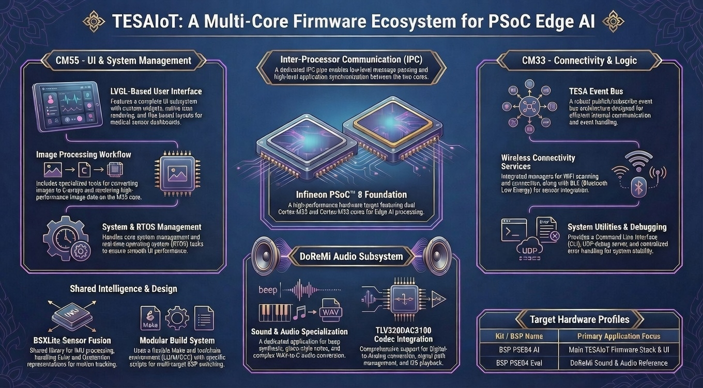

# TESAIoT Firmware Stack (Alpha) & Examples (PSoC Edge AI)

This documentation contains the **TESAIoT** multi-core embedded projects for Infineon PSoC™ 8 (Cortex-M55 + Cortex-M33): the main firmware stack and the DoReMi sound/audio application.

> **Demos, examples & other materials**  
> Video demos, 3D models (e.g. ABB Robot Arm, Cannon, Devices, Gauge, Guitar, MCU-Servo, PLC, PSoC-Edge-E84), kit images, and related assets are available in the **TESAIoT_Models** Google Drive folder:  
> **[https://drive.google.com/drive/folders/1MXBSm1xYbslumSjEUwSm6SXi3KADajb-?usp=drive_link](https://drive.google.com/drive/folders/1MXBSm1xYbslumSjEUwSm6SXi3KADajb-?usp=drive_link)**

---

## Table of Contents

### 1. [TESAIoT Firmware Stack (Alpha)](tesaiot_firmware_stack_alpha/README.md)

Multi-core framework for IoT and medical applications: UI (LVGL) on CM55, connectivity and system on CM33, IPC, WiFi, BLE, and modular services.

#### 1.1 Firmware stack – root & project

| Document                                                                              | Description                                              |
| ------------------------------------------------------------------------------------- | -------------------------------------------------------- |
| [README – Firmware Stack](tesaiot_firmware_stack_alpha/README.md)                     | Overview, capabilities, hardware targets, module summary |
| [CHANGELOG](tesaiot_firmware_stack_alpha/CHANGELOG.md)                                | Version history and changes                              |
| [Build setup (Make & toolchain)](tesaiot_firmware_stack_alpha/docs/BUILD_SETUP.md)    | Environment, LLVM/GCC, `make getlibs` / build / program  |
| [Switch target kits](tesaiot_firmware_stack_alpha/docs/SWITCH_TARGET_KITS.md)         | Changing BSP/target (e.g. PSE84 AI vs Eval)              |
| [IPC communication](tesaiot_firmware_stack_alpha/docs/ipc_communication.md)           | Inter-processor communication design                     |
| [WiFi scan architecture](tesaiot_firmware_stack_alpha/docs/wifi_scan_architecture.md) | WiFi scanning design and flow                            |

#### 1.2 CM55 – Application & UI

| Document                                                                                           | Description                       |
| -------------------------------------------------------------------------------------------------- | --------------------------------- |
| [UI/LVGL subsystem (CM55)](tesaiot_firmware_stack_alpha/proj_cm55/src/ui/README.md)                | LVGL integration and UI subsystem |
| [UI core](tesaiot_firmware_stack_alpha/proj_cm55/src/ui/core/README.md)                            | Core UI (theme, layout)           |
| [UI widgets](tesaiot_firmware_stack_alpha/proj_cm55/src/ui/widgets/README.md)                      | Custom widgets                    |
| [UI layout examples](tesaiot_firmware_stack_alpha/proj_cm55/src/ui/examples/UI_LAYOUT_EXAMPLES.md) | Flex/layout usage examples        |
| [LVGL examples](tesaiot_firmware_stack_alpha/proj_cm55/src/lvgl_examples/README.md)                | LVGL demos                        |
| [Image LV demo](tesaiot_firmware_stack_alpha/proj_cm55/src/img_lv_demo/README.md)                  | Image rendering demos             |
| [Native icons rendering](tesaiot_firmware_stack_alpha/proj_cm55/src/docs/doc-3.11.1.md)            | Native icon rendering             |
| [Image to C-code conversion](tesaiot_firmware_stack_alpha/proj_cm55/src/docs/doc-3.11.2.md)        | Converting images to C arrays     |
| [Image-data (C-array) rendering](tesaiot_firmware_stack_alpha/proj_cm55/src/docs/doc-3.11.3.md)    | Rendering C-array image data      |
| [Flex-based layouts & animations](tesaiot_firmware_stack_alpha/proj_cm55/src/docs/docs-3.11.4.md)  | Flex layouts and animations       |
| [BLE medical sensors dashboard](tesaiot_firmware_stack_alpha/proj_cm55/src/docs/docs-3.11.5.md)    | BLE medical sensors UI            |
| [CM55 IPC pipe](tesaiot_firmware_stack_alpha/proj_cm55/src/cm55-pipe.md)                           | CM55 pipe / IPC details           |

#### 1.3 CM55 modules

| Document                                                                                                    | Description                         |
| ----------------------------------------------------------------------------------------------------------- | ----------------------------------- |
| [IPC application layer (CM55)](tesaiot_firmware_stack_alpha/proj_cm55/modules/cm55_ipc_app/CM55_IPC_APP.md) | High-level IPC app interface        |
| [IPC pipe (CM55)](tesaiot_firmware_stack_alpha/proj_cm55/modules/cm55_ipc_pipe/CM55_IPC_PIPE.md)            | Low-level message passing CM55↔CM33 |
| [CM55 system management](tesaiot_firmware_stack_alpha/proj_cm55/modules/cm55_system/CM55_SYSTEM.md)         | System and RTOS on CM55             |
| [LED hardware control](tesaiot_firmware_stack_alpha/proj_cm55/modules/led_controller/LED_HARDWARE.md)       | LED peripheral control              |

#### 1.4 CM33 – Connectivity & system

| Document                                                                                             | Description                |
| ---------------------------------------------------------------------------------------------------- | -------------------------- |
| [CLI (CM33)](tesaiot_firmware_stack_alpha/proj_cm33_ns/modules/cm33_cli/CM33_CLI.md)                 | Command-line interface     |
| [CM33 system services](tesaiot_firmware_stack_alpha/proj_cm33_ns/modules/cm33_system/CM33_SYSTEM.md) | Date/time, system services |
| [Error handler](tesaiot_firmware_stack_alpha/proj_cm33_ns/modules/error_handler/USER_MANUAL.md)      | Error handling usage       |
| [Event bus](tesaiot_firmware_stack_alpha/proj_cm33_ns/modules/event_bus/USER_MANUAL.md)              | TESA event bus (pub/sub)   |
| [IPC logger](tesaiot_firmware_stack_alpha/proj_cm33_ns/modules/ipc_log/USER_MANUAL.md)               | IPC log utility            |
| [UDP debug server](tesaiot_firmware_stack_alpha/proj_cm33_ns/modules/udp_server/UDP_SERVER.md)       | UDP debug server           |
| [WiFi connection](tesaiot_firmware_stack_alpha/proj_cm33_ns/modules/wifi_connect/WIFI_CONNECT.md)    | WiFi connection service    |
| [WiFi manager](tesaiot_firmware_stack_alpha/proj_cm33_ns/modules/wifi_manager/WIFI_MANAGER.md)       | WiFi manager service       |

#### 1.5 Shared & libraries

| Document                                                                                     | Description                         |
| -------------------------------------------------------------------------------------------- | ----------------------------------- |
| [User button](tesaiot_firmware_stack_alpha/shared/docs/USER_BUTTON.md)                       | Shared user button logic            |
| [WiFi scanner (shared)](tesaiot_firmware_stack_alpha/shared/docs/WIFI_SCANNER.md)            | WiFi scanner implementation         |
| [UI layout library – user manual](tesaiot_firmware_stack_alpha/lib_ui_layout/USER_MANUAL.md) | `lib_ui_layout` usage (flex, theme) |

#### 1.6 BSXLite (IMU / sensor fusion)

| Document                                                                                                                      | Description                   |
| ----------------------------------------------------------------------------------------------------------------------------- | ----------------------------- |
| [Setup BSXLite](tesaiot_firmware_stack_alpha/COMPONENT_BSXLITE/docs/SETUP_BSXLITE.md)                                         | BSXLite setup                 |
| [Euler vs quaternion](tesaiot_firmware_stack_alpha/COMPONENT_BSXLITE/docs/EULER_vs_QUATERNION.md)                             | Orientation representations   |
| [IMU CLI commands](tesaiot_firmware_stack_alpha/COMPONENT_BSXLITE/docs/IMU_CLI_COMMANDS.md)                                   | CLI for IMU/fusion            |
| [Moving BSXLite to another project](tesaiot_firmware_stack_alpha/COMPONENT_BSXLITE/docs/moving_bsxlite_to_another_project.md) | Reusing BSXLite in other apps |

#### 1.7 Design & planning (docs/think, scripts)

| Document                                                                                                      | Description               |
| ------------------------------------------------------------------------------------------------------------- | ------------------------- |
| [Log queue printf implementation](tesaiot_firmware_stack_alpha/docs/think/log_queue_printf_implementation.md) | Log queue / printf design |
| [IPC data structure plan](tesaiot_firmware_stack_alpha/docs/think/ipc_data_structure_plan.md)                 | IPC data structures       |
| [TESA scripts README](tesaiot_firmware_stack_alpha/scripts/tesaiot/README.md)                                 | Build/workflow scripts    |
| [TESA workflow](tesaiot_firmware_stack_alpha/scripts/tesaiot/WORKFLOW.md)                                     | Script workflow           |

#### 1.8 TESA event bus & logging (CM55 src)

| Document                                                                                                                       | Description            |
| ------------------------------------------------------------------------------------------------------------------------------ | ---------------------- |
| [Event bus – memory](tesaiot_firmware_stack_alpha/proj_cm55/src/tesa/event_bus/docs/tesa_event_bus_memory.md)                  | Event bus memory model |
| [Event bus – examples & usage](tesaiot_firmware_stack_alpha/proj_cm55/src/tesa/event_bus/docs/event_bus_examples_and_usage.md) | Event bus usage        |
| [Event bus – safety analysis](tesaiot_firmware_stack_alpha/proj_cm55/src/tesa/event_bus/docs/event_bus_safety_analysi.md)      | Safety considerations  |
| [Event bus – MISRA C](tesaiot_firmware_stack_alpha/proj_cm55/src/tesa/event_bus/docs/misra_c_compliance_improvements.md)       | MISRA C alignment      |
| [Logging – examples & usage](tesaiot_firmware_stack_alpha/proj_cm55/src/tesa/logging/docs/logging_examples_and_usage.md)       | Logging usage          |

#### 1.9 BSP / target

| Document                                                                                       | Description       |
| ---------------------------------------------------------------------------------------------- | ----------------- |
| [BSP PSE84 AI – README](tesaiot_firmware_stack_alpha/bsps/TARGET_APP_KIT_PSE84_AI/README.md)   | PSE84 AI kit BSP  |
| [BSP PSE84 AI – release](tesaiot_firmware_stack_alpha/bsps/TARGET_APP_KIT_PSE84_AI/RELEASE.md) | BSP release notes |

---

### 2. [TESAIoT Sound / Audio – DoReMi](tesaiot_sound_audio_doremi/README.md)

PSoC Edge DoReMi application: software beep synthesis, I2S playback, piano-style notes, WAV→C conversion, and TLV320DAC3100 codec integration.

#### 2.1 DoReMi – main docs

| Document                                                                                  | Description                                                       |
| ----------------------------------------------------------------------------------------- | ----------------------------------------------------------------- |
| [DoReMi README (main tutorial)](tesaiot_sound_audio_doremi/README.md)                     | Full tutorial: overview, beep, I2S, piano, WAV→C, codec           |
| [TUTORIAL](tesaiot_sound_audio_doremi/docs/TUTORIAL.md)                                   | DoReMi tutorial (overview, sound gen, I2S, piano, WAV conversion) |
| [Design and implementation](tesaiot_sound_audio_doremi/docs/design_and_implementation.md) | Design and implementation details                                 |
| [Using the code example](tesaiot_sound_audio_doremi/docs/using_the_code_example.md)       | How to use the DoReMi code example                                |

#### 2.2 DoReMi – audio codec & I2S

| Document                                                                                                                 | Description                                |
| ------------------------------------------------------------------------------------------------------------------------ | ------------------------------------------ |
| [Audio codec – TLV320DAC3100 (Digital-to-Analog)](tesaiot_sound_audio_doremi/proj_cm33_ns/source/app_i2s/Audio-Codec.md) | Codec interface, I2C/I2S, DAC, signal path |

#### 2.3 DoReMi – BSP

| Document                                                                                              | Description               |
| ----------------------------------------------------------------------------------------------------- | ------------------------- |
| [BSP PSE84 Eval – README](tesaiot_sound_audio_doremi/bsps/TARGET_APP_KIT_PSE84_EVAL_EPC2/README.md)   | PSE84 Eval BSP for DoReMi |
| [BSP PSE84 Eval – release](tesaiot_sound_audio_doremi/bsps/TARGET_APP_KIT_PSE84_EVAL_EPC2/RELEASE.md) | BSP release notes         |

---

## Quick reference

| Repository                       | Purpose                                                                                                              |
| -------------------------------- | -------------------------------------------------------------------------------------------------------------------- |
| **tesaiot_firmware_stack_alpha** | Main firmware: CM55 UI (LVGL), CM33 connectivity (WiFi, BLE, CLI, event bus), IPC, build setup, BSXLite, shared docs |
| **tesaiot_sound_audio_doremi**   | Audio app: beep generator, I2S player, piano/songs, WAV→C, TLV320DAC3100 codec docs                                  |

Both use Infineon PSoC 8 (Cortex-M55 + Cortex-M33). The firmware stack is the primary application framework; DoReMi is a dedicated sound/audio application and reference.

---

_Last updated: 2026-02-28_
