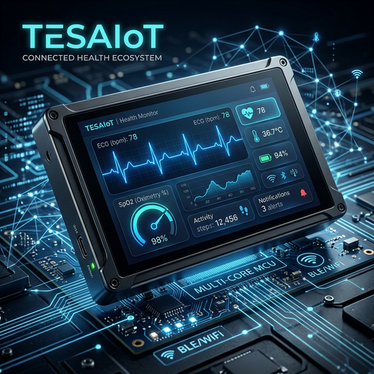

# TESAIoT Firmware Stack (Alpha)

> [!WARNING]
> This repository is under active development and changes frequently. Please ensure you are using the latest version to avoid compatibility issues.

## Table of contents

- [UI/VLGL Subsystem CM55](proj_cm55/src/ui/README.md)
- [Native Icons Rendering](proj_cm55/src/docs/doc-3.11.1.md)
- [Image to C-code Conversion](proj_cm55/src/docs/doc-3.11.2.md)
- [Image-data (C-array) Rendering](proj_cm55/src/docs/doc-3.11.3.md)
- [Flex-based Layouts & Animations](proj_cm55/src/docs/docs-3.11.4.md)
- [BLE Medical Sensors Dashboard](proj_cm55/src/docs/docs-3.11.5.md)

## User Manuals

#### CM33 Core (Connectivity)
- [Command Line Interface (CLI)](proj_cm33_ns/modules/cm33_cli/CM33_CLI.md)
- [CM33 System Services](proj_cm33_ns/modules/cm33_system/CM33_SYSTEM.md)
- [Error Handler Guide](proj_cm33_ns/modules/error_handler/USER_MANUAL.md)
- [Event Bus Manual](proj_cm33_ns/modules/event_bus/USER_MANUAL.md)
- [IPC Logger Utility](proj_cm33_ns/modules/ipc_log/USER_MANUAL.md)
- [UDP Debug Server](proj_cm33_ns/modules/udp_server/UDP_SERVER.md)
- [WiFi Connection Service](proj_cm33_ns/modules/wifi_connect/WIFI_CONNECT.md)
- [WiFi Manager Service](proj_cm33_ns/modules/wifi_manager/WIFI_MANAGER.md)

#### CM55 Core (Application/UI)
- [IPC Application Layer](proj_cm55/modules/cm55_ipc_app/CM55_IPC_APP.md)
- [IPC Communication Pipe](proj_cm55/modules/cm55_ipc_pipe/CM55_IPC_PIPE.md)
- [CM55 System Management](proj_cm55/modules/cm55_system/CM55_SYSTEM.md)
- [LED Hardware Control](proj_cm55/modules/led_controller/LED_HARDWARE.md)

#### Shared Resources
- [User Button Logic](shared/docs/USER_BUTTON.md)
- [WiFi Scanner Implementation](shared/docs/WIFI_SCANNER.md)

### Overview

The **TESAIoT Firmware Stack** is a high-performance, multi-core embedded framework tailored for advanced IoT and Medical applications. Built on the **Infineon PSoC8** architecture, it optimizes the distribution of tasks across the **Cortex-M55** (UI & Application logic) and **Cortex-M33** (Connectivity & System) cores.

### Core Capabilities

- **Advanced UI Engine**: Fully integrated with **LVGL 9.2.0**, utilizing a premium design system ([`ui_theme.h`](proj_cm55/src/ui/core/ui_theme.h)) and semantic flexbox-based layouts ([`ui_layout.h`](proj_cm55/src/ui/core/ui_layout.h)).
- **Multi-Core IPC**: Robust inter-processor communication powered by the **TESA Event Bus**, ensuring low-latency synchronization between the UI and system cores.
- **Medical & IoT Readiness**: Purpose-built dashboards and data pipelines for BLE-based medical sensors (e.g., Heart Rate, SpO2) and WiFi connectivity management.
- **Graphic Performance**: Optimized C-array image rendering (ARGB8888) with support for hardware-accelerated animations and runtime transformations.
- **Modular Architecture**: Clean separation of concerns between core drivers, IPC services, and the UI subsystem.

### Hardware Targets

- **MCU**: Infineon PSoC8 (Cortex-M55 + Cortex-M33).
- **Display**: Waveshare 7-inch DSI LCD (1024x600 resolution).
- **Communication**: Integrated support for WiFi (via IPC) and BLE (GATT/SMP).

### Project Modules

The project is logically divided into two main module groups corresponding to the hardware cores:

#### CM33: Connectivity & System Management
*Located in [`proj_cm33_ns/modules/`](proj_cm33_ns/modules/)*
- **WiFi Management**: Handles SSID scanning, connection state, and persistence.
- **BLE Sensors**: Manages GATT notifications and data extraction from medical devices.
- **TESA Event Bus**: The core IPC publisher/subscriber system.
- **System Services**: Date/Time sync, UDP server for debugging, and Error Handling.

#### CM55: Application & UI Subsystem
*Located in [`proj_cm55/modules/`](proj_cm55/modules/)*
- **LVGL Display**: Core UI rendering engine, theme management, and DSI driver integration.
- **IPC App Layer**: High-level application interface for receiving system/sensor events.
- **IPC Pipe**: Low-level message passing between hardware cores.
- **LED/System Control**: Local peripheral management and RTOS performance monitoring.

---

*Last Updated: 2026-02-28*

