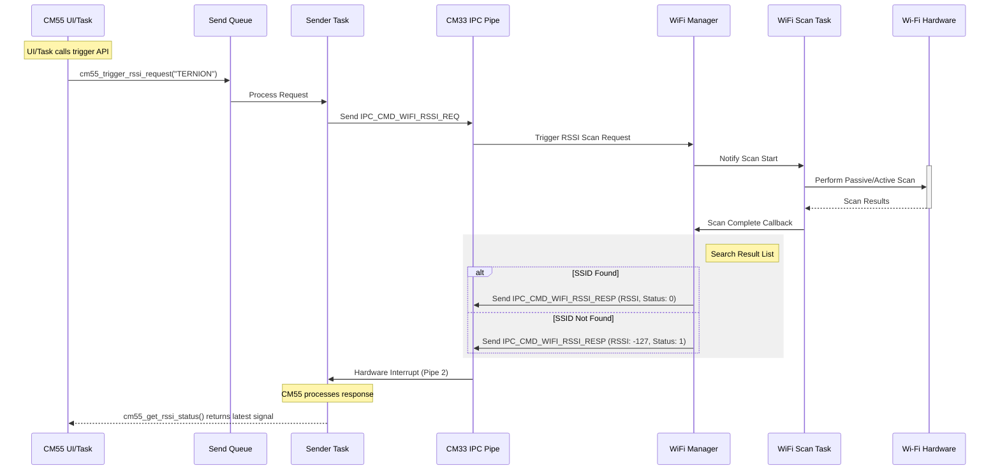

# Wi-Fi RSSI Request Operation

This document describes the end-to-end mechanism for requesting the Received Signal Strength Indicator (RSSI) of a specific Wi-Fi Access Point (SSID) from the CM55 core to the CM33 core.

## Overview

The operation is an asynchronous request-response flow using the hardware IPC (Inter-Processor Communication) Pipe. The CM55 core initiates the request, and the CM33 core performs a physical Wi-Fi scan to retrieve the latest signal strength for the requested SSID.

## Sequence Diagram



## Communication Protocol

### IPC Command IDs
- `IPC_CMD_WIFI_RSSI_REQ` (0x94): Sent by CM55 to request scanning.
- `IPC_CMD_WIFI_RSSI_RESP` (0x95): Sent by CM33 with the scan result.

### Structured Request (`wifi_scan_request_t`)
The CM55 uses the unified request structure with `WIFI_FILTER_MODE_SSID`:
```c
typedef enum {
  WIFI_FILTER_MODE_NONE = 0,
  WIFI_FILTER_MODE_SSID,
  WIFI_FILTER_MODE_MAC,
  WIFI_FILTER_MODE_BAND,
  WIFI_FILTER_MODE_RSSI,
  WIFI_FILTER_MODE_MAX
} wifi_filter_mode_t;

typedef struct {
  wifi_filter_mode_t mode;
  union {
    char ssid[64];
    uint8_t mac[6];
    int32_t rssi_threshold;
    uint32_t band;
  } param;
} wifi_scan_request_t;
```

### Response Payload (`wifi_status_t`)
The CM33 returns a simplified status structure for signal monitoring:
```c
typedef struct {
  char ssid[64];
  int32_t rssi;    // Signal strength in dBm (-127 if not found)
  uint32_t status; // 0: Success, 1: Not Found, 2: Scan Failed
} wifi_status_t;
```

## Implementation Details

### CM55 Core (Requester)
- **API**: `cm55_trigger_rssi_request(ssid)` pushes a request to `s_ipc_send_queue`.
- **Sender Task**: `cm55_ipc_sender_task` processes the queue and sends the IPC message.
- **Reporting**: UI can retrieve the latest response asynchronously using `cm55_get_rssi_status()`.

### CM33 Core (Provider)
- **Manager**: `wifi_scan_manager.c` handles searching the scan buffer upon completion.
- **Task**: `wifi_scan_task.c` performs the physical scan.
- **Asynchronous Response**: The IPC response is decoupled from the request due to the ~1.5s scan duration.

---
*Last updated: 2026-02-08*
