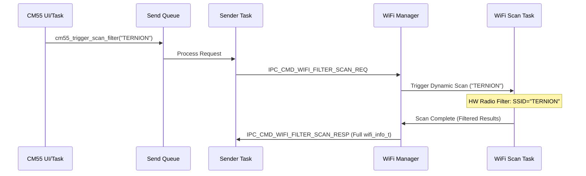

# Wi-Fi Targeted SSID Filtered Scan

This operation allows the CM55 (UI core) to request the full Wi-Fi network details for a specific SSID. It leverages hardware-level filtering on the CM33 Connectivity core to find the target efficiently without processing the entire scan list.

## Sequence Diagram



## Communication Protocol

### IPC Command IDs
- `IPC_CMD_WIFI_FILTER_SCAN_REQ` (0x96): Request full info for a specific SSID.
- `IPC_CMD_WIFI_FILTER_SCAN_RESP` (0x97): Response with `wifi_filter_result_t`.

### Structured Request (`wifi_scan_request_t`)
The CM55 packages the filter criteria into this unified structure:
```c
typedef enum {
  WIFI_FILTER_MODE_NONE = 0,
  WIFI_FILTER_MODE_SSID,
  WIFI_FILTER_MODE_MAC,
  WIFI_FILTER_MODE_BAND,
  WIFI_FILTER_MODE_RSSI,
  WIFI_FILTER_MODE_MAX
} wifi_filter_mode_t;

typedef struct {
  wifi_filter_mode_t mode;
  union {
    char ssid[64];
    uint8_t mac[6];
    int32_t rssi_threshold;
    uint32_t band;
  } param;
} wifi_scan_request_t;
```

### Response Payload (`wifi_filter_result_t`)
The CM33 returns the rich data for the found AP:
```c
typedef struct {
    wifi_info_t info;  // SSID, BSSID, RSSI, Channel, Security (string)
    uint32_t status;    // 0: Found, 1: Not Found, 2: Scan Failed
} wifi_filter_result_t;
```

## Comparison: RSSI vs Filtered Scan

| Feature | RSSI Request | Filtered Scan |
| :--- | :--- | :--- |
| **Command** | 0x94 | 0x96 |
| **Response** | `wifi_status_t` | `wifi_filter_result_t` |
| **Data Returned** | SSID + RSSI | Full `wifi_info_t` (MAC, Channel, etc.) |
| **Filtering** | Software search after full scan | Hardware-assisted SSID filter |
| **Usage** | Periodic signal monitoring | Detailed network discovery |
