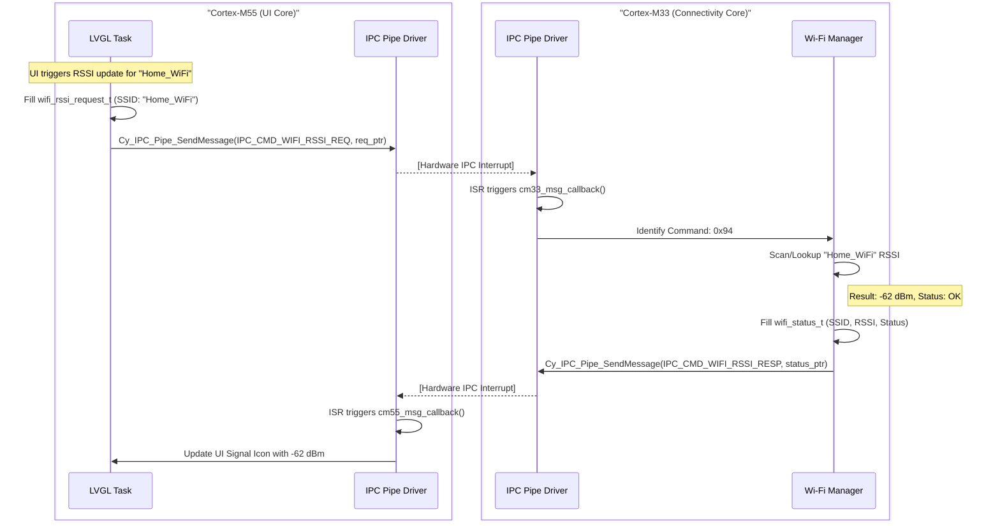

# Request to get RSSI from the given SSID

This design describes the process for the CM55 (UI core) to request the signal strength (RSSI) of a specific Wi-Fi network from the CM33 (Connectivity core).

## 1. IPC Protocol Additions

The following commands will be added to `ipc_communication.h`:

- **`IPC_CMD_WIFI_RSSI_REQ` (0x94)**: Sent by CM55 to initiate an RSSI lookup for a specific SSID.
- **`IPC_CMD_WIFI_RSSI_RESP` (0x95)**: Sent by CM33 with the results (SSID + RSSI).

## 2. Data Payload Design

### Request Payload (CM55 -> CM33)
The CM55 sends a request structure containing the target SSID.

```c
typedef struct {
    char ssid[64];
} wifi_rssi_request_t;
```

### Response Payload (CM33 -> CM55)
The CM33 responds using a shared status structure. This structure is intended to be reused for other Wi-Fi operations (like connection results).

```c
typedef struct {
    char ssid[64];
    int32_t rssi;
    uint8_t status; // 0: Success/Connected, 1: SSID not found, 2: Scan Failed, 3: Auth Error
} wifi_status_t;
```

## 3. Implementation Workflow

### CM55 (Requestor)
1. **Trigger**: User selects a specific SSID or the UI needs to update a specific network's signal.
2. **Action**: CM55 prepares an `ipc_msg_t`, sets `cmd = IPC_CMD_WIFI_RSSI_REQ`.
3. **Draft**: Cast `ipc_msg_t.data` to `wifi_rssi_request_t*` and fill the `ssid`.
4. **Send**: `Cy_IPC_Pipe_SendMessage` to CM33.
5. **Listen**: In `cm55_msg_callback`, handle `IPC_CMD_WIFI_RSSI_RESP`, cast `data` to `wifi_status_t*`, and update the UI.

### CM33 (Provider)
1. **Receive**: In `cm33_msg_callback`, identify `IPC_CMD_WIFI_RSSI_REQ`.
2. **Process**: 
   - Cast `ipc_recv_msg->data` to `wifi_rssi_request_t*` to get the target SSID.
   - Use the Wi-Fi driver to retrieve the latest RSSI.
3. **Respond**: 
   - Fill a `wifi_status_t` struct with the found RSSI and appropriate status code.
   - Set `cmd = IPC_CMD_WIFI_RSSI_RESP`.
   - Send back to CM55 using `Cy_IPC_Pipe_SendMessage`.

## 4. Detailed Sequence Diagram

The following diagram illustrates the interaction between the higher-level application logic and the low-level IPC drivers during an RSSI request.



## 5. Security & Validation

- **Length Check**: CM33 must validate that the received SSID string in `wifi_rssi_request_t` is null-terminated and does not exceed 63 characters + null.
- **Message Integrity**: The `client_id` and `intr_mask` must be validated by the pipe driver before processing the command to prevent cross-core memory corruption.
- **Cache vs. Live Scan**: To prevent UI lag, CM33 should prioritize returning cached RSSI values if the device is currently connected to the requested SSID.
