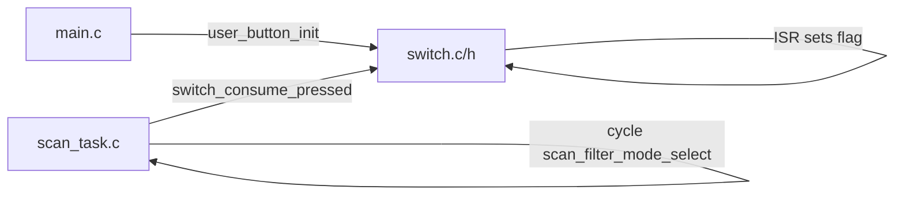

# Extract switch-related code to switch.c / switch.h

## Overview

Extract user button (physical switch SW2/SW4) initialization and interrupt handling from `proj_cm33_ns/scan_task.c` into new `proj_cm33_ns/switch.c` and `proj_cm33_ns/switch.h`, and update callers (scan_task, main) and build.

---

## Scope: what "switch" means

"Switch" here means the **user button** (physical switches SW2 / SW4 on the kit). The code to move is the button init, interrupt handler, and the "pressed" flag used by the scan task to cycle the scan filter mode.

**Out of scope:** The C `switch (scan_filter_mode_select)` in `scan_task()` (lines 352–394) stays in `scan_task.c`; it is scan-filter logic, not hardware switch logic.

---

## Code to extract

### From `proj_cm33_ns/scan_task.c`

| Item | Location | Action |
|------|----------|--------|
| Macro `BTN1_INTERRUPT_PRIORITY` | ~line 30 | Move to `switch.c` (or `switch.h` if needed by tests) as implementation detail. |
| Global `button_pressed` | ~line 54 | Move to `switch.c` as `static bool s_switch_pressed`; expose via accessor (see API below). |
| `button_interrupt_handler()` | ~lines 193–214 | Move to `switch.c` as `static`; update to set `s_switch_pressed = true` and keep same GPIO/NVIC clear logic and `CYBSP_USER_BTN2_ENABLED` handling. |
| `user_button_init()` | ~lines 233–263 | Move to `switch.c`; keep name for minimal change at call sites, or rename to `switch_init()` and update callers. |

### From `proj_cm33_ns/scan_task.h`

- Remove declaration `void user_button_init(void);` (~line 127).

---

## New files

### `proj_cm33_ns/switch.h`

- Include guard, minimal includes (e.g. `stdbool.h` if API uses `bool`).
- Declare:
  - `void user_button_init(void);` (or `void switch_init(void);`).
  - **Pressed flag API** (choose one):
    - **Option A (recommended):** `bool switch_consume_pressed(void);` — returns true if switch was pressed since last consume, and clears the flag. Keeps state internal to the switch module.
    - **Option B:** `extern volatile bool switch_pressed;` — scan_task reads and clears manually (simpler but exposes global).

### `proj_cm33_ns/switch.c`

- Includes: `switch.h`, `cybsp.h`, `retarget_io_init.h` (for `handle_app_error`), and any BSP/GPIO headers required for `Cy_GPIO_*`, `Cy_SysInt_Init`, `NVIC_*`.
- File-local macro `BTN1_INTERRUPT_PRIORITY` (or equivalent name).
- Static variable `s_switch_pressed`.
- Static `button_interrupt_handler()` (same logic as today; set `s_switch_pressed = true`).
- `user_button_init()` (same logic: clear GPIO/NVIC for BTN1 and optionally BTN2, `Cy_SysInt_Init`, `handle_app_error` on failure, `NVIC_EnableIRQ`).
- `switch_consume_pressed()`: enter critical or use atomics if needed, read and clear `s_switch_pressed`, return value.

---

## Call site updates

### `proj_cm33_ns/scan_task.c`

- Add `#include "switch.h"`.
- Remove macro `BTN1_INTERRUPT_PRIORITY`, variable `button_pressed`, and the two functions above.
- In `scan_task()` loop, replace:
  - `if (true == button_pressed) { ... button_pressed = false; }`
  - with: `if (switch_consume_pressed()) { ... }` (same logic for incrementing and wrapping `scan_filter_mode_select`).

### `proj_cm33_ns/main.c`

- Add `#include "switch.h"` (and remove `#include "scan_task.h"` only if it was solely for `user_button_init`; otherwise keep scan_task.h and add switch.h).
- Keep call `user_button_init();` (or `switch_init();` if renamed) so button init still runs at startup.

---

## Build

- `proj_cm33_ns/Makefile`: Build system "automatically looks in the Makefile's directory tree for source code"; adding `switch.c` in `proj_cm33_ns` should get it picked up. If the project uses an explicit `SOURCES` list elsewhere, add `switch.c` there.

---

## Dependency note

- `user_button_init()` calls `handle_app_error()` on interrupt init failure; that is declared in `proj_cm33_ns/retarget_io_init.h`. `switch.c` should include that header so the dependency stays explicit.

---

## Summary flow (after refactor)

No changes to scan_task_config.h or to the scan filter `switch` statement; only the physical switch (button) code moves to the new module.

---

## Task list

- [x] Create `proj_cm33_ns/switch.h` with include guard, `user_button_init(void)`, and `switch_consume_pressed(void)`.
- [x] Create `proj_cm33_ns/switch.c` with `BTN1_INTERRUPT_PRIORITY`, `s_switch_pressed`, `button_interrupt_handler()`, `user_button_init()`, and `switch_consume_pressed()`.
- [x] Remove switch-related code from `proj_cm33_ns/scan_task.c` (macro, `button_pressed`, `button_interrupt_handler`, `user_button_init`); add `#include "switch.h"`; use `switch_consume_pressed()` in the scan loop.
- [x] Remove `void user_button_init(void);` from `proj_cm33_ns/scan_task.h`.
- [x] Add `#include "switch.h"` to `proj_cm33_ns/main.c` (keep `user_button_init();` call).
- [x] Verify build picks up `switch.c` (add to SOURCES if needed).
