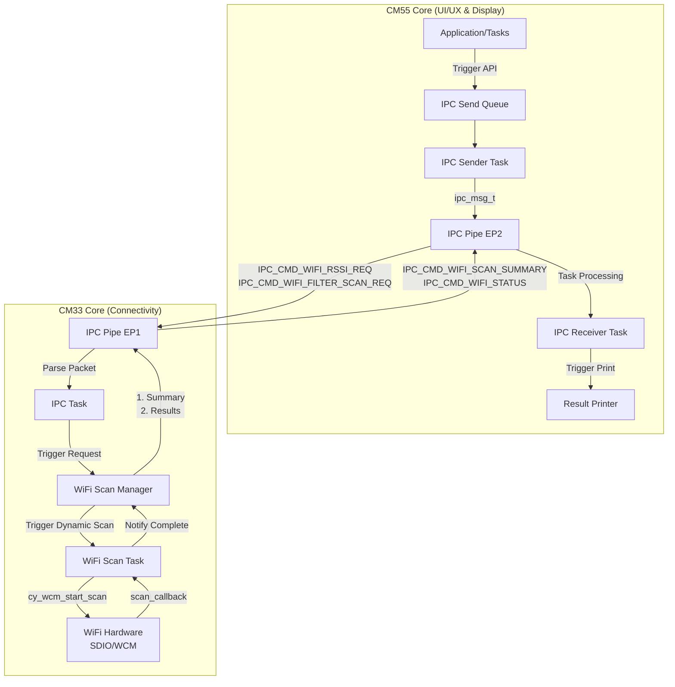
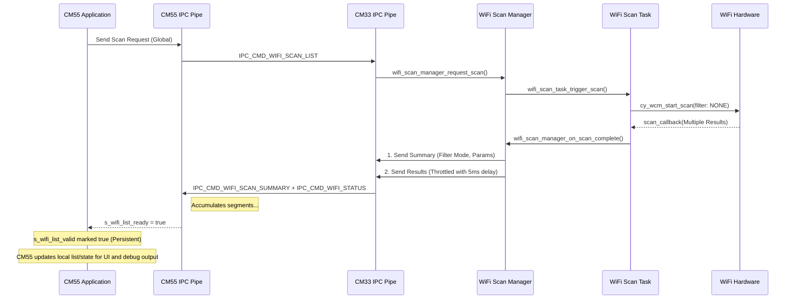

# WiFi Scan Architecture - CM33 and CM55 Collaboration

This document explains how the CM33 and CM55 cores work together to perform on-demand Wi-Fi scanning with advanced filtering capabilities.

## System Architecture

## Operation Modes

| Mode | Purpose | Request Command | Response Format | Filtering Logic |
| :--- | :--- | :--- | :--- | :--- |
| **Global Scan** | Retrieve full list of APs | `0x93` | `wifi_scan_summary_t` + multiple `wifi_info_t` | Software (all APs) |
| **RSSI Monitor** | Periodic signal update | `0x94` (`wifi_scan_request_t`) | `wifi_status_t` | Managed Search |
| **Filtered Scan** | Details for specific target | `0x96` (`wifi_scan_request_t`) | `wifi_filter_result_t` | **Hardware Filter** |

## Data Flow & Synchronization

To allow the high-performance CM55 core to handle display formatting without starving the CM33's connectivity tasks, the following synchronization is used:

1.  **Summary First**: CM33 sends `IPC_CMD_WIFI_SCAN_SUMMARY` containing result count and active filter parameters.
2.  **Throttled Results**: CM33 iterates through results, sending each as an `IPC_CMD_WIFI_STATUS` message with a **5ms delay** between packets.
3.  **Accumulation**: CM55 listener task copies results into a local buffer.
4.  **Ready Trigger**: Once the final segment (index == count-1) is received, the CM55 sets `s_wifi_list_ready = true`.
5.  **Autonomous Printing**: The CM55's `cm55_ipc_receiver_task` sees the flag and invokes `print_wifi_list()`, providing human-readable console output.

## Sequence Diagram - Global Scan

## Module Responsibilities

### CM33 WiFi Scan Task
- **Initialization**: Sets up SDIO and WCM.
- **Filter Management**: Handles manual filters (button) and dynamic filters (IPC).
- **Sorting**: Ranks results by RSSI before publishing.

### CM33 WiFi Scan Manager
- **State Tracking**: Tracks if a filtered scan is "pending".
- **Result Search**: After a scan, it searches for target SSIDs to satisfy RSSI/Filter requests.
- **IPC Marshalling**: Packages results into `wifi_status_t`, `wifi_filter_result_t`, and throttles `wifi_info_t` segment bursts.

### CM55 Application (IPC Pipe Module)
- **Request Management**: Uses `s_ipc_send_queue` and `cm55_ipc_sender_task` to throttle and manage outgoing requests from UI/Tasks.
- **Result Accumulation**: Reassembles the Wi-Fi list from individual segments.
- **Persistence**: Maintains `s_wifi_list_valid` so UI components can access data even after console printing is complete.
- **Display Logic**: Provides Wi-Fi data/state to CM55 UI components and debug views.

---
*Last updated: 2026-02-08*
