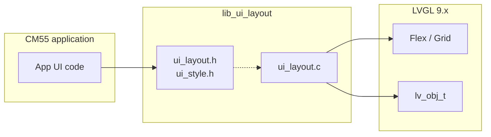
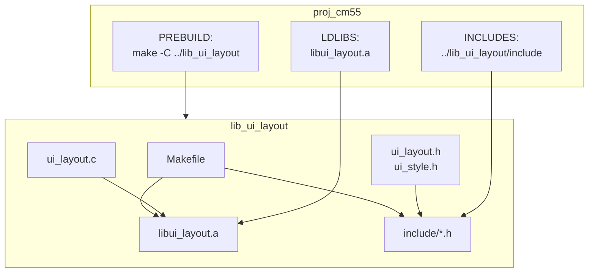

# LVGL

**LVGL 9.x layout and styling helpers for PSoC Edge CM55 (display core).**

Static library providing flex, grid, stack, and “clean” containers; spacing (pad, gap, margin); size/position helpers; and optional card/pill styling. Reduces boilerplate and keeps UI code consistent across the TESAIoT firmware stack.

---

## Table of Contents

1. [Overview](#1-overview)
2. [Architecture](#2-architecture)
3. [Features at a glance](#3-features-at-a-glance)
4. [Build & output](#4-build--output)
5. [Integration (proj_cm55)](#5-integration-proj_cm55)
6. [Quick start](#6-quick-start)
7. [Documentation & references](#7-documentation--references)
8. [Source layout](#8-source-layout)

---

## 1. Overview

| Item | Description |
|------|-------------|
| **Target** | PSoC Edge CM55 (display / UI core) |
| **LVGL** | 9.x (flex & grid APIs) |
| **Output** | Static library `libui_layout.a` + headers `ui_layout.h`, `ui_style.h` |
| **Role** | Semantic layout helpers (flex row/col, grid, stack, clean containers) and style constants so application code stays short and consistent. |

The library is built separately; the CM55 application links `libui_layout.a` and includes the public headers from `lib_ui_layout/include/`.

---

## 2. Architecture



**Build and link flow:**



---

## 3. Features at a glance

| Category | Capabilities |
|----------|--------------|
| **Flex** | Row/column, center, wrap, reverse, wrap-reverse; theme-visible or “clean” (layout-only). |
| **Grid** | Grid container + `ui_grid_place()` for child placement. |
| **Stack / overlay** | Stack container, fill parent, center in parent. |
| **Clean containers** | No background, border, scroll, or click; optional clean scroll. |
| **Spacing** | Pad (all, xy, x, y), gap, margin (all, xy, x, y). |
| **Size & position** | Fill parent, wrap content, fixed or percent width/height, center in parent. |
| **Card / pill** | Card container, pill styling (radius + padding). |
| **Style constants** | `ui_style.h`: spacing (`UI_SPACE_*`), radius (`UI_RADIUS_*`), sizes, opacity, z-order. |

---

## 4. Build & output

Paths below are relative to the **project root** (parent of `lib_ui_layout`).

### Build

```bash
cd lib_ui_layout
make
```

### Output

| Artifact | Path |
|----------|------|
| Static library | `lib_ui_layout/lib/libui_layout.a` |
| Public headers | `lib_ui_layout/include/ui_layout.h`, `lib_ui_layout/include/ui_style.h` |

Headers are copied from `lib_ui_layout/` into `include/` by the Makefile. Use `make clean` to remove build outputs.

### Override toolchain

```bash
GCC_PATH=/path/to/gcc/bin make
```

See [USER_MANUAL.md](USER_MANUAL.md) for prerequisites, clean, and [TOOLCHAIN_NOTE.md](TOOLCHAIN_NOTE.md) for GCC vs LLVM_ARM when linking into proj_cm55.

---

## 5. Integration (proj_cm55)

proj_cm55 uses the library by default (`USE_UI_LAYOUT_LIB=1`):

- **PREBUILD** – builds `lib_ui_layout` before each app build.
- **LDLIBS** – links `../lib_ui_layout/lib/libui_layout.a`.
- **INCLUDES** – adds `../lib_ui_layout/include`.
- **CY_IGNORE** – excludes in-tree `src/ui/core/ui_layout.c` to avoid duplicate symbols.

To build without the library (use in-tree source):

```bash
cd proj_cm55
USE_UI_LAYOUT_LIB=0 make build
```

---

## 6. Quick start

```c
#include "ui_layout.h"
#include "ui_style.h"

/* Clean column as root, gap 8, pad 12 */
lv_obj_t *root = ui_clean_col(parent, 8, 12);
ui_fill_parent(root);

/* Header row */
lv_obj_t *header = ui_row(root, 8, 8);
lv_label_set_text(lv_label_create(header), "Title");

/* Body column that grows */
lv_obj_t *body = ui_clean_col(root, 8, 12);
ui_flex_grow(body, 1);

/* Card with style constants */
lv_obj_t *card = ui_card_container(parent, UI_SPACE_M, UI_RADIUS_CARD);
ui_pad_all(card, UI_PAD_SCREEN);
```

---

## 7. Documentation & references

| Document | Description |
|----------|-------------|
| [USER_MANUAL.md](USER_MANUAL.md) | Full user manual: API reference, spacing/size constants, build details, integration (Makefile), usage examples, limits. |
| [TOOLCHAIN_NOTE.md](TOOLCHAIN_NOTE.md) | GCC vs LLVM_ARM when linking `libui_layout.a` into proj_cm55. |

For flex/layout usage examples in the CM55 app, see [UI layout examples](../proj_cm55/src/ui/examples/UI_LAYOUT_EXAMPLES.md).

---

## 8. Source layout

| Path | Description |
|------|-------------|
| `lib_ui_layout/ui_layout.c` | Implementation. |
| `lib_ui_layout/ui_layout.h` | Public API (copied to `include/` by make). |
| `lib_ui_layout/ui_style.h` | Style constants (copied to `include/` by make). |
| `lib_ui_layout/Makefile` | Builds library and copies headers. |
| `lib_ui_layout/config/cycfg_system.h` | Minimal stub for library build. |

All source and build outputs live under `lib_ui_layout/`.

---

*Part of the TESAIoT Firmware Stack (Alpha). See [tesaiot_firmware_stack_alpha README](../README.md) for the full project.*
