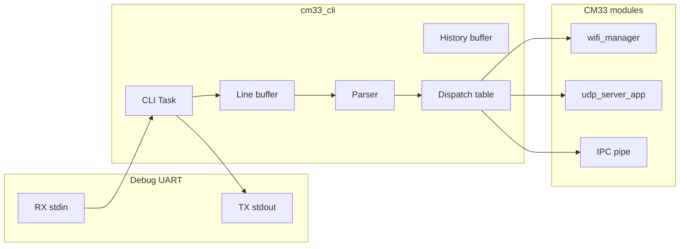

# CM33 CLI Module – User Manual

**Author:** Asst. Prof. Santi Nuratch, Ph.D  
**Organization:** Thailand Embedded Systems Association (TESA)

---

## 1. Overview

The CM33 CLI module runs on the CM33 (non-secure) core and provides a UART-based command-line interface on the debug UART. A single FreeRTOS task reads character input, supports full line editing (backspace, ANSI arrow keys for history), maintains a circular history of completed lines, and dispatches tokenized commands to a table-driven handler set. All output is sent via CM33 `printf` (retarget-io UART path). Commands drive the Wi-Fi manager, UDP server app, and optional IPC; input is taken only from the debug UART (stdin) on CM33.

---

## 2. Features

- **Single CLI task** – One FreeRTOS task blocks on `retarget_io_getchar()`, builds the current line, handles escape sequences and backspace, and on Enter tokenizes and dispatches.
- **Line buffer** – Fixed maximum length (128 bytes); input beyond that is ignored.
- **History** – Circular buffer of 8 completed lines; Up/Down arrow keys replace the current line with a history entry and redraw the line.
- **Escape sequences** – ANSI `ESC [ A` (Up), `ESC [ B` (Down); Backspace = `\b` or `0x7F`. Printable characters are echoed.
- **Table-driven commands** – Array of `{ "cmd", "help text", handler_fn }`; handler receives `argc` and `argv[]`, uses `printf` for output. Unknown command prints `Unknown command 'x'. Type 'help'.`
- **Commands** – `help`, `version`, `clear`, `echo`, `uptime`, `heap`, `time` (now, date, clock, set, sync, ntp), `date`, `sysinfo`, `log` (status), `tasks`, `stacks`, `buttons` (status), `led` (on, off, toggle), `mac`, `ip`, `gateway`, `netmask`, `ping`, `reboot`, `reset`, `wifi` (scan, connect, disconnect, status, list, info), `udp` (start, stop, send, status), `ipc` (ping, send, status, recv).
- **Configurable** – Line length, history count, task stack size, and priority offset are defined in `cm33_cli.h`.
- **Optional stop** – `cm33_cli_stop()` deletes the CLI task.

---

## 3. Dependencies

- **FreeRTOS** – Task and `vTaskDelay` (for UART getchar polling).
- **BSP / PDL** – Debug UART (`CYBSP_DEBUG_UART_HW`) and `Cy_SCB_UART_Get` for input.
- **retarget_io_init.h** – `retarget_io_getchar()` (implemented in CM33 `retarget_io_init.c`).
- **wifi_manager.h** – `wifi_manager_request_scan`, `wifi_manager_request_connect`, `wifi_manager_request_disconnect`, `wifi_manager_request_status`.
- **udp_server_app.h** – `udp_server_app_start`, `udp_server_app_stop`, `udp_server_app_send`, `udp_server_app_get_status` and `udp_server_app_status_t`.
- **ipc_communication.h** – `ipc_wifi_scan_request_t`, `ipc_wifi_connect_request_t` for Wi-Fi CLI commands.

---

## 4. Architecture

Input flows from the debug UART RX into the CLI task, which fills a line buffer and maintains a history buffer. On Enter, the line is tokenized and the first token is used to look up a handler in a dispatch table; the handler calls into Wi-Fi manager, UDP server app, or other modules. All CLI responses go out via the same CM33 UART stdout path.



**Task flow:** The CLI task loop: read one character with `retarget_io_getchar()`; if ESC, parse two more bytes for Up/Down and update history/line/redraw; if CR/LF, tokenize line, push to history, dispatch, print prompt; if backspace, remove last character and echo erase; if printable, append to line (if space) and echo. Handlers are short: they trigger module APIs and print a result; they do not block for long.

---

## 5. Hardware Configuration

CLI input and output use the **debug UART** already configured for the project (e.g. `CYBSP_DEBUG_UART_HW`). No extra pins or hardware are required. Connect a terminal (e.g. PuTTY, minicom) to the board’s debug UART at the configured baud rate to use the CLI.

---

## 6. Integration

### 6.1 Makefile

The CLI module lives in the CM33 non-secure project: `proj_cm33_ns/modules/cm33_cli/`.

- **SOURCES** – Add the module source:
  ```makefile
  SOURCES += modules/cm33_cli/cm33_cli.c
  ```
- **INCLUDES** – Add the module include directory:
  ```makefile
  INCLUDES += modules/cm33_cli
  ```
Ensure the build also has `../shared/include` (for `ipc_communication.h`), project root (for `retarget_io_init.h`), and the paths for `wifi_manager` and `udp_server` as required by the CLI commands.

### 6.2 Initialization (typical in `main.c`)

1. Call `cm33_cli_init()` after UART/retarget is ready.
2. Call `cm33_cli_start()` after the IPC pipe (and optionally Wi-Fi) is up so commands can use them.

Example:

```c
#include "cm33_cli.h"
#include "cm33_ipc_pipe.h"

if (!cm33_ipc_pipe_start()) {
  handle_error(NULL);
}

if (!cm33_cli_init()) {
  handle_error(NULL);
}

if (!cm33_cli_start()) {
  handle_error(NULL);
}

cm33_system_enable_cm55();
```

### 6.3 Init order

1. UART/retarget and `retarget_io_getchar()` must be available (CM33 `retarget_io_init.c`).
2. `cm33_cli_init()` then `cm33_cli_start()` after `cm33_ipc_pipe_start()` so CLI can use IPC and other modules.


### 6.4 Output

All CLI output uses `printf` to the CM33 debug UART. The prompt is `cli> `; it is printed after each command and at task startup.

---

## 7. API Reference

### 7.1 Lifecycle

| Function | Description |
|----------|-------------|
| `cm33_cli_init()` | Initializes CLI state. Call once before `cm33_cli_start()`. Returns true. |
| `cm33_cli_start()` | Creates the CLI FreeRTOS task. Call after IPC pipe (and optionally Wi-Fi) is up. Returns true if the task was created (`pdPASS`). |
| `cm33_cli_stop()` | Deletes the CLI task. Safe to call if the task was never started or already deleted. |

---

## 8. Types and configuration

Configuration is via macros in `cm33_cli.h`:

| Macro | Default | Description |
|-------|---------|-------------|
| `CM33_CLI_LINE_MAX` | 128 | Maximum line length in bytes. |
| `CM33_CLI_HISTORY_COUNT` | 8 | Number of history entries (circular). |
| `CM33_CLI_STACK_SIZE` | 1024 | CLI task stack size (words). |
| `CM33_CLI_TASK_PRIORITY_OFFSET` | 2 | Added to `tskIDLE_PRIORITY` for CLI task priority. |

No public config struct; adjust these defines to tune the CLI.

---

## 9. Command reference

Commands are **case-sensitive**. Format: `command [arg1 [arg2 ...]]`. Tokens are separated by spaces/tabs; first token is the command name.

### 9.1 General

| Command | Description |
|---------|-------------|
| `help` | Lists all commands and their short help strings. |
| `version` | Prints firmware/CLI version string and build date (e.g. "CM33 CLI 1.0" plus `__DATE__` `__TIME__`). |
| `clear` | Clears the terminal screen (ANSI escape). |
| `echo` | Echoes the remaining arguments to output (space-separated). Useful for scripting and testing. |
| `uptime` | Prints time since boot in seconds and ticks. |
| `heap` | Prints FreeRTOS heap free (bytes). With heap_2/4/5 also prints minimum-ever free; with heap_3 prints "not available". |
| `date` | Prints current date only (YYYY-MM-DD). Same as `time date`. |
| `sysinfo` | Prints a one-line snapshot: uptime (s), heap free, RTC time, task count. |
| `led` | Subcommands: `on`, `off`, `toggle`. Controls the user LED (BSP). |
| `mac` | Prints the STA (WiFi client) MAC address via `cy_wcm_get_mac_addr`. Format: XX:XX:XX:XX:XX:XX. |
| `ip` | Prints the STA IPv4 address via `cy_wcm_get_ip_addr`. Format: dotted decimal (e.g. 192.168.1.10). |
| `gateway` | Prints the default gateway IPv4 via `cy_wcm_get_gateway_ip_address`. |
| `netmask` | Prints the STA netmask IPv4 via `cy_wcm_get_ip_netmask`. |
| `ping` | Sends ICMP ping to `<a.b.c.d>`. Optional second arg: timeout in ms (default 2000). Blocking; uses `cy_wcm_ping`. |
| `stacks` | Prints per-task stack high-water mark (minimum free bytes) for all tasks. Requires `configUSE_TRACE_FACILITY`. |
| `reset` | Triggers a software system reset (same effect as pressing the board reset button). The device reboots; the CLI does not return. |
| `reboot` | Alias for `reset`. |

### 9.2 time

Subcommands: `now`, `date`, `clock`, `set`, `sync`, `ntp`. Usage: `time [subcommand] [args]`. Uses the RTC (date_time module); valid after `date_time_init()` in main.

| Subcommand | Args | Description |
|------------|------|-------------|
| `time` or `time now` | — | Prints current date and time (full). |
| `time date` | — | Prints current date only (YYYY-MM-DD). |
| `time clock` | — | Prints current time only (HH:MM:SS). |
| `time set` | `<hour> <min> <sec> <day> <month> <year>` | Sets the RTC to the given values (24h). |
| `time sync` | — | Sets the RTC to the firmware compile date/time. |
| `time ntp` | — | Stub: prints that NTP sync is not available (requires NTP client). Use `time sync` for compile-time. |

### 9.3 log

Usage: `log` or `log status`. Prints a short description of the current log path.

### 9.4 tasks

Usage: `tasks`. Lists FreeRTOS tasks: name, priority, state (R=Running, rdy=Ready, blk=Blocked, sus=Suspended, del=Deleted), and stack high-water mark (words). Requires `configUSE_TRACE_FACILITY`; if disabled, prints a message.

### 9.5a stacks

Usage: `stacks`. Prints for each task the stack high-water mark (minimum free bytes remaining). Useful to detect stack overflow risk. Requires `configUSE_TRACE_FACILITY`.

### 9.5 buttons

Subcommand: `status`. Usage: `buttons status`. Prints for each button (0 and 1) the current state (pressed/released) and press count. Uses `user_buttons_get_state()`.

### 9.6 wifi

Subcommands: `scan`, `connect`, `disconnect`, `status`, `list`, `info`. Usage: `wifi <subcommand> [args]`.

| Subcommand | Args | Description |
|------------|------|-------------|
| `wifi scan` | — | Requests a Wi-Fi scan (no filter). Fails if already connected. |
| `wifi connect` | `<ssid> [pass]` | Requests connection to AP; optional password. |
| `wifi disconnect` | — | Requests disconnection. |
| `wifi status` | — | Requests status; result is asynchronous (event/callback). CLI prints "Status requested." |
| `wifi list` | — | Prints the last scan results (SSID, RSSI, channel). Run `wifi scan` first. |
| `wifi info` | — | Prints associated AP info: SSID, BSSID, RSSI (dBm), channel, channel width, security (via `cy_wcm_get_associated_ap_info`). Fails if not connected. |

### 9.7 udp

Subcommands: `start`, `stop`, `send`, `status`. Usage: `udp <subcommand> [args]`.

| Subcommand | Args | Description |
|------------|------|-------------|
| `udp start` | — | Starts the UDP server socket. |
| `udp stop` | — | Stops the UDP server and clears peers. |
| `udp send` | `<msg>` | Sends the message to the last peer. |
| `udp status` | — | Prints port, peer count, and local IPv4 (or "UDP server not initialized"). |

### 9.8 ipc

Subcommands: `ping`, `send`, `status`, `recv`. Usage: `ipc <subcommand> [args]`. Sends messages to the CM55 core over the IPC pipe; `recv` shows receive stats.

| Subcommand | Args | Description |
|------------|------|-------------|
| `ipc ping` | — | Sends a ping command to CM55 via IPC. |
| `ipc send` | `<message>` | Sends a CLI text message to CM55 via IPC. |
| `ipc status` | — | Prints that the IPC pipe (CM33 → CM55) is running. |
| `ipc recv` | — | Prints IPC receive stats: pending (messages in ring not yet processed) and total (messages received from CM55 since boot). |

### 9.9 Unknown command

If the first token does not match any command, the CLI prints: `Unknown command 'x'. Type 'help'.`

---

## 10. Usage examples

**Start CLI and run commands (after init/start in main):**

```text
cli> help
Commands:
  help     List commands and short help
  version  Firmware/CLI version string
  clear    Clear the terminal screen
  echo     Echo arguments to output
  uptime   Print time since boot (seconds)
  heap     Print FreeRTOS heap free (bytes)
  time     time [now|date|clock|set|sync|ntp]
  date     Print current date (YYYY-MM-DD)
  sysinfo  System snapshot (uptime, heap, time, tasks)
  log      log status
  tasks    List FreeRTOS tasks
  stacks   Task stack high-water marks (bytes free)
  buttons  buttons status
  led      led on|off|toggle
  mac      Print WiFi MAC address
  ip       Print STA IPv4 address
  gateway  Print default gateway IPv4
  netmask  Print STA netmask IPv4
  ping     ping <a.b.c.d> [timeout_ms]
  wifi     wifi scan|connect|disconnect|status|list|info
  udp      udp start|stop|send <msg>|status
  ipc      ipc ping|send|status|recv
  reset    Software reset (like reset button)
  reboot   Reboot (same as reset)

cli> version
CM33 CLI 1.0 Feb 17 2026 12:00:00

cli> wifi scan
Scan requested.

cli> udp status
port 57345, peers 0, local IP 0.0.0.0
```

**Line editing and history:**

- Type a line and press Enter to run it; the line is added to history.
- **Up** arrow: replace current line with previous history entry (older).
- **Down** arrow: replace current line with next history entry (newer), or restore the current edit if already at newest.
- **Backspace** (or Delete 0x7F): remove last character and erase on screen.

---

## 11. Limits and notes

- **Blocking input:** The CLI task blocks on `retarget_io_getchar()`. No other task should depend on this task for real-time work. Keep command handlers short (trigger actions and print; avoid long loops).
- **History:** Stored in RAM only; size is bounded (e.g. 8 entries × 128 bytes). Lost on reset.
- **Thread safety:** The CLI runs in a single task. Handlers call into modules that may run in other tasks (e.g. Wi-Fi callbacks); avoid shared state in handlers or use the same locks/queues used elsewhere in the app.
- **UART:** Only the CM33 core reads from the debug UART for CLI input; CM55 does not use this CLI.
- **ipc:** The `ipc ping` and `ipc send` commands send to CM55 via IPC. Behavior on CM55 depends on its current IPC app handling.
