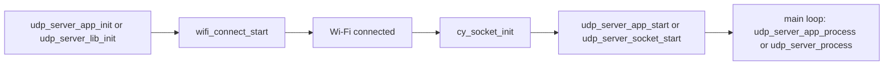
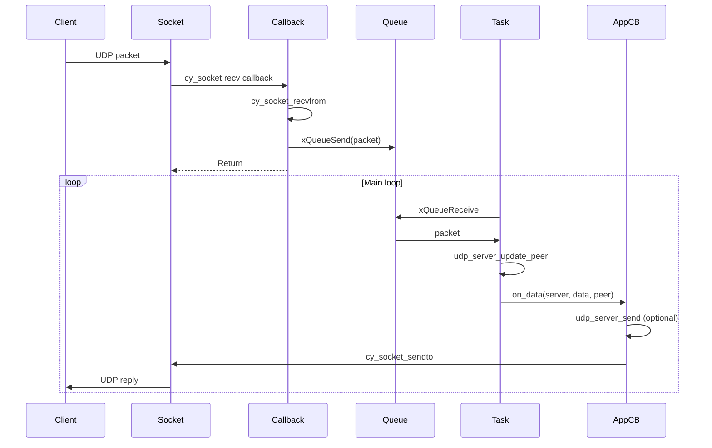

# UDP Server Module – User Manual

**Author:** Asst. Prof. Santi Nuratch, Ph.D  
**Organization:** Thailand Embedded Systems Association (TESA)  
**Version:** 1.0  
**Target:** PSoC Edge E84, CM33 (non-secure)

---

## 1. Overview

The UDP server module runs on the CM33 (non-secure) core and provides a lightweight, non-blocking, callback-driven UDP server on top of the PSoC secure sockets layer. It manages a UDP socket, handles incoming data via a receive callback, and tracks multiple client peers. Peers are learned when they send data; `udp_server_send()` sends to the most recently active peer. Designed for FreeRTOS.

---

## 2. Features

- **Non-blocking** – Suitable for cooperative multitasking (FreeRTOS); no blocking recv loops.
- **Callback-based** – `on_data`, `on_peer_added`, `on_peer_evicted`, `on_error` callbacks.
- **Multi-peer** – Tracks up to `max_peers` clients; evicts LRU when full.
- **Queue-based** – RX callback enqueues packets; `udp_server_process()` drains queue in task context.
- **Configurable** – Port, bind IP, max peers, payload size, queue length, recv timeout.
- **Thread-safe** – Socket receive callback runs in HAL context; application callbacks run in task context via `udp_server_process()`.

---

## 3. Dependencies

- **cy_secure_sockets** – Call `cy_socket_init()` before `udp_server_start()` (e.g. after Wi-Fi connects).
- **FreeRTOS** – Queues and tasks (`queue.h`, `task.h`).
- **cybsp** – For BSP (application only; library does not include it).

---

## 4. Integration

### 4.1 Using in Another Project

To use this module in a **new** ModusToolbox project (e.g. a different PSoC Edge application):

**Step 1: Copy the module**

Copy the entire `udp_server` folder to your project's `modules` directory:

```
your_project/proj_cm33_ns/
├── modules/
│   └── udp_server/          ← Copy this folder
│       ├── udp_server_lib.c
│       ├── udp_server_lib.h
│       └── UDP_SERVER.md
├── Makefile
└── ...
```

If `modules` does not exist, create it under your CM33 (non-secure) project directory.

**Step 2: Modify the Makefile**

Edit the Makefile in your CM33 project (e.g. `proj_cm33_ns/Makefile`). Add:

```makefile
SOURCES+= modules/udp_server/udp_server_lib.c
INCLUDES+= modules/udp_server
```

**Step 3: Ensure dependencies**

- **cy_secure_sockets** – Requires `wifi-core-freertos-lwip-mbedtls` (or equivalent) and `cy_socket_init()` before `udp_server_start()`. Typically you call `cy_socket_init()` after Wi-Fi connects (see 4.2).
- **FreeRTOS** – Add `FREERTOS` to `COMPONENTS` if not already present.
- **cybsp** – Your BSP must provide it (included via ModusToolbox).

**Step 4: Add application code**

Include the header, initialize, start, and process in your task. See 4.2 and 4.3 for init order and example.

---

### 4.2 Makefile (this project)

The UDP server module lives in `proj_cm33_ns/modules/udp_server/`: implementation in `udp_server_lib.c`, public API in `udp_server_lib.h`.

**SOURCES** – Add the library and application implementation:

```makefile
SOURCES+= modules/udp_server/udp_server_lib.c modules/udp_server/udp_server_app.c
```

**INCLUDES** – Add the module directory so the compiler finds `udp_server_lib.h`:

```makefile
INCLUDES+= modules/udp_server
```

### 4.3 Application layer (udp_server_app)

The `udp_server_app` module provides a ready-to-use UDP server on port 57345 with LED toggle support (`'1'`/`'0'`). Use it for quick integration:

```c
#include "udp_server_app.h"

void app_init(void) {
  if (!udp_server_app_init()) {
    return;
  }
}

void wifi_on_connected(void) {
  udp_server_app_start();
}

void main_loop(void) {
  udp_server_app_process();
}

void on_button_press(void) {
  udp_server_app_send_led_toggle();
}
```

| Function | Description |
|----------|-------------|
| `udp_server_app_init()` | Initializes server (port 57345). Call before start/process/send. Returns true on success. |
| `udp_server_app_start()` | Starts socket; call after Wi-Fi connected. Idempotent. |
| `udp_server_app_stop()` | Stops socket and clears peers. |
| `udp_server_app_process()` | Drains RX queue; call from main loop. |
| `udp_server_app_send(data, length)` | Sends to last peer; no-op if no peer. |
| `udp_server_app_send_led_toggle()` | Sends LED toggle cmd to all tracked peers. |

### 4.4 Library initialization (direct use)

For custom behavior, use `udp_server_lib` directly:

1. Fill `udp_server_config_t` with port, bind IP, max peers, payload size, queue length, recv timeout.
2. Fill `udp_server_callbacks_t` with `on_data`, `on_peer_added`, `on_peer_evicted`, `on_error`, and `user_ctx`.
3. Call `udp_server_lib_init(&udp_server, &server_config, &server_callbacks)` before Wi-Fi connect.
4. In `wifi_on_connected`: call `cy_socket_init()` first, then `udp_server_socket_start(&udp_server)`.
5. In the main loop: call `udp_server_process(&udp_server, max_packets)` periodically (e.g. every 50 ms).

Example:

```c
#include "udp_server_lib.h"
#include "cy_secure_sockets.h"

udp_server_t udp_server;
udp_server_config_t server_config;
udp_server_callbacks_t server_callbacks;

void on_data(udp_server_t *server, const uint8_t *data, size_t length,
             const cy_socket_sockaddr_t *peer, void *user_ctx)
{
    (void)user_ctx;
    udp_server_send(server, data, length);  /* Echo to last peer */
}

void udp_task(void *pvParameters)
{
    server_callbacks.on_data = on_data;
    server_callbacks.on_peer_added = NULL;
    server_callbacks.on_peer_evicted = NULL;
    server_callbacks.on_error = NULL;
    server_callbacks.user_ctx = NULL;

    server_config.port = 57345;
    server_config.bind_ip_v4 = 0U;           /* 0.0.0.0 (any interface) */
    server_config.max_peers = 4U;
    server_config.max_payload_size = 256U;
    server_config.rx_queue_length = 8U;
    server_config.recv_timeout_ms = 1000U;

    udp_server_lib_init(&udp_server, &server_config, &server_callbacks);

    /* Call cy_socket_init() first, e.g. after Wi-Fi connects */
    cy_socket_init();
    udp_server_socket_start(&udp_server);

    for (;;) {
        udp_server_process(&udp_server, 4);
        vTaskDelay(pdMS_TO_TICKS(50));
    }
}
```

### 4.5 Init order

1. `udp_server_lib_init()` or `udp_server_app_init()` must be called before Wi-Fi connect.
2. `cy_socket_init()` must be called before `udp_server_socket_start()` (or `udp_server_app_start()`).
3. `udp_server_socket_start()` / `udp_server_app_start()` is typically called from `wifi_on_connected` after Wi-Fi connects.
4. `udp_server_process()` / `udp_server_app_process()` must be called periodically from a task.



### 4.6 Application integration (this project)

In `cm33_ipc_pipe.c` (and related app code):

- **udp_server_app_init** – Called early (before Wi-Fi connect).
- **udp_server_app_start** – Called from `wifi_manager` on-connected path (after `cy_socket_init()`).
- **udp_server_app_process** – Called in the main loop.
- **udp_server_app_send_led_toggle** – Called when USER_BTN1 is pressed (sends LED `'1'`/`'0'` to clients).

The Python client (`udp_client.py`) sends `"A"` periodically so the server learns its address; the client can be started before or after the kit is ready.

---

## 5. Architecture

To ensure thread safety and avoid blocking the socket receive callback, the module uses a deferred processing flow:

1. **Socket callback** – `cy_socket_recvfrom` is invoked by the secure sockets HAL when data arrives.
2. **Queue** – The callback packages the packet (data + peer) and sends it to a FreeRTOS queue via `xQueueSend`.
3. **Process** – The application task calls `udp_server_process()`, which receives from the queue and invokes callbacks (`on_data`, peer update).
4. **Callbacks** – Consumers process data in task context; they can call `udp_server_send()` to reply to the last peer.



---

## 6. API Reference

### 6.1 Lifecycle

| Function | Description |
|----------|-------------|
| `udp_server_lib_init(server, config, callbacks)` | Initialize server. Call before any other API. Validates config (max_peers, max_payload_size, rx_queue_length must be 1–compile-time limit). |
| `udp_server_socket_start(server)` | Create and bind socket. Call `cy_socket_init()` first. Idempotent if already started. |
| `udp_server_stop(server)` | Close socket and clear peers. |

### 6.2 Send / Process

| Function | Description |
|----------|-------------|
| `udp_server_process(server, max_packets)` | Process RX queue; call periodically from a task. Invokes `on_data` for each packet. Returns number of packets processed. |
| `udp_server_send(server, data, length)` | Send to last active peer. Fails if no peer yet. |
| `udp_server_send_to(server, data, length, peer)` | Send to a specific peer. |

### 6.3 Peers

| Function | Description |
|----------|-------------|
| `udp_server_get_peer_count(server)` | Return count of tracked peers. |
| `udp_server_get_peer(server, index, out_peer)` | Get peer address by index. Returns `true` if peer exists and was copied. |
| `udp_server_get_local_port(server, out_port)` | Get bound port. Returns `true` on success. |
| `udp_server_get_bind_ip_v4(server, out_ip_v4)` | Get bind IPv4 (little-endian). Returns `true` if IPv4 and success. |
| `udp_server_get_last_peer(server, out_peer)` | Get last active peer address. Returns `true` if peer exists and was copied. |

### 6.4 udp_server_send behavior

Sends to `server->peers[server->last_peer_index]`. The last peer is updated on each received packet. If no peer has sent data yet, `last_peer_index` is -1 and `udp_server_send` returns `CY_RSLT_TYPE_ERROR`.

---

## 7. Types

### 7.1 udp_server_config_t

| Field | Type | Description |
|-------|------|-------------|
| port | uint16_t | UDP port to bind. **(Required)** |
| bind_ip_v4 | uint32_t | IPv4 to bind. Use `0` for any interface (0.0.0.0). |
| recv_timeout_ms | uint32_t | Socket recv timeout. Recommended: 1000. |
| max_peers | uint16_t | Max peers to track. Must be 1–`UDP_SERVER_MAX_PEERS`. |
| max_payload_size | uint16_t | Max payload size. Must be 1–`UDP_SERVER_MAX_PAYLOAD_SIZE`. |
| rx_queue_length | uint16_t | RX queue length. Must be 1–`UDP_SERVER_RX_QUEUE_LENGTH`. |

### 7.2 udp_server_callbacks_t

| Field | Type | Description |
|-------|------|-------------|
| on_data | udp_server_on_data_t | Called when a data packet is received. |
| on_peer_added | udp_server_on_peer_t | Called when a new peer sends data. |
| on_peer_evicted | udp_server_on_peer_t | Called when LRU peer is evicted (list full). |
| on_error | udp_server_on_error_t | Called on non-fatal errors. |
| user_ctx | void * | Passed to all callbacks. |

### 7.3 Callback signatures

```c
typedef void (*udp_server_on_data_t)(udp_server_t *server, const uint8_t *data,
                                     size_t length,
                                     const cy_socket_sockaddr_t *peer,
                                     void *user_ctx);

typedef void (*udp_server_on_peer_t)(udp_server_t *server, uint16_t peer_index,
                                     const cy_socket_sockaddr_t *peer,
                                     void *user_ctx);

typedef void (*udp_server_on_error_t)(udp_server_t *server, cy_rslt_t result,
                                      void *user_ctx);
```

---

## 8. Compile-Time Configuration

Override in project config or `cy_user_config.h`:

| Constant | Default | Description |
|----------|---------|-------------|
| UDP_SERVER_MAX_PEERS | 4 | Max peers to track. |
| UDP_SERVER_MAX_PAYLOAD_SIZE | 256 | Max UDP payload size. |
| UDP_SERVER_RX_QUEUE_LENGTH | 8 | RX queue length. |

---

## 9. Usage Examples

**Echo server:**

```c
void on_data(udp_server_t *server, const uint8_t *data, size_t length,
             const cy_socket_sockaddr_t *peer, void *user_ctx) {
  (void)peer;
  (void)user_ctx;
  udp_server_send(server, data, length);
}
```

**Send to specific peer:**

```c
cy_socket_sockaddr_t target;
if (udp_server_get_peer(server, 0, &target)) {
  udp_server_send_to(server, data, len, &target);
}
```

**Check if a peer exists before sending:**

```c
if (udp_server_get_peer_count(server) > 0) {
  udp_server_send(server, &cmd, 1);
}
```

---

## 10. Limits and Notes

- **Config validation:** `max_peers`, `max_payload_size`, and `rx_queue_length` must be > 0 and ≤ their compile-time limits.
- **Init order:** Call `cy_socket_init()` before `udp_server_start()`.
- **Last peer:** `udp_server_send()` sends to the most recently active peer; if no peer has sent data yet, it returns `CY_RSLT_TYPE_ERROR`.
- **Event payload:** Packet data and peer address are valid only for the duration of the `on_data` callback; copy if needed after return.
- **Files:** `udp_server_lib.c` – Library implementation; `udp_server_lib.h` – Library API; `udp_server_app.c` – Application layer (port 57345, LED toggle); `udp_server_app.h` – Application API; `UDP_SERVER.md` – This document.
