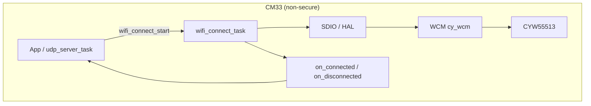
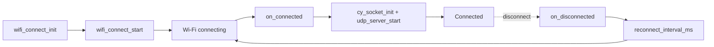
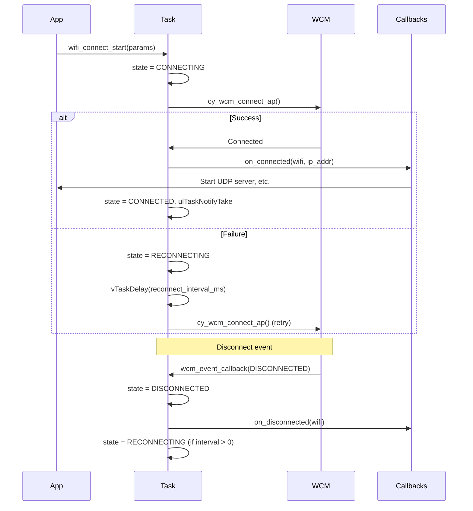

# Wi-Fi Connect Module – User Manual

**Author:** Asst. Prof. Santi Nuratch, Ph.D  
**Organization:** Thailand Embedded Systems Association (TESA)  
**Version:** 1.0  
**Target:** PSoC Edge E84, CM33 (non-secure), CYW55513 Wi-Fi

---

## 1. Overview

The Wi-Fi connect module runs on the CM33 (non-secure) core and provides a task-based API to connect to a Wi-Fi access point (AP), manage the connection lifecycle, and handle automatic reconnection. It wraps the ModusToolbox Wi-Fi Connection Manager (WCM) and performs SDIO initialization for the CYW55513 Wi-Fi module before WCM. Event-driven callbacks notify the application when connected or disconnected so network services (e.g. UDP server) can be started or stopped.

---

## 2. Features

- **SDIO init** – Initializes SDIO interface for CYW55513 before WCM (required for this platform).
- **Event-driven** – Callbacks for `on_connected` and `on_disconnected` events.
- **Reconnection** – Configurable retry interval for automatic reconnection when disconnected.
- **FreeRTOS task** – Runs connection logic in a dedicated task; blocks on task notifications.
- **DHCP support** – Uses DHCP by default; static IP can be configured via `wifi_connect_params_t.ip_setting`.

---

## 3. Dependencies

- **FreeRTOS** – Task and notifications (`xTaskNotifyGive` / `ulTaskNotifyTake`).
- **ModusToolbox WCM (cy_wcm)** – Wi-Fi connect and event APIs.
- **BSP** – SDIO and GPIO for Wi-Fi (e.g. `CYBSP_WIFI_SDIO_*`, `CYBSP_WIFI_HOST_WAKE_*`, `CYBSP_WIFI_WL_REG_ON_*`).
- **Libraries** – `wifi-core-freertos-lwip-mbedtls`, `cybsp`, `mtb_hal_sdio`, `mtb_hal_gpio`.

---

## 4. Hardware Configuration

The module supports PSoC Edge E84 with CYW55513 Wi-Fi via SDIO. BSP must define:

| Symbol | Description |
|--------|-------------|
| CYBSP_WIFI_SDIO_* | SDIO host and HAL config |
| CYBSP_WIFI_HOST_WAKE_* | Host wake GPIO and IRQ |
| CYBSP_WIFI_WL_REG_ON_* | WL REG ON power control GPIO |



---

## 5. Integration

### 5.1 Using in Another Project

To use this module in a **new** ModusToolbox project (e.g. a different PSoC Edge application):

**Step 1: Copy the module**

Copy the entire `wifi_connect` folder to your project's `modules` directory:

```
your_project/proj_cm33_ns/
├── modules/
│   └── wifi_connect/        ← Copy this folder
│       ├── wifi_connect.c
│       ├── wifi_connect.h
│       └── WIFI_CONNECT.md
├── Makefile
└── ...
```

If `modules` does not exist, create it under your CM33 (non-secure) project directory.

**Step 2: Modify the Makefile**

Edit the Makefile in your CM33 project (e.g. `proj_cm33_ns/Makefile`). Add:

```makefile
SOURCES+= modules/wifi_connect/wifi_connect.c
INCLUDES+= modules/wifi_connect
```

**Step 3: Ensure COMPONENTS**

Add these to `COMPONENTS` if not already present:

```makefile
COMPONENTS+= FREERTOS LWIP MBEDTLS RTOS_AWARE
```

**Step 4: Add DEFINES**

Add Wi-Fi-related defines:

```makefile
DEFINES+= CYBSP_WIFI_CAPABLE
```

**Step 5: Add Wi-Fi library dependency**

Ensure your project includes `wifi-core-freertos-lwip-mbedtls` (or equivalent). In ModusToolbox, add the library via the library manager or create a `deps/wifi-core-freertos-lwip-mbedtls.mtb` file with the appropriate URI.

**Step 6: Verify BSP**

Your target BSP must support CYW55513 Wi-Fi over SDIO. It must define:

- `CYBSP_WIFI_SDIO_*`, `CYBSP_WIFI_HOST_WAKE_*`, `CYBSP_WIFI_WL_REG_ON_*`

Supported platforms: PSoC Edge E84 with CYW55513 (e.g. APP_KIT_PSE84_EVAL_EPC2).

**Step 7: Add application code**

Include the header, initialize, set callbacks, and start. See 5.2 and 5.3 for init order and example.

---

### 5.2 Makefile (this project)

The Wi-Fi connect module lives in `proj_cm33_ns/modules/wifi_connect/`: implementation in `wifi_connect.c`, public API in `wifi_connect.h`.

**SOURCES** – Add the module implementation:

```makefile
SOURCES+= modules/wifi_connect/wifi_connect.c
```

**INCLUDES** – Add the module directory so the compiler finds `wifi_connect.h`:

```makefile
INCLUDES+= modules/wifi_connect
```

**COMPONENTS** – Ensure Wi-Fi and related components are enabled (e.g. `FREERTOS`, `LWIP`, `MBEDTLS`). The project typically uses `wifi-core-freertos-lwip-mbedtls`.

### 5.3 Initialization (typical in `udp_server_task`)

1. Fill `wifi_connect_config_t` with `reconnect_interval_ms`.
2. Fill `wifi_connect_callbacks_t` with `on_connected`, `on_disconnected`, and `user_ctx`.
3. Call `wifi_connect_init(&wifi, &config, &callbacks)`.
4. Fill `wifi_connect_params_t` with SSID, password, security, and IP settings (e.g. DHCP with zeroed `ip_setting`).
5. Call `wifi_connect_start(wifi, &params)`.

Example:

```c
#include "wifi_connect.h"
#include "udp_server_lib.h"

static wifi_connect_t *wifi_connect;
static wifi_connect_config_t wifi_connect_config;
static wifi_connect_callbacks_t wifi_connect_callbacks;

static void wifi_on_connected(wifi_connect_t *wifi,
                              const cy_wcm_ip_address_t *ip_addr,
                              void *user_ctx) {
  (void)wifi;
  (void)user_ctx;
  cy_socket_init();
  udp_server_start(&udp_server);
}

static void wifi_on_disconnected(wifi_connect_t *wifi, void *user_ctx) {
  (void)wifi;
  (void)user_ctx;
  udp_server_stop(&udp_server);
}

void app_init(void) {
  wifi_connect_config.reconnect_interval_ms = 10000;
  wifi_connect_callbacks.on_connected = wifi_on_connected;
  wifi_connect_callbacks.on_disconnected = wifi_on_disconnected;
  wifi_connect_callbacks.user_ctx = NULL;

  wifi_connect_init(&wifi_connect, &wifi_connect_config, &wifi_connect_callbacks);

  wifi_connect_params_t params;
  strncpy(params.ssid, "MyNetwork", sizeof(params.ssid));
  strncpy(params.password, "MyPassword", sizeof(params.password));
  params.security = CY_WCM_SECURITY_WPA2_AES_PSK;
  memset(&params.ip_setting, 0, sizeof(params.ip_setting));  /* DHCP */

  wifi_connect_start(wifi_connect, &params);
}
```

### 5.4 Init order

1. `wifi_connect_init()` must be called before `wifi_connect_start()`.
2. `wifi_connect_start()` triggers the connection sequence; `on_connected` is invoked when connected.
3. In `on_connected`, call `cy_socket_init()` and start network services (e.g. `udp_server_start()`).
4. On disconnect, `on_disconnected` runs; reconnection is automatic if `reconnect_interval_ms > 0`.



### 5.5 Internal: SDIO Initialization

The module performs SDIO setup before `cy_wcm_init()`:

- SDIO interrupt and HAL configuration
- SD Host enable, init, 4-bit bus width
- GPIO setup for WL REG ON and HOST WAKE
- Host wake interrupt registration
- Deep sleep callback (when `CY_CFG_PWR_SYS_IDLE_MODE == CY_CFG_PWR_MODE_DEEPSLEEP`)

Without this, `cy_wcm_init()` would hang because the WCM has no way to talk to the CYW55513 over SDIO.

---

## 6. Architecture

The module runs as a single FreeRTOS task that blocks on a task notification. The state machine: IDLE → CONNECTING → CONNECTED (or RECONNECTING on failure). Disconnect events from WCM trigger DISCONNECTED; if `reconnect_interval_ms > 0`, the task delays and transitions back to CONNECTING.



---

## 7. API Reference

### 7.1 Lifecycle

| Function | Description |
|----------|-------------|
| `wifi_connect_init(wifi, config, callbacks)` | Allocates handle, performs SDIO init, `cy_wcm_init()`, registers WCM event callback, creates task. Returns `CY_RSLT_SUCCESS` on success. |
| `wifi_connect_start(wifi, params)` | Copies params, sets state to CONNECTING, notifies task. Task runs `cy_wcm_connect_ap()`. |
| `wifi_connect_stop(wifi)` | Calls `cy_wcm_disconnect_ap()`, sets state to IDLE. |
| `wifi_connect_deinit(wifi)` | Deletes task, deregisters WCM callback, `cy_wcm_deinit()`, frees handle. |

### 7.2 Status

| Function | Description |
|----------|-------------|
| `wifi_connect_is_connected(wifi)` | Returns `true` if state is CONNECTED. |

---

## 8. Types

### 8.1 wifi_connect_config_t

| Field | Type | Description |
|-------|------|-------------|
| reconnect_interval_ms | uint32_t | Delay in ms before retrying connection after disconnect or failure. Use 0 to disable auto-reconnect. When used by `wifi_manager`, this is set to 5000 ms. |

### 8.2 wifi_connect_callbacks_t

| Field | Type | Description |
|-------|------|-------------|
| on_connected | wifi_connect_on_connected_t | Called when connected; receives `wifi`, `ip_addr`, `user_ctx`. |
| on_disconnected | wifi_connect_on_disconnected_t | Called when disconnected; receives `wifi`, `user_ctx`. |
| user_ctx | void * | Passed to all callbacks. |

### 8.3 wifi_connect_params_t

| Field | Type | Description |
|-------|------|-------------|
| ssid | char[33] | SSID of the AP. |
| password | char[65] | Passphrase. |
| security | cy_wcm_security_t | Security type (e.g. `CY_WCM_SECURITY_WPA2_AES_PSK`). |
| ip_setting | cy_wcm_ip_setting_t | Static IP or zero for DHCP. |

### 8.4 wifi_connect_t

Opaque handle for the Wi-Fi connect instance. Allocated by `wifi_connect_init()`.

---

## 9. Usage Examples

**Connect with DHCP:**

```c
wifi_connect_params_t params;
strncpy(params.ssid, "TERNION", sizeof(params.ssid));
strncpy(params.password, "secret", sizeof(params.password));
params.security = CY_WCM_SECURITY_WPA2_AES_PSK;
memset(&params.ip_setting, 0, sizeof(params.ip_setting));
wifi_connect_start(wifi, &params);
```

**Disable auto-reconnect:**

```c
wifi_connect_config.reconnect_interval_ms = 0;
wifi_connect_init(&wifi, &wifi_connect_config, &callbacks);
```

**Check connection status:**

```c
if (wifi_connect_is_connected(wifi)) {
  printf("Connected\n");
}
```

---

## 10. Limits and Notes

- **Platform:** PSoC Edge E84 with CYW55513 Wi-Fi (SDIO). Other platforms may require different SDIO/init sequence.
- **SDIO init:** Must be performed before `cy_wcm_init()`; the module does this automatically in `wifi_connect_init()`.
- **WCM config:** The module sets `wcm_config.wifi_interface_instance = &sdio_instance` for CYW55513.
- **Reconnect:** When `reconnect_interval_ms > 0`, the task retries connection after disconnect or failure.
- **Thread safety:** `wifi_connect_start`, `wifi_connect_stop` are intended to be called from a single context (e.g. main task). Callbacks run in the wifi_connect task context.
- **Files:** `wifi_connect.c` – Implementation; `wifi_connect.h` – Public API; `WIFI_CONNECT.md` – This document.
