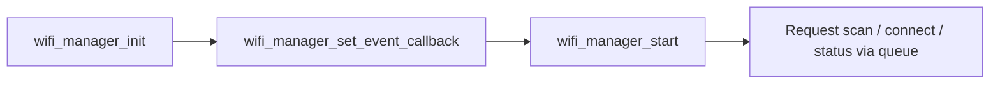
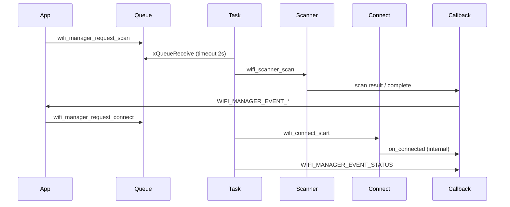

# Wi-Fi Manager Module – User Manual

**Author:** Asst. Prof. Santi Nuratch, Ph.D  
**Organization:** Thailand Embedded Systems Association (TESA)  
**Target:** PSoC Edge E84, CM33 (non-secure)

---

## 1. Overview

The Wi-Fi manager module runs on the CM33 (non-secure) core and coordinates Wi-Fi scanning and connection. It exposes a command-queue API for scan, connect, disconnect, and status requests; uses `wifi_scanner` for scans and `wifi_connect` for connections; and delivers events (scan results, scan complete, status) via a single callback. Status is polled periodically when idle. Designed for integration with the IPC pipe so CM55 can drive Wi-Fi from the UI.

---

## 2. Features

- **Command queue** – Scan, connect, disconnect, and status requests are queued and processed by a dedicated manager task.
- **Unified callback** – One callback receives `WIFI_MANAGER_EVENT_SCAN_RESULT`, `WIFI_MANAGER_EVENT_SCAN_COMPLETE`, or `WIFI_MANAGER_EVENT_STATUS` with typed data.
- **Lazy wifi_connect** – `wifi_connect` handle is created on first connect request; reconnect interval is 5000 ms.
- **Scan blocking** – Scan requests fail if already connected; status reflects `IPC_WIFI_REASON_SCAN_BLOCKED_CONNECTED`.
- **Status polling** – When no command is received for `WIFI_MANAGER_STATUS_POLL_MS` (2000 ms), the task emits current status (e.g. RSSI update).
- **Idempotent start** – `wifi_manager_start()` creates the task and sets up the scanner; subsequent calls return true without re-initializing.

---

## 3. Dependencies

- **FreeRTOS** – Queue and task.
- **wifi_scanner** – `wifi_scanner_setup`, `wifi_scanner_on_scan_complete`, `wifi_scanner_scan`.
- **wifi_connect** – `wifi_connect_init`, `wifi_connect_start`, `wifi_connect_stop`.
- **ipc_communication.h** – `ipc_wifi_scan_request_t`, `ipc_wifi_connect_request_t`, `ipc_wifi_status_t`, `ipc_wifi_scan_complete_t`, `ipc_wifi_link_state_t`, `ipc_wifi_reason_t`.
- **wifi_scanner_types.h** – `wifi_info_t`, `wifi_scanner_config_t`.

---

## 4. Integration

### 4.1 Makefile

The Wi-Fi manager module lives in `proj_cm33_ns/modules/wifi_manager/`.

**SOURCES** – Add the implementation:

```makefile
SOURCES += modules/wifi_manager/wifi_manager.c
```

**INCLUDES** – Add the module directory:

```makefile
INCLUDES += modules/wifi_manager
```

Ensure `wifi_scanner`, `wifi_connect`, and `ipc_communication.h` are on the include path and linked.

### 4.2 Initialization

1. Call `wifi_manager_init()` before `wifi_manager_start()`.
2. Call `wifi_manager_set_event_callback()` to register the event handler.
3. Call `wifi_manager_start()` to create the task and scanner.

Example:

```c
#include "wifi_manager.h"

static void on_wifi_manager_event(wifi_manager_event_t event, const void *data, uint32_t count, void *user_data) {
  switch (event) {
  case WIFI_MANAGER_EVENT_SCAN_RESULT:
    /* data = wifi_info_t[], count = n */
    break;
  case WIFI_MANAGER_EVENT_SCAN_COMPLETE:
    /* data = ipc_wifi_scan_complete_t */
    break;
  case WIFI_MANAGER_EVENT_STATUS:
    /* data = ipc_wifi_status_t */
    break;
  default:
    break;
  }
}

void app_init(void) {
  wifi_manager_init();
  wifi_manager_set_event_callback(on_wifi_manager_event, NULL);
  if (!wifi_manager_start()) {
    handle_error(NULL);
  }
}
```

### 4.3 Init order



---

## 5. Architecture

The manager runs a single FreeRTOS task that blocks on the command queue with a timeout. When a command arrives, it handles scan, connect, disconnect, or status; when the timeout fires (no command), it updates RSSI (if connected) and emits status. Wi-Fi scanner and connect are used as submodules; the connect handle is created lazily on first connect request.



---

## 6. API Reference

### 6.1 Lifecycle

| Function | Description |
|----------|-------------|
| `wifi_manager_init()` | Initializes internal state. Call before start. Returns true. |
| `wifi_manager_start()` | Creates manager task and scanner. Idempotent. Returns true on success. |
| `wifi_manager_set_event_callback(callback, user_data)` | Registers event callback; replaces previous. Returns true. |

### 6.2 Requests (queued)

| Function | Description |
|----------|-------------|
| `wifi_manager_request_scan(request)` | Queues scan request. Fails if connected. Returns true if queued. |
| `wifi_manager_request_connect(request)` | Queues connect request. Returns true if queued. |
| `wifi_manager_request_disconnect()` | Queues disconnect request. Returns true if queued. |
| `wifi_manager_request_status()` | Queues status request; callback receives current status. Returns true if queued. |

---

## 7. Types

### 7.1 wifi_manager_event_t

| Value | Name | Data |
|-------|------|------|
| 0 | WIFI_MANAGER_EVENT_SCAN_RESULT | `wifi_info_t[]`, count = n |
| 1 | WIFI_MANAGER_EVENT_SCAN_COMPLETE | `ipc_wifi_scan_complete_t` |
| 2 | WIFI_MANAGER_EVENT_STATUS | `ipc_wifi_status_t` |

### 7.2 wifi_manager_event_cb_t

```c
typedef void (*wifi_manager_event_cb_t)(wifi_manager_event_t event, const void *data, uint32_t count, void *user_data);
```

---

## 8. Usage Examples

**Request scan:**

```c
ipc_wifi_scan_request_t req = {0};
req.use_filter = 0;
wifi_manager_request_scan(&req);
```

**Request connect:**

```c
ipc_wifi_connect_request_t req = {0};
strncpy(req.ssid, "MyNetwork", sizeof(req.ssid) - 1);
strncpy(req.password, "secret", sizeof(req.password) - 1);
req.security = (uint8_t)CY_WCM_SECURITY_WPA2_AES_PSK;
wifi_manager_request_connect(&req);
```

**Request status:**

```c
wifi_manager_request_status();
```

**Disconnect:**

```c
wifi_manager_request_disconnect();
```

---

## 9. Limits and Notes

- **Scan when connected** – Scan requests return false and status reason is `IPC_WIFI_REASON_SCAN_BLOCKED_CONNECTED` when already connected.
- **Reconnect interval** – `wifi_connect` is configured with `reconnect_interval_ms = 5000` (WIFI_MANAGER_RECONNECT_MS).
- **Thread safety** – Request APIs are intended to be called from a single context (e.g. IPC task); callback runs in manager task context.
- **Files:** `wifi_manager.c` – Implementation; `wifi_manager.h` – Public API; `WIFI_MANAGER.md` – This document.
