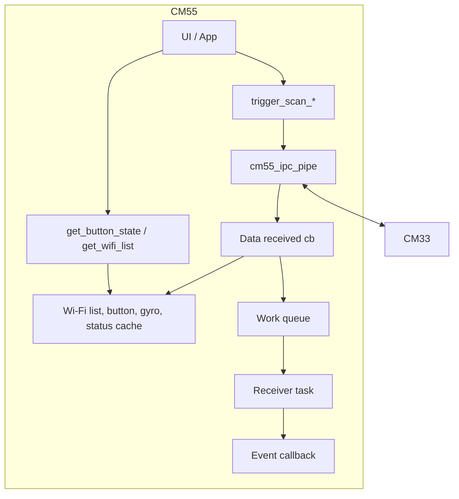
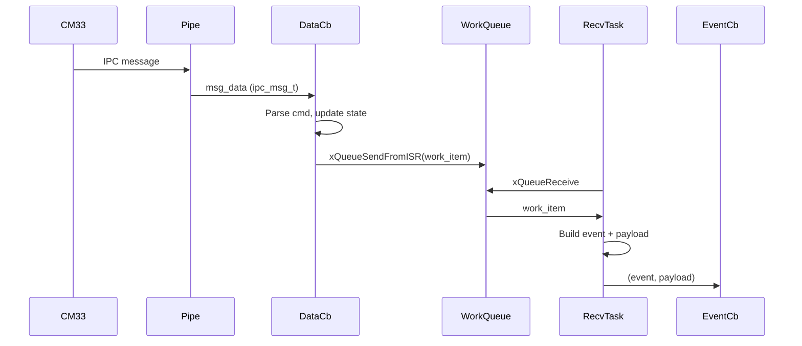

# CM55 IPC App Module – User Manual

**Author:** Asst. Prof. Santi Nuratch, Ph.D  
**Organization:** Thailand Embedded Systems Association (TESA)

---

## 1. Overview

The CM55 IPC app module runs on the CM55 core and provides the application layer on top of the CM55 IPC pipe. It registers as the pipe’s data-received callback, parses incoming IPC messages (Wi-Fi scan results, button events, gyro, Wi-Fi status), updates internal state, and pushes work items to a FreeRTOS work queue. A receiver task dequeues work items and dispatches typed events to an internal event callback. The module also exposes a public API to trigger Wi-Fi scans/connect/disconnect/status requests on CM33 and to read current button/Wi-Fi state from CM55.

---

## 2. Features

- **Typed events** – Incoming IPC is translated into events: `CM55_IPC_EVENT_GYRO`, `CM55_IPC_EVENT_WIFI_STATUS`, `CM55_IPC_EVENT_WIFI_COMPLETE`, `CM55_IPC_EVENT_BUTTON` (plus legacy log event type in API), with a union payload type.
- **Wi-Fi list** – Maintains a local list of up to `CM55_IPC_PIPE_WIFI_LIST_MAX` (32) entries; `cm55_get_wifi_list()` copies results and clears the ready flag. Scan is triggered via `cm55_trigger_scan_all()` or `cm55_trigger_scan_ssid(ssid)`.
- **Button state** – Caches press count and pressed state per button; `cm55_get_button_state()` returns current values.
- **Gyro and Wi-Fi status** – Caches latest gyro sample/sequence and latest Wi-Fi link status.
- **One-time init** – `cm55_ipc_app_init()` starts the pipe (default config), creates log and work queues, starts the pipe with the app’s data callback, and creates the receiver task. Call before any trigger/get API.
- **Pipe dependency** – Depends on the CM55 IPC pipe module; init starts the pipe and registers the app’s callback.

---

## 3. Dependencies

- **FreeRTOS** – Queues and task for receiver and work items.
- **cm55_ipc_pipe** – Pipe init, start, push_request; app registers as data-received callback and uses `CM55_IPC_PIPE_WIFI_LIST_MAX`, `CM55_IPC_PIPE_VALUE_*` for unpacking.
- **ipc_communication.h** – `ipc_msg_t`, `IPC_CMD_*`, `IPC_DATA_MAX_LEN`, `gyro_data_t`.
- **wifi_scanner_types.h** – `wifi_info_t`, `wifi_filter_config_t`, `WIFI_FILTER_MODE_*`, `WIFI_SSID_MAX_LEN`.
- **user_buttons_types.h** – `BUTTON_ID_MAX`, `button_event_t`.

---

## 4. Architecture

Data flow: CM33 sends IPC messages → pipe invokes app’s data-received callback in ISR context → callback parses `ipc_msg_t` (Wi-Fi result/status events, button events, gyro), updates state (Wi-Fi list, button, gyro, Wi-Fi status) and pushes work items via `xQueueSendFromISR` → receiver task receives work items, builds typed event + payload, invokes internal event callback. Trigger flow: app calls `cm55_trigger_scan_all()`, `cm55_trigger_scan_ssid()`, `cm55_trigger_connect()`, `cm55_trigger_disconnect()`, or `cm55_trigger_status_request()` → `cm55_ipc_pipe_push_request(...)` → pipe sender task sends to CM33.





---

## 5. Integration

### 5.1 Makefile

The module lives in the CM55 project tree: `proj_cm55/modules/cm55_ipc_app/` (header and source). The CM55 Makefile already includes it and the pipe module:

```makefile
SOURCES += modules/cm55_ipc_pipe/cm55_ipc_pipe.c
SOURCES += modules/cm55_ipc_app/cm55_ipc_app.c
INCLUDES += modules/cm55_ipc_pipe
INCLUDES += modules/cm55_ipc_app
```

Ensure shared includes (e.g. `ipc_communication.h`, `wifi_scanner_types.h`, `user_buttons_types.h`) are on the include path.

### 5.2 Initialization (typical in main.c)

Call `cm55_ipc_app_init()` once before using trigger or get APIs. It initializes the pipe with default config, creates log and work queues, starts the pipe with the app’s data callback, and creates the receiver task.

```c
#include "cm55_ipc_app.h"

void main(void) {
  /* ... other init ... */
  if (!cm55_ipc_app_init()) {
    /* handle failure */
  }
  /* Now use cm55_trigger_scan_all(), cm55_get_wifi_list(), etc. */
}
```

### 5.3 Init order

- Call `cm55_ipc_app_init()` before `cm55_trigger_scan_all()`, `cm55_trigger_scan_ssid()`, `cm55_get_button_state()`, or `cm55_get_wifi_list()`.
- The app starts the pipe internally; do not call `cm55_ipc_pipe_start()` separately for the normal app flow.

### 5.4 Wi-Fi list consumption

`cm55_get_wifi_list()` clears the internal “ready” flag after copying. For one scan completion, call it once when you need the list; subsequent calls return false until the next scan completes.

---

## 6. API Reference

### 6.1 Lifecycle

| Function | Description |
|----------|-------------|
| `cm55_ipc_app_init()` | One-time init: starts pipe with default config, creates log and work queues, starts pipe with data callback, creates receiver task. Returns false on any failure. Call before trigger/get API. |

### 6.2 Wi-Fi scan trigger

| Function | Description |
|----------|-------------|
| `cm55_trigger_scan_all()` | Requests full Wi-Fi scan on CM33 (no SSID filter). Sends request via pipe; results arrive as CM55_IPC_EVENT_WIFI_COMPLETE. |
| `cm55_trigger_scan_ssid(ssid)` | Requests Wi-Fi scan filtered by SSID on CM33. ssid may be NULL. Results arrive as CM55_IPC_EVENT_WIFI_COMPLETE. |

### 6.3 Getters

| Function | Description |
|----------|-------------|
| `cm55_get_button_state(button_id, press_count, is_pressed)` | Returns cached button state. press_count and is_pressed may be NULL. Returns false if button_id invalid. |
| `cm55_get_wifi_list(out_list, max_count, out_count)` | Copies up to max_count scan results into out_list and sets out_count. Clears ready flag. Returns false if scan not ready or args invalid. |

---

## 7. Types

### 7.1 cm55_ipc_event_t

| Value | Name | Description |
|-------|------|-------------|
| CM55_IPC_EVENT_LOG | 0 | Legacy log event type (kept for API compatibility). |
| CM55_IPC_EVENT_GYRO | 1 | Gyro update; payload.gyro valid. |
| CM55_IPC_EVENT_WIFI_STATUS | 2 | Wi-Fi link/status update; payload.wifi_status valid. |
| CM55_IPC_EVENT_WIFI_COMPLETE | 3 | Wi-Fi scan complete; payload.wifi_complete valid. |
| CM55_IPC_EVENT_BUTTON | 4 | Button event; payload.button valid. |

### 7.2 Payload structs

| Type | Description |
|------|-------------|
| cm55_ipc_payload_log_t | `const char *text` – legacy payload type (may be unused). |
| cm55_ipc_payload_gyro_t | `const gyro_data_t *data`, `uint32_t sequence` – gyro sample and sequence. |
| cm55_ipc_payload_wifi_complete_t | `const wifi_info_t *list`, `uint32_t count` – scan results; valid when count > 0. |
| cm55_ipc_payload_button_t | `uint32_t button_id`, `uint32_t press_count`, `bool is_pressed`. |

### 7.3 cm55_ipc_event_payload_t

Union of all payload structs; use with `cm55_ipc_event_t` to know which member is valid (log, gyro, wifi_complete, button).

### 7.4 cm55_ipc_event_cb_t

Callback type used internally by the receiver task when dispatching typed events (not registered by external code in the current design; the app uses a fixed internal handler).

```c
typedef void (*cm55_ipc_event_cb_t)(cm55_ipc_event_t event, const cm55_ipc_event_payload_t *payload, void *user_data);
```

---

## 8. Usage Examples

**Init and trigger full scan:**

```c
if (!cm55_ipc_app_init()) {
  return;
}
cm55_trigger_scan_all();
```

**Trigger scan by SSID:**

```c
cm55_trigger_scan_ssid("MY_NETWORK");
```

**Read Wi-Fi list after scan complete:**

```c
wifi_info_t list[32];
uint32_t count = 0U;
if (cm55_get_wifi_list(list, 32U, &count) && (count > 0U)) {
  /* use list[0..count-1] */
}
```

**Read button state:**

```c
uint32_t presses;
bool pressed;
if (cm55_get_button_state(BUTTON_ID_0, &presses, &pressed)) {
  /* use presses, pressed */
}
```

---

## 9. Limits and Notes

- **Wi-Fi list size:** Up to `CM55_IPC_PIPE_WIFI_LIST_MAX` (32) entries. `cm55_get_wifi_list()` clears the ready flag; call once per scan completion if you need the list.
- **Button IDs:** Valid `button_id` values are less than `BUTTON_ID_MAX` (from user_buttons_types.h).
- **Thread safety:** State (Wi-Fi list, button, gyro) is updated from the pipe’s data-received callback (ISR context) and read from task context via getters; the implementation uses volatile and queues for synchronization.
- **Event callback:** The internal event callback runs in the receiver task context; it is not configurable via the public API in the current design.
- **Pipe ownership:** The app starts and owns the pipe for the normal flow; do not start the pipe again elsewhere when using the app module.
