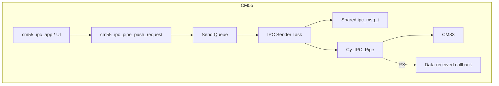
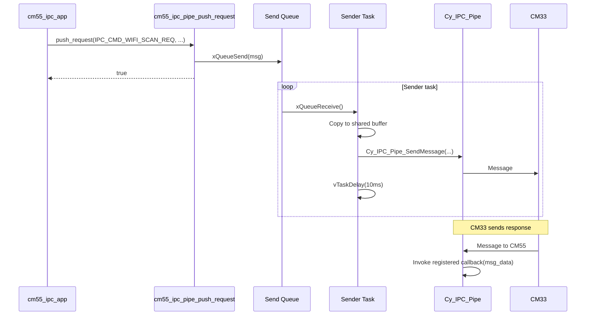
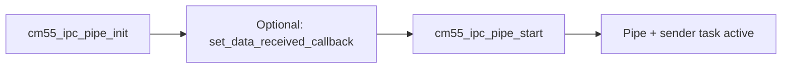

# CM55 IPC Pipe Module – User Manual

**Author:** Asst. Prof. Santi Nuratch, Ph.D  
**Organization:** Thailand Embedded Systems Association (TESA)

---

## 1. Overview

The CM55 IPC pipe module runs on the CM55 core and provides the IPC pipe communication path with CM33. It maintains a FreeRTOS send queue and a sender task that forwards requests (e.g. Wi-Fi scan, connect, disconnect, status) to CM33 via the PSoC IPC pipe. Incoming messages from CM33 are delivered via a single configurable callback that receives raw message data (e.g. Wi-Fi scan results, status, button events). The module is the CM55-side counterpart to the CM33 IPC pipe used for Wi-Fi manager, button state, and scan results.

---

## 2. Features

- **Send queue** – Outgoing requests to CM33 are enqueued; a dedicated sender task reads from the queue and sends via `Cy_IPC_Pipe_SendMessage` with retries and spacing.
- **Single data-received callback** – One callback is registered with the IPC pipe driver; it receives `uint32_t *msg_data` (the `msg_data` from `ipc_msg_t`) when CM33 sends to CM55.
- **Configurable** – Task stack, priority, send-queue length, and startup delay are set via `cm55_ipc_pipe_config_t` or `CM55_GET_CONFIG_DEFAULT()`.
- **Callback optional** – Callback can be passed to `cm55_ipc_pipe_start()` or set later with `cm55_ipc_pipe_set_data_received_callback()`; NULL uses a no-op so the pipe can run without a handler.
- **Init then start** – `cm55_ipc_pipe_init()` applies config; `cm55_ipc_pipe_start()` creates the queue, runs communication setup, waits `startup_delay_ms`, registers the callback, and creates the sender task. Must call init before start.
- **Push API** – `cm55_ipc_pipe_push_request(cmd, data, data_len)` enqueues a request; returns false if queue is full or not initialized. Data length is capped to `IPC_DATA_MAX_LEN`.

---

## 3. Dependencies

- **FreeRTOS** – Queue and task for the sender.
- **PDL / BSP** – `cy_syslib.h` for `Cy_SysLib_Delay`; `ipc_communication.h` for `ipc_msg_t`, command codes, `cm55_ipc_communication_setup()`, and pipe endpoint/client IDs.
- **cm55_fatal_error** – `cm55_handle_fatal_error()` on registration or task-create failure.
- **ipc_communication.h** – `IPC_CMD_*`, `IPC_DATA_MAX_LEN`, `ipc_msg_t`; shared with CM33.

---

## 4. Architecture

Outgoing path: application or other modules (e.g. cm55_ipc_app) call `cm55_ipc_pipe_push_request(cmd, data, data_len)`. The request is copied into an `ipc_msg_t` and sent to a FreeRTOS queue. The sender task blocks on the queue, and when a message is available it fills the shared `ipc_msg_t` buffer, calls `Cy_IPC_Pipe_SendMessage()` to CM33 (with retries and short delays), then yields. Incoming path: when CM33 sends to CM55, the IPC pipe driver invokes the registered callback with the received message data; the callback runs in driver/ISR context so it should be short and not block.





---

## 5. Integration

### 5.1 Makefile

The module lives in `proj_cm55/modules/cm55_ipc_pipe/` (cm55_ipc_pipe.c, cm55_ipc_pipe.h). The CM55 project must have access to `shared/include` for `ipc_communication.h` and to the cm55_fatal_error module.

- **INCLUDES** – Add the module and any shared/cm55_fatal_error paths:
  ```makefile
  INCLUDES += modules/cm55_ipc_pipe
  INCLUDES += modules/cm55_fatal_error
  INCLUDES += ../shared/include
  ```
- **SOURCES** – Add the implementation:
  ```makefile
  SOURCES += modules/cm55_ipc_pipe/cm55_ipc_pipe.c
  ```

### 5.2 Initialization (typical via cm55_ipc_app)

1. Call `cm55_ipc_pipe_init()` with a config pointer (or `CM55_GET_CONFIG_DEFAULT()`).
2. Optionally call `cm55_ipc_pipe_set_data_received_callback()` if the callback is not passed to start.
3. Call `cm55_ipc_pipe_start(cb)`. Pass the data-received callback, or NULL to use the one set earlier (or no-op). On failure the module may call `cm55_handle_fatal_error()` and return false; the caller should treat false as fatal.

Example (as used in cm55_ipc_app):

```c
#include "cm55_ipc_pipe.h"
#include "ipc_communication.h"

static void my_ipc_data_received(uint32_t *msg_data)
{
  (void)msg_data;
}

void app_ipc_init(void)
{
  cm55_ipc_pipe_init(&CM55_GET_CONFIG_DEFAULT());
  if (!cm55_ipc_pipe_start(my_ipc_data_received))
  {
    cm55_handle_fatal_error(NULL);
  }
}
```

### 5.3 Init order

1. `cm55_ipc_pipe_init(config)` – apply config (task stack, prio, queue length, startup delay).
2. Optionally `cm55_ipc_pipe_set_data_received_callback(cb)`.
3. `cm55_ipc_pipe_start(cb)` – create queue, run `cm55_ipc_communication_setup()`, delay `startup_delay_ms`, register callback with pipe, create sender task.



### 5.4 CM55 reception

Incoming IPC messages from CM33 are delivered in the registered callback. The callback receives `uint32_t *msg_data` (pointer into the IPC message data). The application must interpret `cmd`, `value`, and `data` according to `ipc_communication.h` (e.g. `IPC_EVT_WIFI_SCAN_RESULT`, `IPC_EVT_WIFI_SCAN_COMPLETE`, `IPC_EVT_WIFI_STATUS`, `IPC_CMD_BUTTON_EVENT`).

---

## 6. API Reference

### 6.1 Lifecycle

| Function | Description |
|----------|-------------|
| `cm55_ipc_pipe_init(const cm55_ipc_pipe_config_t *config)` | Applies config (task_stack, task_prio, send_queue_len, startup_delay_ms). NULL leaves defaults unchanged. Must be called before start. |
| `cm55_ipc_pipe_start(cm55_ipc_data_received_cb_t cb)` | Creates send queue, runs `cm55_ipc_communication_setup()`, delays startup_delay_ms, registers callback (or no-op if NULL), creates sender task. On failure cleans up queue and may call `cm55_handle_fatal_error()`. Returns false on failure, true on success. |

### 6.2 Callback

| Function | Description |
|----------|-------------|
| `cm55_ipc_pipe_set_data_received_callback(cm55_ipc_data_received_cb_t cb)` | Sets the callback used for received data. NULL allowed. Used when start is called without a callback argument. |

### 6.3 Sending

| Function | Description |
|----------|-------------|
| `cm55_ipc_pipe_push_request(uint32_t cmd, const void *data, uint32_t data_len)` | Enqueues a request to CM33. `cmd` from ipc_communication.h (e.g. IPC_CMD_WIFI_SCAN_REQ). `data` may be NULL when data_len is 0; otherwise copied (capped to IPC_DATA_MAX_LEN). Returns false if queue full or not initialized. |

---

## 7. Types

### 7.1 cm55_ipc_pipe_config_t

| Field | Type | Description |
|-------|------|-------------|
| task_stack | uint32_t | Stack size in words for the IPC sender task. |
| task_prio | uint32_t | FreeRTOS priority of the sender task. |
| send_queue_len | uint32_t | Length of the send queue (number of messages). |
| startup_delay_ms | uint32_t | Delay in ms after pipe setup, before registering callback (allows CM33/IPC to settle). |

### 7.2 CM55_GET_CONFIG_DEFAULT()

Macro that returns an initializer for `cm55_ipc_pipe_config_t` with default stack, priority, queue length, and startup delay (see header constants).

### 7.3 cm55_ipc_data_received_cb_t

Callback invoked when raw IPC message data is received; receives `msg_data` (pointer to message data from `ipc_msg_t`):

```c
typedef void (*cm55_ipc_data_received_cb_t)(uint32_t *msg_data);
```

### 7.4 Constants (from header)

| Constant | Value | Description |
|----------|-------|-------------|
| CM55_IPC_PIPE_WIFI_LIST_MAX | 32U | Max Wi-Fi entries in scan list (payload/local array). |
| CM55_IPC_PIPE_VALUE_INDEX_MASK | 0xFFFFU | Mask for lower 16 bits of packed value (index/count). |
| CM55_IPC_PIPE_VALUE_COUNT_SHIFT | 16U | Shift to get total count from upper 16 bits. |
| CM55_IPC_PIPE_TASK_STACK_DEFAULT | 1024U | Default sender task stack (words). |
| CM55_IPC_PIPE_TASK_PRIO_DEFAULT | 2U | Default sender task priority. |
| CM55_IPC_PIPE_SEND_QUEUE_LEN_DEFAULT | 10U | Default send queue length. |
| CM55_IPC_PIPE_STARTUP_DELAY_MS_DEFAULT | 50U | Default startup delay (ms). |

---

## 8. Usage Examples

**Default config and start with callback:**

```c
cm55_ipc_pipe_init(&CM55_GET_CONFIG_DEFAULT());
if (!cm55_ipc_pipe_start(my_data_received_cb))
{
  cm55_handle_fatal_error(NULL);
}
```

**Set callback before start (no argument to start):**

```c
cm55_ipc_pipe_init(&CM55_GET_CONFIG_DEFAULT());
cm55_ipc_pipe_set_data_received_callback(my_data_received_cb);
if (!cm55_ipc_pipe_start(NULL))
{
  cm55_handle_fatal_error(NULL);
}
```

**Push Wi-Fi scan request:**

```c
ipc_wifi_scan_request_t request = { .filter_mode = 0 };
(void)cm55_ipc_pipe_push_request(IPC_CMD_WIFI_SCAN_REQ, &request, sizeof(request));
```

**Push Wi-Fi status request (no payload):**

```c
(void)cm55_ipc_pipe_push_request(IPC_CMD_WIFI_STATUS_REQ, NULL, 0U);
```

---

## 9. Limits and Notes

- **Single callback** – Only one data-received callback is active; it is the one passed to `cm55_ipc_pipe_start()` or set via `cm55_ipc_pipe_set_data_received_callback()` before start.
- **Callback context** – The callback is invoked from the IPC pipe driver context (interrupt/callback context); keep it short and do not block. Defer heavy work to a task (e.g. post to queue or task notification).
- **Init order** – Call `cm55_ipc_pipe_init()` before `cm55_ipc_pipe_start()`. Ensure system/board and IPC communication setup dependencies are satisfied before start.
- **Payload lifetime** – Data passed to `cm55_ipc_pipe_push_request()` is copied into the queue; the sender task copies it again into the shared buffer for `Cy_IPC_Pipe_SendMessage`. No retention of caller’s buffer after push returns.
- **Queue full** – `cm55_ipc_pipe_push_request()` uses non-blocking send (timeout 0); if the queue is full it returns false. Size the queue via config if many requests are issued in bursts.
- **No stop API** – The module does not provide a stop or de-init; the sender task runs until the system stops.
