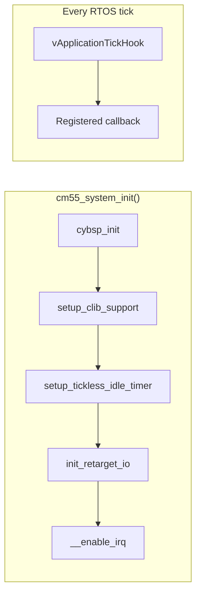
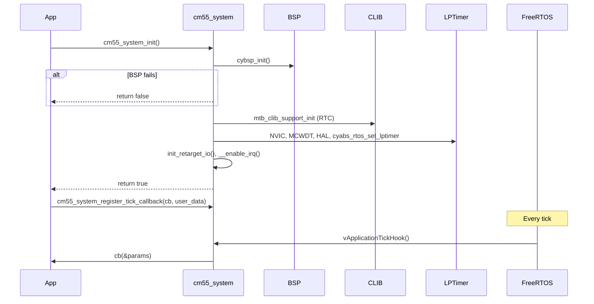

# CM55 System Module – User Manual

**Author:** Asst. Prof. Santi Nuratch, Ph.D  
**Organization:** Thailand Embedded Systems Association (TESA)

---

## 1. Overview

The CM55 system module runs on the Cortex-M55 core and provides a single-entry initialization for the application: BSP (board and device), ModusToolbox CLIB support (RTC-based time), LPTimer for FreeRTOS tickless idle, retarget I/O, and global interrupt enable. After init, the application can optionally register a tick hook callback that is invoked from the FreeRTOS tick hook (`vApplicationTickHook`) every RTOS tick, e.g. for display or periodic logic.

---

## 2. Features

- **Single init** – `cm55_system_init()` performs BSP, CLIB, LPTimer, retarget I/O, and `__enable_irq()` in a fixed order; returns `false` only if `cybsp_init()` fails.
- **Fatal on HAL failure** – If LPTimer or CLIB setup fails, the module calls `cm55_handle_fatal_error()` and does not return.
- **Optional tick hook** – `cm55_system_register_tick_callback(callback, user_data)` registers one callback; `vApplicationTickHook` invokes it each tick with `system_tick_hook_params_t` (tick count and user_data). NULL callback is allowed (no-op each tick).
- **Single hook** – Only one tick hook is stored; repeated calls to `cm55_system_register_tick_callback` overwrite the previous registration.

---

## 3. Dependencies

- **FreeRTOS** – `task.h` for `xTaskGetTickCountFromISR`; `vApplicationTickHook` is implemented by this module and must be the project’s tick hook.
- **BSP / PDL** – `cybsp.h`, `cy_syslib.h`, `cy_time.h`; BSP must define `CYBSP_CM55_LPTIMER_1_*` (IRQ, HW, config, hal_config) and RTC/CLIB symbols used by `mtb_clib_support_init`.
- **cyabs_rtos** – `cyabs_rtos.h`, `cyabs_rtos_set_lptimer()` for tickless idle.
- **cm55_fatal_error** – `cm55_handle_fatal_error()` on LPTimer/CLIB init failure.
- **retarget_io_init** – `init_retarget_io()` for stdio.
- **mtb_hal_rtc**, **mtb_hal_lptimer** – RTC and LPTimer HAL for CLIB and tickless idle.

---

## 4. Architecture

Initialization order is fixed: BSP first, then CLIB support (RTC), then LPTimer (NVIC, MCWDT, HAL, `cyabs_rtos_set_lptimer`), then retarget I/O, then global interrupt enable. The tick hook is not part of init; the application registers it after `cm55_system_init()` and before or after starting the scheduler. Each RTOS tick, FreeRTOS calls `vApplicationTickHook()`; the module invokes the registered callback with the current tick count and user_data.





---

## 5. Integration

### 5.1 Makefile

The module lives in `proj_cm55/modules/cm55_system/`. Add the source and include path:

```makefile
SOURCES += modules/cm55_system/cm55_system.c
INCLUDES += modules/cm55_system
```

### 5.2 Initialization

Call `cm55_system_init()` at the start of `main()` before creating tasks or starting the scheduler. If it returns `false`, treat as fatal (e.g. call `cm55_handle_fatal_error()`). Then optionally register the tick hook. Typical order: init system → register tick hook → init IPC/app → create tasks → start scheduler.

```c
#include "cm55_system.h"
#include "cm55_fatal_error.h"

static void my_tick_cb(const system_tick_hook_params_t *params)
{
  (void)params;
  /* e.g. display_tick(), periodic logic */
}

int main(void)
{
  if (!cm55_system_init())
  {
    cm55_handle_fatal_error(NULL);
  }
  cm55_system_register_tick_callback(my_tick_cb, NULL);
  /* ... rest of init and task creation ... */
  vTaskStartScheduler();
  return 0;
}
```

### 5.3 Init order

BSP must be initialized first so that LPTimer and RTC/CLIB resources are available. Do not call `cm55_system_init()` from a task; call it from `main()` before the scheduler starts.

---

## 6. API Reference

### 6.1 Lifecycle

| Function | Description |
|----------|-------------|
| `cm55_system_init()` | Performs BSP, CLIB, LPTimer, retarget I/O, enables IRQ. Returns `true` on success, `false` if `cybsp_init()` fails. On LPTimer/CLIB errors, calls `cm55_handle_fatal_error()` and does not return. |
| `cm55_system_register_tick_callback(callback, user_data)` | Sets the tick hook callback and user_data. Called from FreeRTOS tick hook each tick; NULL callback is allowed. Overwrites any previous registration. |

---

## 7. Types

### 7.1 system_tick_hook_params_t

| Field | Type | Description |
|-------|------|-------------|
| tick_count | uint32_t | Current RTOS tick count from `xTaskGetTickCountFromISR()`. |
| user_data | void * | Pointer passed to `cm55_system_register_tick_callback()`. |

### 7.2 system_tick_hook_cb_t

Callback type for the tick hook. Invoked from `vApplicationTickHook()` (interrupt context); must be short and avoid blocking.

```c
typedef void (*system_tick_hook_cb_t)(const system_tick_hook_params_t *params);
```

---

## 8. Usage Examples

**Minimal init and tick hook for display**

```c
static void display_tick_cb(const system_tick_hook_params_t *params)
{
  (void)params;
  display_controller_tick();
}

int main(void)
{
  if (!cm55_system_init())
  {
    cm55_handle_fatal_error(NULL);
  }
  cm55_system_register_tick_callback(display_tick_cb, NULL);
  /* ... */
}
```

**No tick hook**

Omit `cm55_system_register_tick_callback()` or pass NULL as callback; `vApplicationTickHook()` will do nothing each tick.

---

## 9. Limits and Notes

- **Single tick hook** – Only one callback is stored; registering again replaces the previous one.
- **Tick hook context** – The callback runs in interrupt context (tick hook); keep it short and do not block.
- **Init order** – Call `cm55_system_init()` once from `main()` before starting the scheduler; do not re-call after HAL is set up.
- **BSP** – The BSP must provide CM55 LPTimer and RTC/CLIB configuration; see your target’s BSP (e.g. TARGET_APP_KIT_PSE84_EVAL_EPC2).
