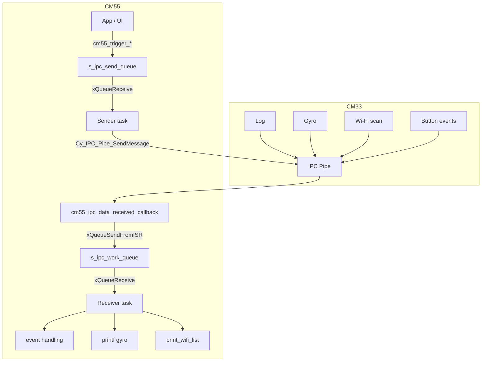
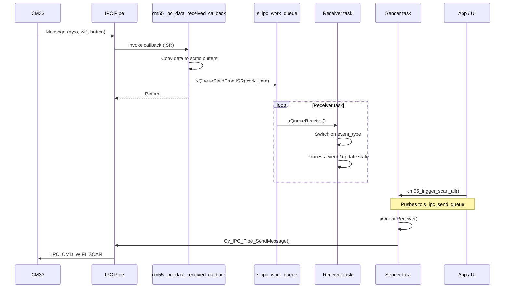

# CM55 IPC Pipe – User Manual

**Author:** Asst. Prof. Santi Nuratch, Ph.D  
**Organization:** Thailand Embedded Systems Association (TESA)

---

## 1. Overview

The CM55 IPC pipe module runs on the CM55 core and provides IPC communication with CM33. It receives gyro, Wi‑Fi scan/status, and button events from CM33 via a work queue; triggers Wi‑Fi requests on demand; and exposes button/Wi‑Fi state to the application (e.g. UI). It uses FreeRTOS queues and tasks for event-driven processing.

---

## 2. Features

- **Work queue pattern** – IPC callback runs in ISR context, pushes work items via `xQueueSendFromISR`; a dedicated receiver task processes events in task context.
- **Event types** – LOG, GYRO, WIFI_COMPLETE, BUTTON; each maps to an IPC command and receiver action.
- **Print forwarding to CM33** – CM55 stdout is routed by `_write()` over IPC (`IPC_CMD_PRINT`) so CM33 prints on UART.
- **Wi‑Fi scan** – `cm55_trigger_scan_all()` and `cm55_trigger_scan_ssid()` push scan requests to CM33 via a sender task.
- **Button and Wi‑Fi access** – `cm55_get_button_state()` and `cm55_get_wifi_list()` read data updated by the IPC callback.
- **Error handler** – CM55-specific `handle_error()` on fatal init failure; resources are cleaned up before invocation.

---

## 3. Dependencies

- **FreeRTOS** – Queues and tasks for receiver/sender.
- **ipc_communication.h** – `ipc_msg_t`, IPC command codes, endpoint addresses.
- **user_buttons_types.h** – `button_event_t`, `BUTTON_ID_MAX`.
- **wifi_scanner_types.h** – `wifi_info_t`, `wifi_filter_config_t`.
- **proj_cm55/modules/cm55_fatal_error** – `cm55_handle_fatal_error()` for fatal errors.

---

## 4. Architecture

The module uses a work queue pattern: the IPC callback runs in ISR context and pushes small work items; the receiver task blocks on the queue and processes events by type.





### 4.1 Event Types

| Event              | IPC Command           | Callback Action                                                   | Receiver Task Action   |
|--------------------|-----------------------|-------------------------------------------------------------------|------------------------|
| IPC_EVENT_LOG      | (legacy/not used)     | Reserved for backward compatibility                                | No-op |
| IPC_EVENT_GYRO     | IPC_CMD_GYRO          | Copy to s_gyro_data, push work item                               | Print gyro data        |
| IPC_EVENT_WIFI_COMPLETE | IPC_CMD_WIFI_SCAN (last) | Copy to s_wifi_list[], set s_wifi_list_ready, push work item | print_wifi_list()      |
| IPC_EVENT_BUTTON   | IPC_CMD_BUTTON_EVENT  | Copy to s_btn_*, push work item                                   | Reserved               |

### 4.2 Queues

| Queue              | Length | Item Type         | Purpose                     |
|--------------------|--------|-------------------|-----------------------------|
| s_ipc_work_queue   | 16     | ipc_work_item_t   | Event notifications         |
| s_log_queue        | 64     | app_log_msg_t     | Legacy/internal log buffer  |
| s_ipc_send_queue   | 10     | ipc_msg_t         | Outgoing commands to CM33   |

---

## 5. Integration

### 5.1 Makefile

The CM55 IPC pipe lives in `proj_cm55/modules/cm55_ipc_pipe/` (cm55_ipc_pipe.c, cm55_ipc_pipe.h). The fatal error handler is in `proj_cm55/modules/cm55_fatal_error/`.

- **INCLUDES** – Ensure `shared/include`, `modules/cm55_fatal_error`, and `modules/cm55_ipc_pipe` are on the path:
  ```makefile
  INCLUDES += ../shared/include
  INCLUDES += modules/cm55_fatal_error
  INCLUDES += modules/cm55_ipc_pipe
  ```
- **SOURCES** – Add the IPC pipe source and cm55_fatal_error:
  ```makefile
  SOURCES += modules/cm55_fatal_error/cm55_fatal_error.c
  SOURCES += modules/cm55_ipc_pipe/cm55_ipc_pipe.c
  ```

### 5.2 Initialization (typical in main.c)

Call `cm55_ipc_pipe_start()` once after board init. On failure it returns false or calls `cm55_handle_fatal_error()` (does not return).

```c
#include "cm55_ipc_pipe.h"

if (!cm55_ipc_pipe_start()) {
  cm55_handle_fatal_error("CM55 IPC pipe init failed");
}
```

### 5.3 Init Order

1. Board/BSP init (e.g. `cybsp_init()`).
2. Call `cm55_ipc_pipe_start()` to set up IPC and spawn tasks.


---

## 6. API Reference

### 6.1 Lifecycle

| Function | Description |
|----------|-------------|
| `cm55_ipc_pipe_start()` | Creates queues, registers IPC callback, spawns receiver and sender tasks. On failure, cleans up and calls `handle_error()`. Returns true on success. |

### 6.2 Wi‑Fi Scan

| Function | Description |
|----------|-------------|
| `cm55_trigger_scan_all()` | Triggers a Wi‑Fi scan with no SSID filter. Pushes IPC_CMD_WIFI_SCAN with WIFI_FILTER_MODE_NONE. |
| `cm55_trigger_scan_ssid(ssid)` | Triggers a Wi‑Fi scan filtered by the given SSID. `ssid` may be NULL. |

### 6.3 Data Access

| Function | Description |
|----------|-------------|
| `cm55_get_button_state(button_id, press_count, is_pressed)` | Returns the current state of a button. `press_count` and `is_pressed` may be NULL. Returns false if `button_id` is invalid. |
| `cm55_get_wifi_list(out_list, max_count, out_count)` | Copies up to `max_count` Wi‑Fi scan results into `out_list`; sets `out_count`. Clears `s_wifi_list_ready` after copy. Returns false if scan not ready or arguments invalid. |

---

## 7. Types

### 7.1 ipc_event_type_t (internal)

| Value | Name                   |
|-------|------------------------|
| 0     | IPC_EVENT_LOG          |
| 1     | IPC_EVENT_GYRO         |
| 2     | IPC_EVENT_WIFI_COMPLETE |
| 3     | IPC_EVENT_BUTTON       |

### 7.2 ipc_work_item_t (internal)

| Field       | Type    | Description                    |
|-------------|---------|--------------------------------|
| event_type  | uint8_t | One of ipc_event_type_t.       |
| reserved    | uint8_t | Reserved.                      |
| value       | uint16_t| Optional (e.g. total_count).   |

---

## 8. Usage Examples

**Trigger scan and read results:**

```c
cm55_trigger_scan_all();
Cy_SysLib_Delay(5000);
wifi_info_t list[32];
uint32_t count;
if (cm55_get_wifi_list(list, 32, &count)) {
  for (uint32_t i = 0; i < count; i++) {
    printf("SSID: %s, RSSI: %ld\n", list[i].ssid, (long)list[i].rssi);
  }
}
```

**Read button state:**

```c
uint32_t presses;
bool pressed;
if (cm55_get_button_state(BUTTON_ID_0, &presses, &pressed)) {
  printf("BTN1: pressed=%d, count=%lu\n", pressed, (unsigned long)presses);
}
```

**Trigger filtered scan:**

```c
cm55_trigger_scan_ssid("MY_NETWORK");
```

---

## 9. Limits and Notes

- **Queue sizes:** Work queue 16, log queue 64, send queue 10. Adjust macros if needed.
- **Thread safety:** The callback runs in ISR context; only `xQueueSendFromISR` and buffer copies are allowed. The receiver and sender tasks run in task context.
- **Wi‑Fi list consumption:** `cm55_get_wifi_list()` clears `s_wifi_list_ready`; call once per scan completion if you need the list.
- **Error handler:** Uses `proj_cm55/modules/cm55_fatal_error`; on init failure, resources are freed before `cm55_handle_fatal_error()` is called.
- **Sender throttling:** Sender task applies 100 ms delay after each send to avoid overwhelming the IPC hardware buffer.
