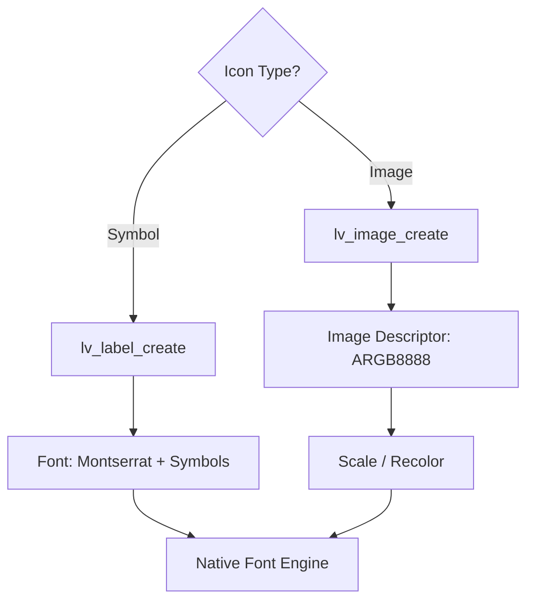
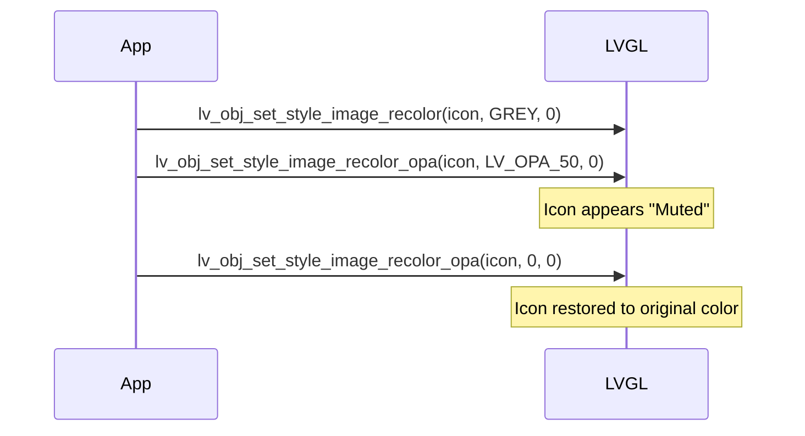

# LVGL Native Icons Rendering

This document explains the implementation and management of icons within the **PSoC8 CM55** UI subsystem. In LVGL 9.2.0, icons are handled either as monochromatic text symbols or as native image descriptors.

## How icons work

There are two primary ways to render icons in this project:

1.  **Symbol Fonts**: Lightweight, text-based icons (FontAwesome subset).
2.  **Native Images**: Bitmap-based assets (C arrays) with runtime scaling and recoloring support.

### Symbol-based icons (Text)

Symbols are characters from a specialized icon font. They are color-agnostic (tinted by the text color style) and consume minimal Flash space.

- **Related Code**: [`lv_symbol_def.h`](https://github.com/lvgl/lvgl/blob/master/src/lv_symbol_def.h)

```c
lv_obj_t * label = lv_label_create(parent);
lv_label_set_text(label, LV_SYMBOL_SETTINGS " Setup");
lv_obj_set_style_text_color(label, UI_COLOR_PRIMARY, 0); // Icons follow text color
```

### Image-based icons (Native UI)

For custom assets like logos or specific UI brands, we use the `lv_image` object. Unlike symbols, these can be multi-colored and transformed (scaled/rotated) natively.

- **Source Asset Example**: [`ui_img_healthcare_64x64_png.c`](../ui/widgets/ui_img_healthcare_64x64_png.c)

```c
extern const lv_image_dsc_t ui_img_healthcare_icon;

lv_obj_t * img = lv_image_create(parent);
lv_image_set_src(img, &ui_img_healthcare_icon);
```

## Quick usage recipe

1.  **Select Symbol**: Refer to the built-in icons in the [LVGL Documentation](https://docs.lvgl.io/master/widgets/label.html#symbols).
2.  **Apply Style**: Use naming conventions from [`ui_theme.h`](../ui/core/ui_theme.h).
3.  **Transform**: Use `lv_image_set_scale(obj, 128)` to shrink an image icon to 50%.

## Diagrams

### Rendering logic



### State Transformation (Active/Inactive)

This logic is implemented in [`examples.c: update_footer_buttons`](../ui/widgets/examples.c#L593).



## Symbol Reference

| Symbol Macro | Visual Representation | Purpose |
|--------------|-----------------------|---------|
| `LV_SYMBOL_OK` | Checkmark | Confirmation |
| `LV_SYMBOL_CLOSE` | Cross | Close/Cancel |
| `LV_SYMBOL_SETTINGS` | Gear | Configuration |
| `LV_SYMBOL_WIFI` | Signal bars | Connectivity status |
| `LV_SYMBOL_WARNING` | Triangle ! | Alerts and status |

## Reference

- [LVGL Symbol Documentation](https://docs.lvgl.io/master/widgets/label.html#symbols)
- [UI Layout Abstractions](../ui/README.md)
- [Project Theme Header](../ui/core/ui_theme.h)

---
*Last Updated: 2026-02-28*