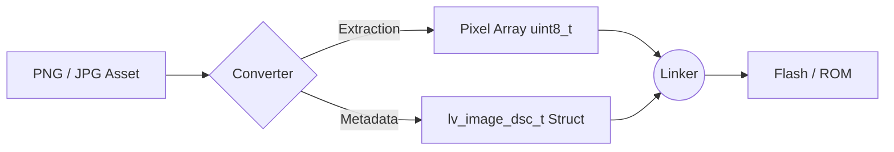
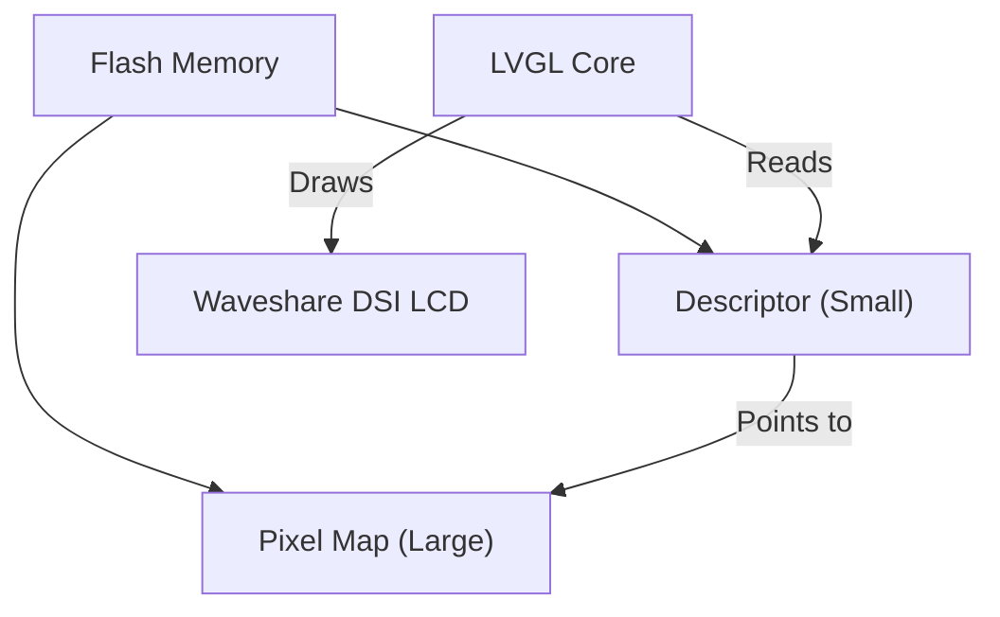

# Image to C-code Conversion

This document details how raw graphic assets (PNG, JPG) are converted into optimized C source code for the **PSoC8 CM55** platform using **LVGL 9.2.0**.

## How the conversion works

Embedded systems lack a standard file system or high-speed JPEG decoders. To render images smoothly, we convert them into **uncompressed pixel maps** (C Arrays) that reside in Flash memory.

1.  **Input**: A high-resolution PNG (with transparency).
2.  **Process**: Pixel values are extracted and arranged.
3.  **Output**: A `.c` file containing a `uint8_t` array and an `lv_image_dsc_t` structure.

- **Sample Converted Asset**: [`ui_img_healthcare_64x64_png.c`](../ui/widgets/ui_img_healthcare_64x64_png.c)

### LVGL-specific structures

Each converted image provides:

- **Pixel Map**: A `const uint8_t` array holding raw ARGB/RGB data.
- **Image Descriptor**: A structure defining the width, height, and color format so LVGL knows how to "read" the array.

```c
const lv_image_dsc_t my_asset_name = {
  .header.cf = LV_COLOR_FORMAT_ARGB8888, // 32-bit with Alpha
  .header.w = 64,  // Width
  .header.h = 64,  // Height
  .data_size = 64 * 64 * 4,
  .data = my_asset_pixel_map,
};
```

## Quick usage recipe

1.  **Format PNG**: Create your asset (e.g., `wifi_icon.png`).
2.  **Convert**: Use [LVGL Online Converter](https://lvgl.io/tools/imageconverter) or SquareLine Studio.
3.  **Deploy**: Add the `.c` file to [`src/ui/widgets/`](../ui/widgets/) or [`src/img_lv_demo/`](../img_lv_demo/).
4.  **Reference**:
    ```c
    extern const lv_image_dsc_t wifi_icon;
    lv_image_set_src(target_obj, &wifi_icon);
    ```

## Diagrams

### Conversion Pipeline



### Memory Mapping



## Conversion Reference

| Target Format | Memory Usage | Use Case |
|---------------|--------------|----------|
| **ARGB8888** | 4 bytes/px | High-quality icons with transparency |
| **RGB565** | 2 bytes/px | Full-screen background images (no alpha) |
| **I1 (Indexed)** | 1 bit/px | Very small monochrome symbols/masks |

## Reference

- [LVGL Image Converter Tool](https://lvgl.io/tools/imageconverter)
- [PSoC8 Main README](../../README.md)
- [UI Subsystem README](../ui/README.md)

---
*Last Updated: 2026-02-28*
