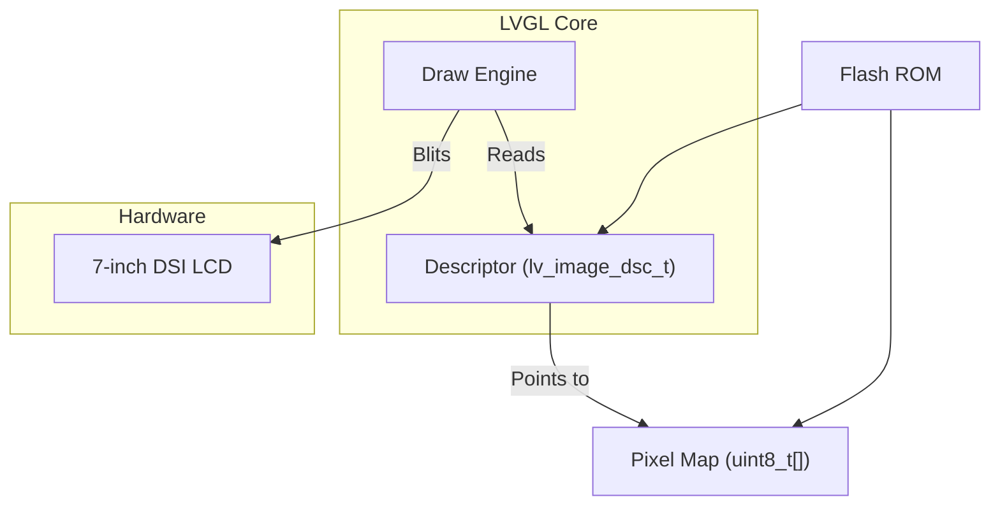
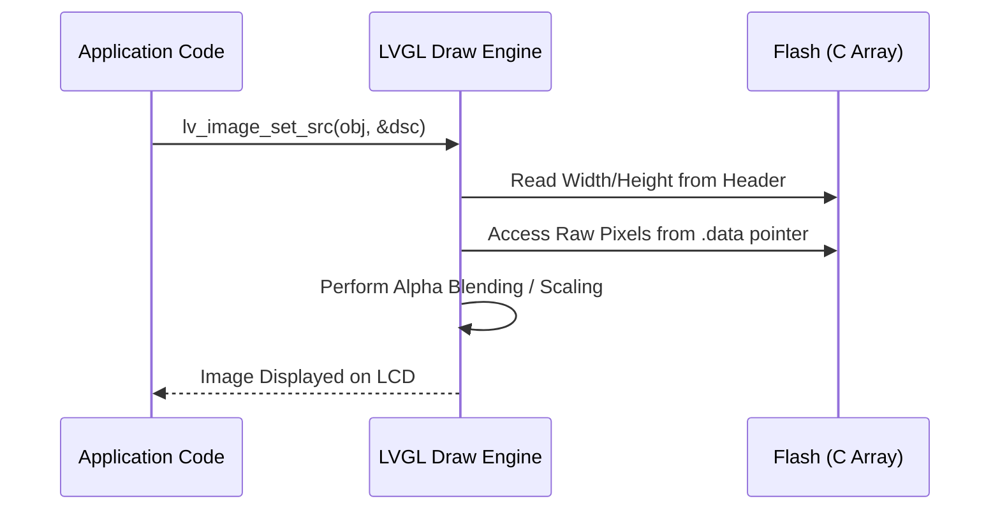

# Image-data (C array) Rendering

This document explains the technical details of rendering bitmap images directly from C arrays in **LVGL 9.2.0** for the **PSoC8 CM55** platform.

## How it works

Direct C-array rendering is the most performant way to display graphics in an embedded system. Instead of loading files from an SD card or Flash partition at runtime, the image data is compiled into the application binary as a `const` array.

### The Mechanism
1.  **Memory Residency**: The pixel data resides in the **Internal Flash (ROM)**.
2.  **Zero-overhead Access**: LVGL accesses the pixel values directly via pointers, avoiding any file system I/O or decompression buffers.
3.  **Draw Pipeline**: When `lv_image_set_src` is called with a pointer to an `lv_image_dsc_t`, LVGL's internal draw engine reads the memory address and blits the pixels to the frame buffer.

- **Example Asset**: [`ui_img_healthcare_64x64_png.c`](../ui/widgets/ui_img_healthcare_64x64_png.c)
- **Usage Example**: [`examples.c`](../ui/widgets/examples.c)

### Structure Breakdown
Each image asset is defined by two components in a `.c` file:

- **Pixel Array**: A `uint8_t` array containing the raw color data.
- **Image Descriptor**: An `lv_image_dsc_t` structure that holds the metadata (width, height, format, and magic number).

```c
const lv_image_dsc_t my_image = {
    .header.magic = LV_IMAGE_HEADER_MAGIC, // Identifies as LVGL image
    .header.cf = LV_COLOR_FORMAT_ARGB8888, // Color format
    .header.w = 64,                         // Width in pixels
    .header.h = 64,                         // Height in pixels
    .data_size = sizeof(my_image_data),    // Byte size
    .data = my_image_data                  // Pointer to raw data
};
```

## Quick usage recipe

1.  **Define Asset**: Ensure your `.c` file is included in the project's source list.
2.  **Declare Extern**: In your UI source code:
    ```c
    extern const lv_image_dsc_t ui_img_healthcare_64x64_png;
    ```
3.  **Render**:
    ```c
    lv_obj_t * img = lv_image_create(lv_screen_active());
    lv_image_set_src(img, &ui_img_healthcare_64x64_png);
    ```

## Diagrams

### Memory Flow



### Rendering Pipeline Logic



## Performance Tips

- **Pre-multiplying Alpha**: For `ARGB8888` images, ensure the alpha channel is pre-multiplied during conversion to save CPU cycles during blending.
- **Stride Alignment**: Ensure the data is aligned (usually 4 bytes) to allow the CPU to fetch data using word-sized instructions.
- **Avoid Runtime Scaling**: If memory allows, use different assets for different sizes instead of [`lv_image_set_scale`](https://docs.lvgl.io/master/widgets/image.html#scaling) for maximum sharpness and minimal CPU load.

## Reference

- [LVGL Image Basics](https://docs.lvgl.io/master/widgets/image.html)
- [UI Theme Definition](../ui/core/ui_theme.h)
- [PSoC8 Memory Map](../../README.md)

---
*Last Updated: 2026-02-28*