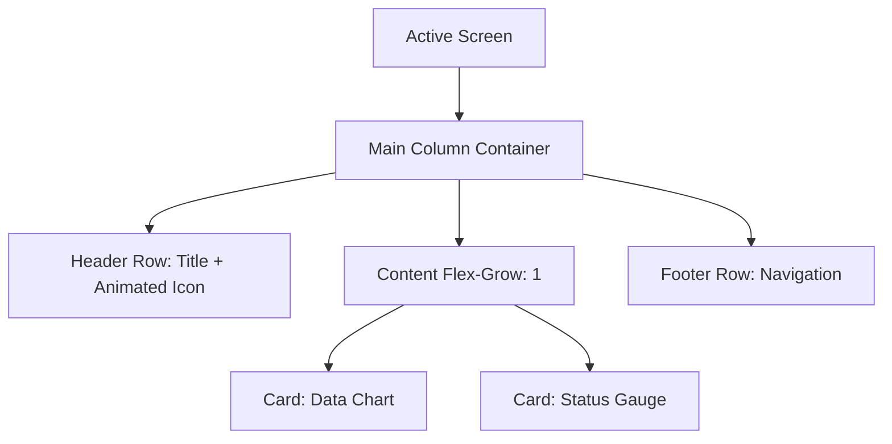
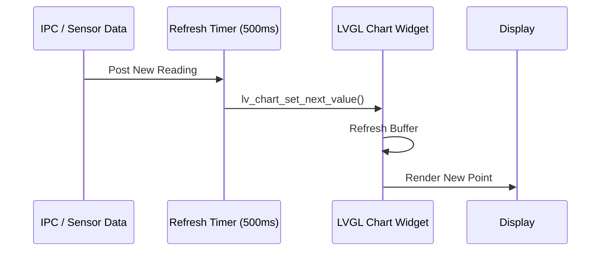

# Flex-based layout with animated Icons and chart/gauge indicators

This document describes how to build dynamic, responsive dashboards using **Flexbox** layouts, integrated with animated assets and real-time data visualization widgets in **LVGL 9.2.0**.

## How the layouts work

Instead of absolute positioning (X,Y), this project utilizes **Flexbox** (via [`ui_layout.h`](../ui/core/ui_layout.h)) to create fluid interfaces that adapt to content size and screen orientations.

1.  **Containers**: Logical groupings created with `ui_row()` or `ui_col()`.
2.  **Alignment**: Automatic centering, distribution (space-between), and wrapping.
3.  **Growing**: UI elements can "grow" to fill available space using `ui_flex_grow()`.

- **Implementation Source**: [`ui_layout.c`](../ui/core/ui_layout.c)

### Animated Icons

Animations add life to the UI, highlighting active states or "heartbeat" status. We use the `lv_anim_t` engine to transform images over time.

- **Example Source**: [`examples.c: example_6`](../ui/widgets/examples.c#L777) (Pulsing Heart Rate Icon)

```c
// Example: Pulsing status icon
lv_anim_t a;
lv_anim_init(&a);
lv_anim_set_var(&a, icon_obj);
lv_anim_set_values(&a, 256, 300); // Scale from 100% to 120%
lv_anim_set_duration(&a, 800);
lv_anim_set_playback_duration(&a, 800);
lv_anim_set_repeat_count(&a, LV_ANIM_REPEAT_INFINITE);
lv_anim_set_exec_cb(&a, (lv_anim_exec_xcb_t)lv_image_set_scale);
lv_anim_start(&a);
```

### Real-time Indicators (Charts and Gauges)

Charts are used for historical data (e.g., RSSI logs), while gauges/arcs provide immediate status feedback.

- **Chart Example**: [`examples.c: lv_example_chart_1`](../ui/widgets/examples.c#L115)

*   **Charts**: Created with `lv_chart_create()`, supporting multiple series and scrolling.
*   **Gauges**: In LVGL 9.x, gauges are implemented as `lv_scale` widgets or custom `lv_arc` configurations.

## Quick usage recipe

1.  **Create Container**: `lv_obj_t * row = ui_row(parent, 10, 20);` (defined in [`ui_layout.h`](../ui/core/ui_layout.h))
2.  **Add Chart**:
    ```c
    lv_obj_t * chart = lv_chart_create(row);
    lv_chart_set_type(chart, LV_CHART_TYPE_LINE);
    lv_chart_series_t * ser = lv_chart_add_series(chart, UI_COLOR_PRIMARY, LV_CHART_AXIS_PRIMARY_Y);
    ```
3.  **Feed Data**: Use a `lv_timer` to call `lv_chart_set_next_value(chart, ser, new_val)` periodically.

## Diagrams

### Flex Layout Hierarchy



### Data Visualization Flow



## Comparison: Flex vs. Absolute

| Feature | Flex Layout (Recommended) | Absolute Positioning |
| :--- | :--- | :--- |
| **Maintenance** | Easy - move one item, others follow | Hard - must adjust every X,Y coord |
| **Responsiveness** | Scales to different screens | Fixed size only |
| **Dynamic Content** | Containers grow with text/data | Text often overflows boundaries |

## Reference

- [LVGL Flex Layout docs](https://docs.lvgl.io/master/layouts/flex.html)
- [LVGL Animation docs](https://docs.lvgl.io/master/overview/animation.html)
- [UI Layout Library (`ui_layout.h`)](../ui/core/ui_layout.h)

---
*Last Updated: 2026-02-28*