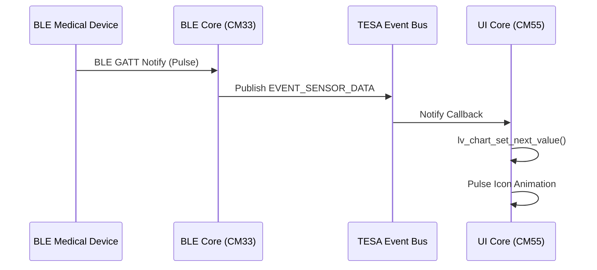
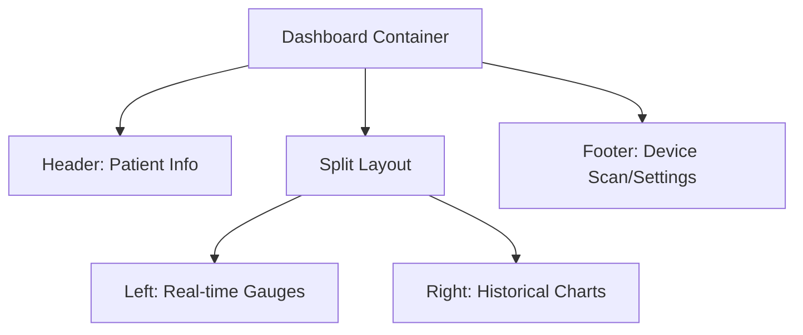

# Dashboard with BLE-based medical devices/sensors reading & visualization

This document outlines the architecture for integrating and visualizing real-time data from BLE (Bluetooth Low Energy) medical sensors on the **TESAIoT Dashboard**.

## How the integration works

The system follows a multi-tier architecture where the **CM33** core handles BLE connectivity and the **CM55** core handles the UI visualization, communicating via the **TESA Event Bus (IPC)**.

1.  **Sensor Interface**: Wireless BLE sensors (Heart Rate, SpO2, etc.) transmit GATT data to the PSoC8.
2.  **IPC Pipeline**: The BLE stack (on CM33) publishes raw readings to the **Event Bus**.
3.  **UI Component**: The Dashboard (on CM55) subscribes to these events and updates the LVGL widgets.

- **Main Dashboard Implementation**: [`wifi_operator_dashboard.c`](../ui/widgets/wifi_operator_dashboard.c)
- **IPC Protocol Definition**: [`ipc_communication.h`](../ipc_communication.h)

## Core Components

### 1. Data Visualization Widgets
*   **Heart Rate (Pulse)**: Visualized using [`lv_arc`](https://docs.lvgl.io/master/widgets/arc.html) or a dedicated Gauge.
*   **Historical Trends**: A [`lv_chart`](https://docs.lvgl.io/master/widgets/chart.html) component showing BPM over the last 60 seconds.

### 2. Device Management
The dashboard includes a "Members/Devices" tab where sensors are listed with status badges (Connected, Pairing, Low Battery).

- **UI Helper**: [`ui_theme_apply_value`](../ui/core/ui_theme.c#L24) (formats sensor readings consistently)

## Quick implementation recipe

1.  **Subscribe to IPC**:
    ```c
    // Subscribe to BLE sensor updates on the Event Bus
    tesa_event_subscribe(EVENT_SENSOR_DATA_RECEIVED, sensor_update_cb);
    ```
2.  **Update Widget**:
    ```c
    void sensor_update_cb(tesa_event_t *e) {
        sensor_reading_t *data = (sensor_reading_t*)e->payload;
        lv_label_set_text_fmt(hr_label, "%d BPM", data->heart_rate);
        lv_chart_set_next_value(hr_chart, hr_series, data->heart_rate);
    }
    ```

## Diagrams

### Sensor-to-UI Signal Flow



### Dashboard UI Layout



## Performance Considerations

*   **Asynchronous Updates**: Never poll BLE status in the LVGL loop; use the **Event Bus** callbacks to trigger UI refreshes only when data changes.
*   **Drawing Frequency**: Limit chart refreshes to 5-10Hz to prevent saturating the CM55 execution time.

## Reference

- [TESA Event Bus Architecture](../../tesa/event_bus/docs/)
- [CM33 BLE Documentation](../../../proj_cm33/docs/)
- [Dashboard Layout Source](../ui/widgets/wifi_operator_dashboard.c)

---
*Last Updated: 2026-02-28*