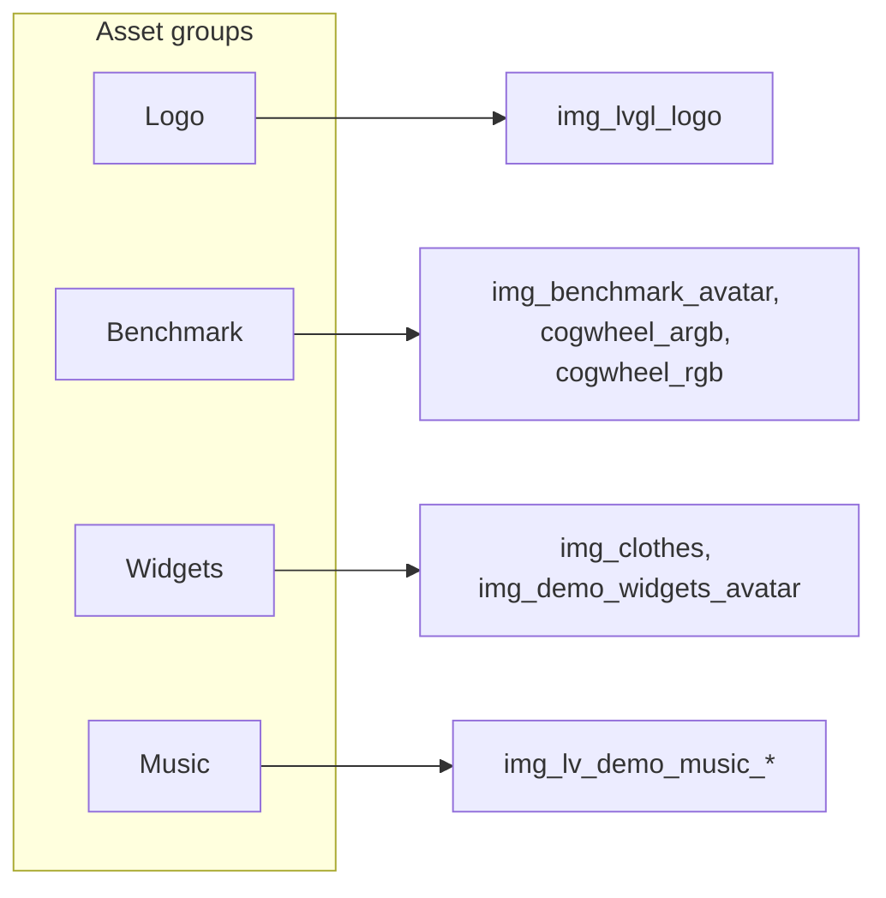
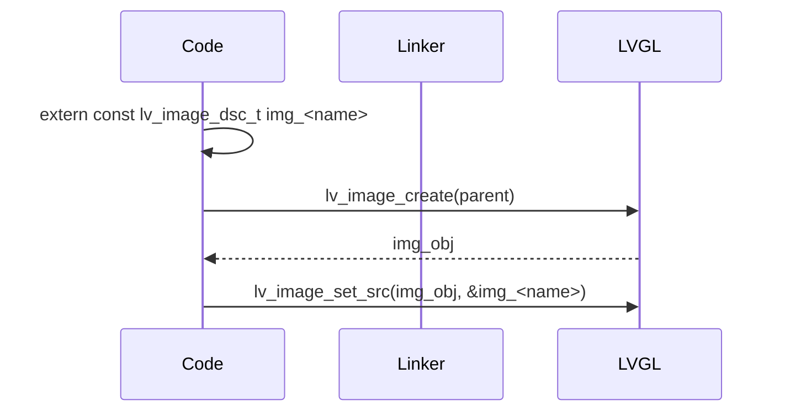
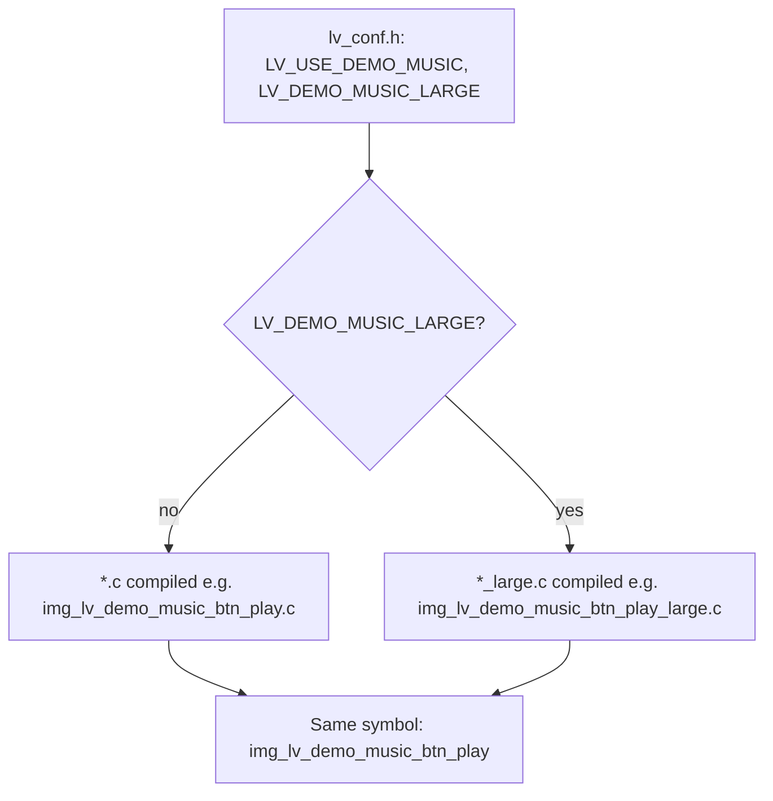
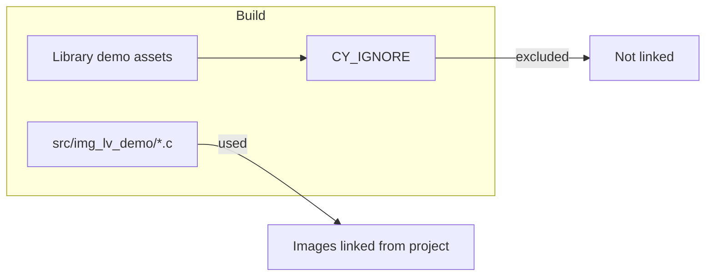

# LVGL Demo Image Assets

This folder contains image assets for LVGL demos (logo, benchmark, widgets, music). The files are used as **local overrides**: the build is configured so that these sources are used instead of the image assets shipped inside the LVGL library.

## How the assets work

Each `.c` file (or pair of files for music assets) defines a pixel map array and a single global **image descriptor** of type `lv_image_dsc_t`. The symbol name matches the asset (e.g. `img_lvgl_logo`, `img_demo_widgets_avatar`). To use an asset in your code:

1. Include LVGL (e.g. `lvgl.h` or your project’s LVGL include).
2. Declare the descriptor: `extern const lv_image_dsc_t img_<name>;`
3. Create an image object and set its source: `lv_image_set_src(lv_image_create(parent), &img_<name>);`

The project already compiles all `src/img_lv_demo/*.c` files; the Makefile excludes the corresponding LVGL library assets so that these local copies are linked. No extra build steps are required.

### LVGL-based (native) image rendering

These assets are used with LVGL’s **image object** (`lv_image`). You create an image with `lv_image_create(parent)` and set its source to a descriptor with `lv_image_set_src(img, &img_<name>)`. LVGL then renders the pixel data natively (no external file I/O). The same descriptor can be used for icons, logos, or any bitmap; there is no separate “icon” type—icons are just images. For **symbol (font) icons** LVGL uses a different path (symbol fonts and `lv_label_set_text` with symbol text); the files in this folder are **bitmap images** only.

### Image to C-code conversion

The `.c` files in this folder were produced by **converting raster images** (e.g. PNG, BMP) into C source. Typical options:

- **LVGL image converter** (online or offline): outputs a `.c` file with a `uint8_t` pixel map array and an `lv_image_dsc_t` initializer. Configure color format (e.g. ARGB8888) and optional premultiplication to match your display.
- **Build/IDE image tools**: some embedded IDEs or asset pipelines can export images as C arrays; ensure the output matches LVGL’s descriptor format (header with `cf`, `w`, `h`, `stride`, and `data` pointing to the array).

After conversion, place the `.c` in `src/img_lv_demo/` (or your chosen folder) and add an `extern` declaration where you use it. If the asset replaces one from an LVGL demo, add the library path to `CY_IGNORE` in the Makefile so your file is used instead.

### Image-data (C array) rendering

Each `.c` file provides:

1. **Pixel map**: a `const uint8_t` C array (e.g. `img_lvgl_logo_map[]`) holding raw pixel data. In this project the assets use **ARGB8888** with **premultiplied alpha** (`LV_COLOR_FORMAT_ARGB8888`, `LV_IMAGE_FLAGS_PREMULTIPLIED`). The descriptor’s `header.stride` is the bytes per row; `header.w` and `header.h` are width and height in pixels.
2. **Image descriptor**: a `const lv_image_dsc_t` (e.g. `img_lvgl_logo`) whose `data` points to that array and `data_size` is the array size. The descriptor also carries format and dimensions so LVGL knows how to interpret the bytes.

When you call `lv_image_set_src(img, &img_<name>)`, LVGL uses the descriptor to read the C array and draw it (with blending if alpha is used). No decoding step is needed at runtime—the data is already in the format the display driver expects (or is converted once by LVGL’s draw pipeline). This is **direct C-array image rendering**: the image lives in ROM/RAM as a C array and is rendered from memory.

## Asset groups



### LVGL logo

| Symbol | Source file(s) | Purpose |
|--------|----------------|---------|
| `img_lvgl_logo` | `img_lvgl_logo.c`, `img_lvgl_logo_export.c` | LVGL logo image |

Used in this project in [test_lvgl.c](../ui/basics/test_lvgl.c): `extern const lv_image_dsc_t img_lvgl_logo;` and `lv_image_set_src(logo_img, &img_lvgl_logo)`.

### Benchmark demo

| Symbol | Source file | Purpose |
|--------|-------------|---------|
| `img_benchmark_avatar` | `img_benchmark_avatar.c` | Avatar image for benchmark demo |
| `img_benchmark_cogwheel_argb` | `img_benchmark_cogwheel_argb.c` | Cogwheel (ARGB) for benchmark |
| `img_benchmark_cogwheel_rgb` | `img_benchmark_cogwheel_rgb.c` | Cogwheel (RGB) for benchmark |

For use with the LVGL benchmark demo.
git
### Widgets demo

| Symbol | Source file | Purpose |
|--------|-------------|---------|
| `img_clothes` | `img_clothes.c` | Clothes image for widgets demo |
| `img_demo_widgets_avatar` | `img_demo_widgets_avatar.c` | Avatar image for widgets demo |

For use with the LVGL widgets demo.

### Music demo

Music assets each have **two** source files: a normal resolution (e.g. `img_lv_demo_music_btn_play.c`) and a large resolution (e.g. `img_lv_demo_music_btn_play_large.c`). Both define the **same symbol name** (e.g. `img_lv_demo_music_btn_play`). Which file is compiled is controlled at build time by `LV_USE_DEMO_MUSIC` and `LV_DEMO_MUSIC_LARGE` in `lv_conf.h`. See [Music variant selection](#music-variant-selection) below.

| Symbol | Source files | Purpose |
|--------|--------------|---------|
| `img_lv_demo_music_btn_play` | `img_lv_demo_music_btn_play.c`, `img_lv_demo_music_btn_play_large.c` | Play button |
| `img_lv_demo_music_btn_pause` | `img_lv_demo_music_btn_pause.c`, `img_lv_demo_music_btn_pause_large.c` | Pause button |
| `img_lv_demo_music_btn_prev` | `img_lv_demo_music_btn_prev.c`, `img_lv_demo_music_btn_prev_large.c` | Previous track |
| `img_lv_demo_music_btn_next` | `img_lv_demo_music_btn_next.c`, `img_lv_demo_music_btn_next_large.c` | Next track |
| `img_lv_demo_music_btn_loop` | `img_lv_demo_music_btn_loop.c`, `img_lv_demo_music_btn_loop_large.c` | Loop toggle |
| `img_lv_demo_music_btn_rnd` | `img_lv_demo_music_btn_rnd.c`, `img_lv_demo_music_btn_rnd_large.c` | Shuffle / random |
| `img_lv_demo_music_btn_list_play` | `img_lv_demo_music_btn_list_play.c`, `img_lv_demo_music_btn_list_play_large.c` | List play button |
| `img_lv_demo_music_btn_list_pause` | `img_lv_demo_music_btn_list_pause.c`, `img_lv_demo_music_btn_list_pause_large.c` | List pause button |
| `img_lv_demo_music_corner_left` | `img_lv_demo_music_corner_left.c`, `img_lv_demo_music_corner_left_large.c` | Left corner decoration |
| `img_lv_demo_music_corner_right` | `img_lv_demo_music_corner_right.c`, `img_lv_demo_music_corner_right_large.c` | Right corner decoration |
| `img_lv_demo_music_cover_1` | `img_lv_demo_music_cover_1.c`, `img_lv_demo_music_cover_1_large.c` | Album cover 1 |
| `img_lv_demo_music_cover_2` | `img_lv_demo_music_cover_2.c`, `img_lv_demo_music_cover_2_large.c` | Album cover 2 |
| `img_lv_demo_music_cover_3` | `img_lv_demo_music_cover_3.c`, `img_lv_demo_music_cover_3_large.c` | Album cover 3 |
| `img_lv_demo_music_icon_1` | `img_lv_demo_music_icon_1.c`, `img_lv_demo_music_icon_1_large.c` | Music list icon 1 |
| `img_lv_demo_music_icon_2` | `img_lv_demo_music_icon_2.c`, `img_lv_demo_music_icon_2_large.c` | Music list icon 2 |
| `img_lv_demo_music_icon_3` | `img_lv_demo_music_icon_3.c`, `img_lv_demo_music_icon_3_large.c` | Music list icon 3 |
| `img_lv_demo_music_icon_4` | `img_lv_demo_music_icon_4.c`, `img_lv_demo_music_icon_4_large.c` | Music list icon 4 |
| `img_lv_demo_music_list_border` | `img_lv_demo_music_list_border.c`, `img_lv_demo_music_list_border_large.c` | List border graphic |
| `img_lv_demo_music_slider_knob` | `img_lv_demo_music_slider_knob.c`, `img_lv_demo_music_slider_knob_large.c` | Slider knob |
| `img_lv_demo_music_wave_top` | `img_lv_demo_music_wave_top.c`, `img_lv_demo_music_wave_top_large.c` | Top waveform |
| `img_lv_demo_music_wave_bottom` | `img_lv_demo_music_wave_bottom.c`, `img_lv_demo_music_wave_bottom_large.c` | Bottom waveform |

## Quick usage recipe

1. Include LVGL (e.g. `#include "lvgl.h"` or your project’s LVGL header).
2. Declare the image descriptor: `extern const lv_image_dsc_t img_<name>;`
3. Create an image object and set its source:

   ```c
   lv_obj_t *img = lv_image_create(parent);
   lv_image_set_src(img, &img_<name>);
   ```

No extra build steps are needed; `src/img_lv_demo/*.c` is already part of the build.

## Build and configuration

The [Makefile](../../Makefile) uses `CY_IGNORE` to exclude the LVGL library’s demo image sources (under `$(SEARCH_lvgl)/demos/music/assets/`, `demos/benchmark/assets/`, and `demos/widgets/assets/`). The linker therefore uses the copies in `proj_cm55/src/img_lv_demo/` instead.

For the **music demo** assets, which variant (normal vs large) is compiled is controlled in [lv_conf.h](../../modules/lvgl_display/core/lv_conf.h) (or wherever LVGL is configured):

- `LV_USE_DEMO_MUSIC`: enable the music demo and its assets.
- `LV_DEMO_MUSIC_LARGE`: when set, the `*_large.c` sources are compiled; otherwise the normal `.c` sources are used. The resulting symbol name is the same in both cases.

## Diagrams

### Usage flow



### Music variant selection

For each music asset there are two source files (normal and `_large`). The preprocessor and build select one of them; both define the same symbol.



### Build override

The build collects sources from both the LVGL library and the project. Library demo image assets are excluded so that the project’s copies in `src/img_lv_demo/` are used.



## Reference

- [LVGL examples](https://github.com/lvgl/lvgl/tree/master/examples)
- LVGL demos (music, widgets, benchmark) use these asset symbol names; see the LVGL repo `demos/` directory for full demo UIs.
