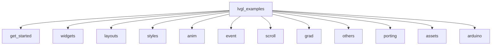
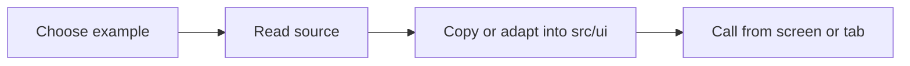
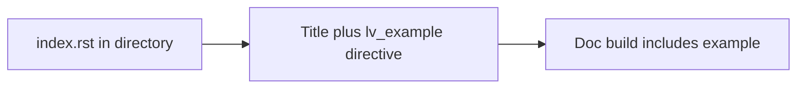

# LVGL Examples — Tutorial

This directory is a **reference copy** of the official LVGL examples. It is **not built** as part of the PSoC CM55 project; use it to read and adapt example code into the app. Upstream source: [LVGL examples](https://github.com/lvgl/lvgl/tree/master/examples).

---

## 1. What's in this directory

Examples are grouped by topic:

| Folder | Purpose |
|--------|---------|
| `get_started/` | Minimal "Hello world" and first steps |
| `widgets/` | Buttons, labels, charts, sliders, tabview, etc. (by widget type in subfolders) |
| `layouts/` | Flex and grid layout examples |
| `styles/` | Theming and style usage |
| `anim/` | Animations and timelines |
| `event/` | Input and event handling |
| `scroll/` | Scrolling behavior |
| `grad/` | Gradients |
| `others/` | Misc (snapshot, gridnav, etc.) |
| `porting/` | Display/input/FS templates and OSAL example |
| `assets/` | Images, fonts, and other assets used by examples |
| `arduino/` | Arduino-specific example |

High-level layout:



---

## 2. How to use an example in the PSoC app

Runnable UI for this project lives in `proj_cm55/src/ui/` (e.g. `src/ui/widgets/examples.c`). This folder is excluded from the build; you copy or adapt logic from here into the app.

**Step 1 — Find the example**

- Browse by topic: e.g. `get_started/lv_example_get_started_1.c`, `widgets/chart/lv_example_chart_1.c`, `widgets/tabview/lv_example_tabview_2.c`.
- Each `.c` file implements a single function: `void lv_example_<topic>_<n>(void)`.

**Step 2 — Read the source**

- Open the file and see how the widget is created and styled. Examples use the active screen (`lv_screen_active()`) or create their own; in the app you will usually create objects on your tab or screen.

**Step 3 — Integrate into the app**

- Copy or reimplement the logic in `proj_cm55/src/ui/widgets/examples.c` (or another UI module under `src/ui/`).
- Call your function from the appropriate screen or tab (e.g. from a tab callback or a "demo" button).

Flow:



### Usage examples

**Example 1 — Hello world**

Reference: `get_started/lv_example_get_started_1.c` implements `void lv_example_get_started_1(void)`. It uses `lv_screen_active()` for the background and label. To run it from your screen or tab, ensure the desired screen is active, then call:

```c
lv_example_get_started_1();
```

**Example 2 — Chart (already in the app)**

The chart demo is implemented in `proj_cm55/src/ui/widgets/examples.c` as `lv_example_chart_1()`. It is invoked from the tabview via a wrapper. From any module that includes the examples header:

```c
#include "examples.h"

static void my_tab_callback(void) {
  lv_example_chart_1();
}
```

**Example 3 — Creating on a specific parent**

Reference examples often use `lv_screen_active()`. To show the same UI inside a tab or a panel, create widgets on that parent instead. Adapted from `get_started/lv_example_get_started_1.c`:

```c
void my_hello_on_parent(lv_obj_t *parent) {
  lv_obj_set_style_bg_color(parent, lv_color_hex(0x003a57), LV_PART_MAIN);
  lv_obj_t *label = lv_label_create(parent);
  lv_label_set_text(label, "Hello world");
  lv_obj_set_style_text_color(label, lv_color_hex(0xffffff), LV_PART_MAIN);
  lv_obj_align(label, LV_ALIGN_CENTER, 0, 0);
}
```

Call `my_hello_on_parent(tab_content)` when building that tab.

**Example 4 — Style and tabview demos**

The app also implements `lv_example_style_1()` and `lv_example_tabview_2()` in `src/ui/widgets/examples.c`. Reference sources: `styles/lv_example_style_1.c`, `widgets/tabview/lv_example_tabview_2.c`. Call them the same way as the chart:

```c
lv_example_style_1();
lv_example_tabview_2();
```

**Example 5 — Switching which example runs**

In `src/ui/widgets/examples.c`, a single entry point runs one example at a time. Uncomment the one you want:

```c
void run_examples(void) {
  // lv_example_tabview_2();
  // lv_example_style_1();
  lv_example_chart_1();
}
```

Call `run_examples()` from your tabview (e.g. when the user selects the Examples tab) or from a menu handler. Only one of the three should be uncommented so the active screen is not filled by multiple demos at once.

**Example 6 — Chart on a tab content**

To show a chart inside a specific tab (instead of the full screen), adapt the chart logic to take a parent and create the chart on it:

```c
void lv_example_chart_1_on_parent(lv_obj_t *parent) {
  lv_obj_set_style_bg_color(parent, lv_color_black(), 0);
  lv_obj_t *chart = lv_chart_create(parent);
  lv_obj_set_size(chart, LV_PCT(80), LV_PCT(60));
  lv_obj_center(chart);
  lv_chart_set_type(chart, LV_CHART_TYPE_LINE);
  lv_chart_series_t *ser1 = lv_chart_add_series(chart, lv_palette_main(LV_PALETTE_GREEN), LV_CHART_AXIS_PRIMARY_Y);
  /* ... add series, set values, lv_chart_refresh(chart); ... */
}
```

Then from the tabview: `lv_example_chart_1_on_parent(lv_tabview_get_content(tabview, tab_index));`

---

## 3. How index.rst works

The `index.rst` files in this tree are used by the **LVGL documentation build** to include example code in the docs. They are not required to run or build examples on PSoC.

**Basic pattern**

In each directory that contains examples, `index.rst` lists them with a title and a directive:

- A line with the example title.
- An underline (e.g. `---` or `---...`).
- A directive: `.. lv_example:: path/to/lv_example_xxx` with `:language: c`. The path is relative to the `lvgl/examples/` directory.

**What each part does:** The first line is the heading text that appears in the docs. The line of dashes under it is required reStructuredText syntax for that heading. The blank line separates the heading from the directive. The `.. lv_example::` directive tells the doc build which example file to pull in; the path is relative to `lvgl/examples/` (e.g. `anim/lv_example_anim_1` means the file `anim/lv_example_anim_1.c`). The `:language: c` option tells the doc build to highlight the included code as C.

Example (one anim example in an `index.rst`):

```rst
Example 1 Title
---------------

.. lv_example:: anim/lv_example_anim_1
    :language: c
```

To list an example from another folder, use its path relative to `lvgl/examples/`, e.g. `.. lv_example:: widgets/chart/lv_example_chart_2`.

**Optional directives**

- **Custom section heading**: In a directory’s `index.rst`, use `.. example_heading: Your Section Name` so the docs show a different heading than the folder name (e.g. "3rd-Party Libraries" for `libs/`).
- **Directory order**: In a parent `index.rst`, use `.. dir_order:` followed by a list of subdirectory names (one per line) to control the order in which subdirectories appear in the docs (e.g. list `obj` first under `widgets/`).



---

## 4. Quick reference

- **Main folders**: `get_started`, `widgets`, `layouts`, `styles`, `anim`, `event`, `scroll`, `grad`, `others`, `porting`, `assets`, `arduino`.
- **Naming**: Example sources follow `lv_example_<topic>_<n>.c` and expose `void lv_example_<topic>_<n>(void)`.
- **Single include (reference only)**: `lvgl_examples/lv_examples.h` pulls in all example headers; the app does not build this tree, so use the folder only as reference when writing code in `src/ui/`.
