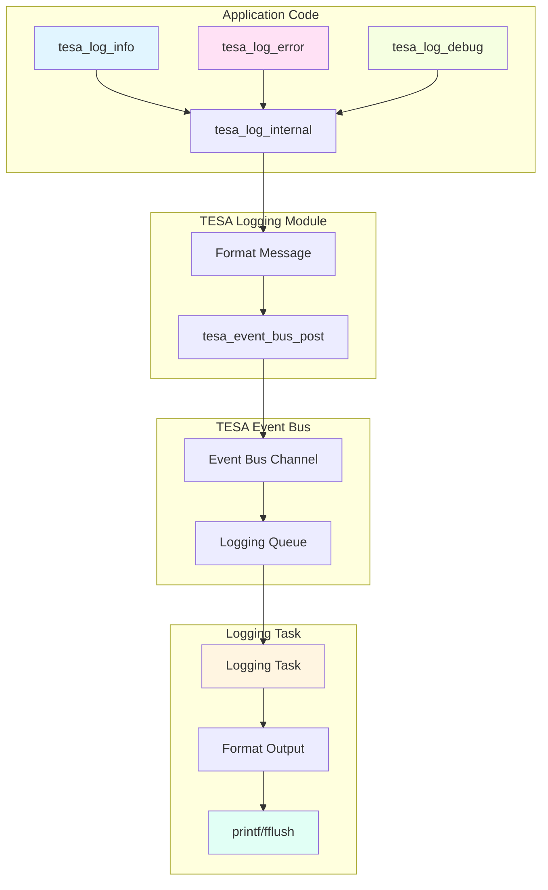

# TESA Logging System Examples and Usage Guide

## Introduction

The TESA Logging System is a multi-level, asynchronous logging framework designed for medical device firmware that requires deterministic, thread-safe, and memory-safe logging capabilities. Built on top of the TESA Event Bus, it provides a robust logging infrastructure suitable for real-time embedded systems.

### Key Features

- **Multi-level logging**: Six log levels (VERBOSE, DEBUG, INFO, WARNING, ERROR, CRITICAL)
- **Asynchronous logging**: Non-blocking log operations via event bus
- **Thread-safe**: Safe for both FreeRTOS task and ISR contexts (future)
- **Memory-safe**: Static memory pools only (no dynamic allocation)
- **Configurable output**: Timestamps, colors, and log level filtering
- **Format strings**: Standard printf-style formatting support
- **Medical device ready**: Designed for IEC 62304 compliance and MISRA C standards

### Related Documentation

- [Event Bus Documentation](../event_bus/docs/event_bus_examples_and_usage.md) - Underlying event bus system
- [API Reference](../tesa_logging.h) - Complete API documentation
- [Configuration Reference](../tesa_logging_config.h) - Configuration options

### Document Structure

This guide covers:
1. System architecture and flow
2. Basic setup and initialization
3. Configuration options
4. Logging examples
5. Runtime configuration changes
6. Best practices
7. Integration patterns

---

## 1. System Architecture

### 1.1 Architecture Overview

The logging system uses a publish-subscribe pattern built on the TESA Event Bus. Log messages are posted as events and processed by a dedicated logging task, ensuring non-blocking operation.



### 1.2 Message Flow

1. **Application code** calls a logging function (e.g., `tesa_log_info()`)
2. **Logging function** formats the message using `vsnprintf()` and posts it to the event bus
3. **Event bus** delivers the event to the logging queue (subscribed queue)
4. **Logging task** receives the event from the queue
5. **Logging task** formats the output with timestamp, colors, and level prefix
6. **Output** is sent to stdout via `printf()`

### 1.3 Log Levels

Log levels are ordered from most verbose to most critical:

| Level    | Value | Use Case                                       |
| -------- | ----- | ---------------------------------------------- |
| VERBOSE  | 0     | Very detailed information for debugging        |
| DEBUG    | 1     | Debugging information                          |
| INFO     | 2     | General informational messages                 |
| WARNING  | 3     | Warning conditions that don't stop operation   |
| ERROR    | 4     | Error conditions that may affect functionality |
| CRITICAL | 5     | Critical errors that may cause system failure  |

**Filtering**: Only messages at or above the configured minimum level are processed and output.

---

## 2. Basic Setup

### 2.1 Prerequisites

Before initializing the logging system, ensure:
1. The TESA Event Bus is initialized (`tesa_event_bus_init()`)
2. FreeRTOS scheduler is running (required for the logging task)

```c
#include "tesa_event_bus.h"
#include "tesa_logging.h"

void system_init(void) {
    // Initialize event bus first
    tesa_event_bus_result_t result = tesa_event_bus_init();
    if (TESA_EVENT_BUS_SUCCESS != result) {
        // Handle error
        return;
    }
    
    // Start FreeRTOS scheduler before initializing logging
    vTaskStartScheduler();
    
    // Logging is initialized later (see below)
}
```

### 2.2 Basic Initialization

The simplest way to initialize logging is with default settings:

```c
void init_logging_default(void) {
    tesa_event_bus_result_t result = tesa_logging_init();
    
    if (TESA_EVENT_BUS_SUCCESS != result) {
        // Handle initialization error
        switch (result) {
            case TESA_EVENT_BUS_ERROR_INVALID_PARAM:
                // Invalid default configuration
                break;
            case TESA_EVENT_BUS_ERROR_MEMORY:
                // Failed to create queue or task
                break;
            case TESA_EVENT_BUS_ERROR_CHANNEL_NOT_FOUND:
                // Event bus not initialized
                break;
            default:
                break;
        }
        return;
    }
    
    // Logging is now ready to use
}
```

**Default Configuration** (from `tesa_logging_config.h`):
- Minimum log level: `INFO` (2)
- Colors: Enabled
- Timestamp: Enabled
- Timestamp format: Full datetime (`[YYYY-MM-DD HH:MM:SS:XXX]`)

### 2.3 Initialization with Custom Configuration

For more control, initialize with a custom configuration:

```c
void init_logging_custom(void) {
    tesa_logging_config_t config = {
        .min_level = TESA_LOG_DEBUG,              // Show DEBUG and above
        .enable_colors = true,                    // Enable ANSI colors
        .enable_timestamp = true,                 // Include timestamps
        .timestamp_format = TESA_LOG_TIMESTAMP_MS // Use milliseconds format
    };
    
    tesa_event_bus_result_t result = tesa_logging_init_with_config(&config);
    
    if (TESA_EVENT_BUS_SUCCESS != result) {
        // Handle error (see error codes above)
        return;
    }
}
```

---

## 3. Configuration Options

### 3.1 Build-Time Configuration

Configuration can be set at build time via `tesa_logging_config.h` or by defining macros before including the header:

```c
// Define before including tesa_logging.h
#define TESA_LOGGING_DEFAULT_LEVEL TESA_LOG_DEBUG
#define TESA_LOGGING_ENABLE_COLORS 1U
#define TESA_LOGGING_ENABLE_TIMESTAMP 1U
#define TESA_LOGGING_TIMESTAMP_FORMAT TESA_LOG_TIMESTAMP_MS
#define TESA_LOGGING_QUEUE_LENGTH 64U           // Increase queue size
#define TESA_LOGGING_TASK_STACK_SIZE 4096U      // Larger stack
#define TESA_LOGGING_TASK_PRIORITY 6U           // Higher priority

#include "tesa_logging.h"
```

### 3.2 Configuration Options

| Configuration                   | Type          | Default           | Description                             |
| ------------------------------- | ------------- | ----------------- | --------------------------------------- |
| `TESA_LOGGING_DEFAULT_LEVEL`    | `uint8_t`     | 2 (INFO)          | Minimum log level to output             |
| `TESA_LOGGING_ENABLE_COLORS`    | `uint8_t`     | 1 (enabled)       | Enable ANSI color codes                 |
| `TESA_LOGGING_ENABLE_TIMESTAMP` | `uint8_t`     | 1 (enabled)       | Include timestamps in output            |
| `TESA_LOGGING_TIMESTAMP_FORMAT` | `uint8_t`     | 1 (full datetime) | Timestamp format (0=ms, 1=full, 2=time) |
| `TESA_LOGGING_QUEUE_LENGTH`     | `uint8_t`     | 32                | Queue size for log messages             |
| `TESA_LOGGING_TASK_STACK_SIZE`  | `uint16_t`    | 2048              | Stack size for logging task             |
| `TESA_LOGGING_TASK_PRIORITY`    | `UBaseType_t` | 5                 | Priority of logging task                |

### 3.3 Runtime Configuration

All configuration options can be changed at runtime after initialization:

```c
// Change minimum log level
tesa_logging_set_level(TESA_LOG_DEBUG);

// Disable colors (useful for non-terminal output)
tesa_logging_set_colors_enabled(false);

// Change timestamp format
tesa_logging_set_timestamp_format(TESA_LOG_TIMESTAMP_MS);

// Query current settings
tesa_log_level_t current_level = tesa_logging_get_level();
bool colors_enabled = tesa_logging_get_colors_enabled();
```

---

## 4. Logging Examples

### 4.1 Basic Logging

Simple log messages with different levels:

```c
void example_basic_logging(void) {
    // Informational message
    tesa_log_info("System initialized successfully");
    
    // Debug message
    tesa_log_debug("Processing sensor data");
    
    // Warning message
    tesa_log_warning("Low battery: %d%%", battery_level);
    
    // Error message
    tesa_log_error("Failed to read sensor: error code %d", error_code);
    
    // Critical error
    tesa_log_critical("System shutdown required: %s", reason);
}
```

**Output Example**:
```
[INFO] [2024-01-15 14:30:25:123] System initialized successfully
[DEBUG] [2024-01-15 14:30:25:145] Processing sensor data
[WARN] [2024-01-15 14:30:25:167] Low battery: 15%
[ERROR] [2024-01-15 14:30:25:189] Failed to read sensor: error code 42
[CRITICAL] [2024-01-15 14:30:25:211] System shutdown required: Memory fault
```

### 4.2 Using Macro Shortcuts

The logging system provides convenient macros for cleaner code:

```c
void example_macro_usage(void) {
    // These are equivalent to the function calls
    TESA_LOG_INFO("Application started");
    TESA_LOG_DEBUG("Variable value: %d", value);
    TESA_LOG_WARNING("Threshold exceeded: %f", reading);
    TESA_LOG_ERROR("Operation failed with code: 0x%04X", error);
}
```

### 4.3 Format String Support

Full printf-style formatting is supported:

```c
void example_format_strings(void) {
    int32_t sensor_id = 5;
    float temperature = 25.7f;
    uint32_t timestamp = 12345678UL;
    const char *status = "OK";
    
    tesa_log_info("Sensor %d: temp=%.1f°C, ts=%lu, status=%s",
                  sensor_id, temperature, (unsigned long)timestamp, status);
    
    // Hexadecimal formatting
    tesa_log_debug("Register 0x%02X value: 0x%04X", reg_addr, reg_value);
    
    // String formatting with width
    tesa_log_info("%-20s : %10d bytes", "Buffer size", buffer_size);
}
```

### 4.4 Conditional Logging

For performance-critical code, check the log level before expensive operations:

```c
void example_conditional_logging(void) {
    // Only format string if logging is enabled for this level
    if (TESA_LOG_DEBUG >= tesa_logging_get_level()) {
        tesa_log_debug("Expensive debug info: %s", expensive_string_format());
    }
    
    // Alternative: The logging system already filters, but this avoids
    // string formatting overhead if you have expensive operations
}
```

**Note**: The logging system automatically filters messages below the minimum level, but checking the level before expensive formatting operations can save CPU cycles.

### 4.5 Error Handling in Logging

All logging functions return `tesa_event_bus_result_t` to indicate success or failure:

```c
void example_error_handling(void) {
    tesa_event_bus_result_t result = tesa_log_info("Test message");
    
    if (TESA_EVENT_BUS_SUCCESS != result) {
        // Logging failed - possible reasons:
        // - Event bus not initialized
        // - Logging not initialized
        // - Event pool exhausted (rare)
        // - Queue full (rare, indicates high log rate)
        
        // Fallback: Direct printf (not recommended, blocks)
        (void)printf("[FALLBACK] Test message\r\n");
    }
}
```

---

## 5. Advanced Usage

### 5.1 Dynamic Log Level Changes

Adjust log verbosity at runtime based on system state:

```c
void example_dynamic_levels(void) {
    // Normal operation - show INFO and above
    tesa_logging_set_level(TESA_LOG_INFO);
    
    // When debugging - show DEBUG and above
    tesa_logging_set_level(TESA_LOG_DEBUG);
    
    // Production mode - only WARNING and above
    tesa_logging_set_level(TESA_LOG_WARNING);
    
    // Emergency diagnostics - show everything
    tesa_logging_set_level(TESA_LOG_VERBOSE);
}
```

### 5.2 Output Configuration Changes

Modify output format based on destination or requirements:

```c
void example_output_config(void) {
    // For serial console with terminal - full features
    tesa_logging_set_colors_enabled(true);
    tesa_logging_set_timestamp_format(TESA_LOG_TIMESTAMP_FULL_DATETIME);
    
    // For file logging - no colors, simpler timestamp
    tesa_logging_set_colors_enabled(false);
    tesa_logging_set_timestamp_format(TESA_LOG_TIMESTAMP_MS);
    
    // For minimal output - no timestamp
    tesa_logging_set_timestamp_enabled(false);
}
```

### 5.3 Integration with Error Handling

Integrate logging with your error handling system:

```c
typedef enum {
    ERROR_NONE = 0,
    ERROR_SENSOR_TIMEOUT,
    ERROR_COMM_FAILURE,
    ERROR_MEMORY_ALLOCATION
} system_error_t;

system_error_t handle_error(system_error_t error) {
    switch (error) {
        case ERROR_SENSOR_TIMEOUT:
            tesa_log_warning("Sensor timeout detected");
            break;
            
        case ERROR_COMM_FAILURE:
            tesa_log_error("Communication failure: retry %d", retry_count);
            break;
            
        case ERROR_MEMORY_ALLOCATION:
            tesa_log_critical("Memory allocation failed: size=%zu", size);
            // Critical errors may trigger recovery actions
            break;
            
        default:
            tesa_log_debug("Unknown error code: %d", error);
            break;
    }
    
    return error;
}
```

---

## 6. Best Practices

### 6.1 Log Level Guidelines

Follow these guidelines for choosing log levels:

- **VERBOSE**: Detailed tracing, function entry/exit, variable dumps
- **DEBUG**: Development information, algorithm details, state transitions
- **INFO**: Normal operational messages, successful operations, state changes
- **WARNING**: Recoverable errors, degraded performance, unusual conditions
- **ERROR**: Operation failures, unexpected conditions, recoverable system errors
- **CRITICAL**: System-threatening errors, unrecoverable conditions, shutdown triggers

### 6.2 Message Format Guidelines

- **Be descriptive**: Include context and relevant data
- **Include identifiers**: Sensor IDs, task names, file handles, etc.
- **Use appropriate format specifiers**: Match the data type
- **Avoid sensitive data**: Don't log passwords, keys, or personal information
- **Keep messages concise**: Long messages can slow down output

```c
// Good examples
tesa_log_info("Sensor %d calibrated: offset=%.3f", sensor_id, offset);
tesa_log_error("Task '%s' watchdog timeout: %lu ms", task_name, timeout_ms);

// Bad examples
tesa_log_info("Error occurred");              // Too vague
tesa_log_debug("x=%d y=%d z=%d", x, y, z);    // Missing context
tesa_log_info("Password: %s", password);      // Security risk
```

### 6.3 Performance Considerations

- **Minimize log frequency**: High-rate logging can impact system performance
- **Filter at source**: Don't log in tight loops unless necessary
- **Use appropriate levels**: Keep production code at INFO or higher
- **Avoid in ISRs**: Logging from ISRs should be avoided (future: ISR-safe versions)
- **Check log level**: For expensive operations, check level before formatting

### 6.4 Thread Safety

- **Safe from tasks**: All logging functions are thread-safe and can be called from any FreeRTOS task
- **Not yet ISR-safe**: ISR usage requires special handling (future enhancement)
- **Non-blocking**: Logging functions return immediately after posting to event bus

### 6.5 Memory Considerations

- **Static allocation only**: No dynamic memory allocation
- **Queue sizing**: Size queue based on expected log burst rates
- **Message size limit**: Log messages are limited to 220 characters (configurable)
- **Stack size**: Ensure logging task has adequate stack for formatting operations

---

## 7. Integration Patterns

### 7.1 System Initialization Pattern

```c
void system_init(void) {
    tesa_event_bus_result_t result;
    
    // 1. Initialize event bus
    result = tesa_event_bus_init();
    if (TESA_EVENT_BUS_SUCCESS != result) {
        // Handle fatal error
        system_halt();
    }
    
    // 2. Initialize logging (after event bus, before scheduler if possible)
    tesa_logging_config_t log_config = {
        .min_level = TESA_LOG_INFO,
        .enable_colors = true,
        .enable_timestamp = true,
        .timestamp_format = TESA_LOG_TIMESTAMP_FULL_DATETIME
    };
    result = tesa_logging_init_with_config(&log_config);
    if (TESA_EVENT_BUS_SUCCESS != result) {
        // Handle error - logging may be unavailable
        (void)printf("[FATAL] Logging initialization failed: %d\r\n", result);
    }
    
    // 3. Start FreeRTOS scheduler
    tesa_log_info("Starting FreeRTOS scheduler");
    vTaskStartScheduler();
    
    // Should never reach here
    system_halt();
}
```

### 7.2 Module Initialization Pattern

```c
void sensor_module_init(void) {
    tesa_log_info("Initializing sensor module");
    
    if (sensor_hardware_init() != 0) {
        tesa_log_error("Sensor hardware initialization failed");
        return;
    }
    
    if (sensor_calibration_load() != 0) {
        tesa_log_warning("Sensor calibration not found, using defaults");
    }
    
    tesa_log_info("Sensor module initialized successfully");
}
```

### 7.3 Error Handling Pattern

```c
typedef struct {
    tesa_event_bus_result_t result;
    const char *operation;
} error_context_t;

tesa_event_bus_result_t perform_operation(const char *op_name) {
    error_context_t ctx = {
        .operation = op_name,
        .result = TESA_EVENT_BUS_SUCCESS
    };
    
    // Perform operation
    if (operation_failed()) {
        ctx.result = TESA_EVENT_BUS_ERROR_INVALID_PARAM;
        tesa_log_error("Operation '%s' failed: %d", op_name, ctx.result);
        return ctx.result;
    }
    
    tesa_log_debug("Operation '%s' completed successfully", op_name);
    return ctx.result;
}
```

### 7.4 State Transition Logging

```c
typedef enum {
    STATE_IDLE,
    STATE_RUNNING,
    STATE_ERROR,
    STATE_SHUTDOWN
} system_state_t;

void transition_to_state(system_state_t new_state) {
    tesa_log_info("State transition: %d -> %d", current_state, new_state);
    
    current_state = new_state;
    
    switch (new_state) {
        case STATE_ERROR:
            tesa_log_error("System entered ERROR state");
            break;
        case STATE_SHUTDOWN:
            tesa_log_critical("System shutdown initiated");
            break;
        default:
            break;
    }
}
```

---

## 8. Troubleshooting

### 8.1 Common Issues

**Logs not appearing**:
- Check that `tesa_event_bus_init()` was called before `tesa_logging_init()`
- Verify log level is set appropriately (messages below minimum level are filtered)
- Ensure FreeRTOS scheduler is running (logging task requires scheduler)

**Queue full errors**:
- Increase `TESA_LOGGING_QUEUE_LENGTH` in configuration
- Reduce log message frequency
- Check if logging task is processing messages (may be blocked)

**Missing timestamps**:
- Verify `enable_timestamp` is set to `true`
- Check system time configuration (for full datetime format)

**Colors not working**:
- Verify terminal/console supports ANSI escape codes
- Check `enable_colors` configuration
- Some serial terminals don't support colors

### 8.2 Debugging the Logging System

Enable debug-level logging to troubleshoot the logging system itself:

```c
// Enable debug level to see logging system messages
tesa_logging_set_level(TESA_LOG_DEBUG);

// Check initialization status
if (false == logging_initialized) {
    tesa_log_error("Logging not initialized");
}

// Verify event bus is initialized
// (Check via event bus API if available)
```

---

## 9. API Reference Summary

### Initialization Functions

- `tesa_logging_init()` - Initialize with default configuration
- `tesa_logging_init_with_config(config)` - Initialize with custom configuration

### Configuration Functions

- `tesa_logging_set_level(level)` - Set minimum log level
- `tesa_logging_get_level()` - Get current minimum log level
- `tesa_logging_set_colors_enabled(enabled)` - Enable/disable colors
- `tesa_logging_get_colors_enabled()` - Get color enable state
- `tesa_logging_set_timestamp_enabled(enabled)` - Enable/disable timestamps
- `tesa_logging_get_timestamp_enabled()` - Get timestamp enable state
- `tesa_logging_set_timestamp_format(format)` - Set timestamp format
- `tesa_logging_get_timestamp_format()` - Get current timestamp format

### Logging Functions

- `tesa_log_verbose(format, ...)` - Log VERBOSE level message
- `tesa_log_debug(format, ...)` - Log DEBUG level message
- `tesa_log_info(format, ...)` - Log INFO level message
- `tesa_log_warning(format, ...)` - Log WARNING level message
- `tesa_log_error(format, ...)` - Log ERROR level message
- `tesa_log_critical(format, ...)` - Log CRITICAL level message

### Macros

- `TESA_LOG_VERBOSE(...)` - Macro for VERBOSE logging
- `TESA_LOG_DEBUG(...)` - Macro for DEBUG logging
- `TESA_LOG_INFO(...)` - Macro for INFO logging
- `TESA_LOG_WARNING(...)` - Macro for WARNING logging
- `TESA_LOG_ERROR(...)` - Macro for ERROR logging
- `TESA_LOG_CRITICAL(...)` - Macro for CRITICAL logging

---

## 10. Example Application

Complete example showing typical usage:

```c
#include "tesa_event_bus.h"
#include "tesa_logging.h"
#include "FreeRTOS.h"
#include "task.h"

void application_task(void *pvParameters) {
    (void)pvParameters;
    
    uint32_t counter = 0U;
    
    tesa_log_info("Application task started");
    
    for (;;) {
        counter++;
        
        if (0U == (counter % 1000U)) {
            tesa_log_info("Application running: cycle %lu", (unsigned long)counter);
        }
        
        if (0U == (counter % 100U)) {
            tesa_log_debug("Counter value: %lu", (unsigned long)counter);
        }
        
        // Simulate error condition
        if (5000U == counter) {
            tesa_log_error("Simulated error at counter %lu", (unsigned long)counter);
        }
        
        vTaskDelay(pdMS_TO_TICKS(10));
    }
}

void system_init(void) {
    tesa_event_bus_result_t result;
    
    // Initialize event bus
    result = tesa_event_bus_init();
    if (TESA_EVENT_BUS_SUCCESS != result) {
        (void)printf("Event bus init failed: %d\r\n", result);
        return;
    }
    
    // Initialize logging
    tesa_logging_config_t log_config = {
        .min_level = TESA_LOG_DEBUG,
        .enable_colors = true,
        .enable_timestamp = true,
        .timestamp_format = TESA_LOG_TIMESTAMP_FULL_DATETIME
    };
    result = tesa_logging_init_with_config(&log_config);
    if (TESA_EVENT_BUS_SUCCESS != result) {
        (void)printf("Logging init failed: %d\r\n", result);
        return;
    }
    
    // Log system initialization
    tesa_log_info("System initializing");
    tesa_log_info("Logging system ready");
    
    // Create application task
    BaseType_t task_result = xTaskCreate(
        application_task,
        "AppTask",
        1024,
        NULL,
        3,
        NULL
    );
    
    if (pdPASS == task_result) {
        tesa_log_info("Application task created");
    } else {
        tesa_log_error("Failed to create application task");
    }
    
    // Start scheduler
    tesa_log_info("Starting FreeRTOS scheduler");
    vTaskStartScheduler();
}
```

---

## Conclusion

The TESA Logging System provides a robust, safe, and efficient logging solution for embedded medical device applications. By following this guide and the best practices outlined, you can integrate comprehensive logging into your application while maintaining system performance and safety standards.

For additional information or support, refer to:
- [API Reference](../tesa_logging.h)
- [Configuration Reference](../tesa_logging_config.h)
- [Event Bus Documentation](../event_bus/docs/event_bus_examples_and_usage.md)
