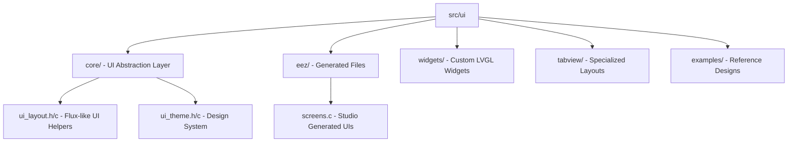
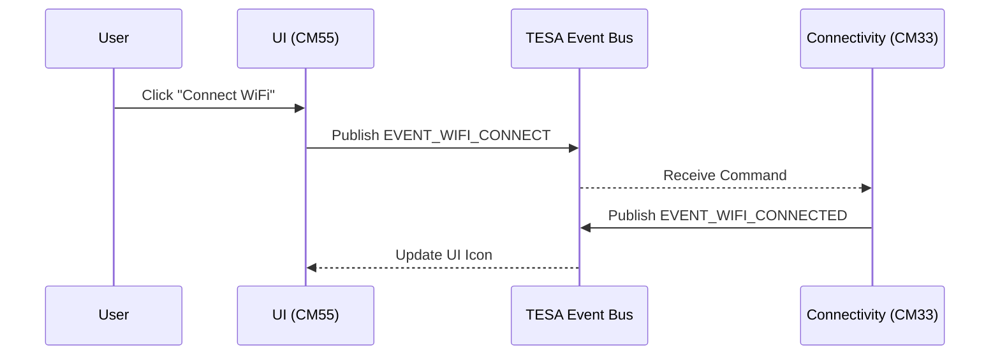

# UI Subsystem: LVGL 9.2.0 for PSoC8 (CM55)

Welcome to the UI subsystem documentation. This directory contains the graphics stack for the **PSoC8 CM55** core, utilizing **LVGL 9.2.0** on a Waveshare 7-inch DSI LCD (1024x600).

The architecture is designed to bridge high-level UI design tools (**EEZ Studio**) with hand-coded structural logic and Inter-Processor Communication (IPC).

---

## Directory Structure



| Directory | Description |
| :--- | :--- |
| `core/` | **The Semantic Layer.** Contains naming conventions and logic for layouts, themes, and styles. |
| `eez/` | **Design Assets.** Automated exports from EEZ Studio. Should generally not be modified by hand. |
| `tabview/` | **Navigation.** Implementation of the multi-tab dashboard used in the main application. |
| `widgets/` | **Custom Components.** Reusable UI parts like specialized status bars or graphs. |

---

## Getting Started (Tutorial)

This guide shows you how to build a modern, responsive UI using the project's semantic helpers.

### 1. Basic Initialization
The UI entry point is located in `eez/ui.c`. The system tick is driven by the CM55 system clock.

```c
#include "ui/eez/ui.h"

int main() {
    // ... system init ...
    ui_init(); // Initializes EEZ screens and themes
    
    while(1) {
        ui_tick(); // Updates animations and inputs
        vTaskDelay(pdMS_TO_TICKS(5));
    }
}
```

### 2. Using Semantic Layouts (ui_layout)
Instead of manual pixel-pushing, use the `ui_layout.h` helpers to create flexbox-based designs.

```c
#include "ui_layout.h"
#include "ui_theme.h"

void create_my_panel(lv_obj_t *parent) {
    // Create a horizontal row with 10px gap and 20px padding
    lv_obj_t *row = ui_row(parent, 10, 20);
    ui_width_fill(row); // Grow to match parent width
    
    // Add items
    lv_obj_t *btn = lv_button_create(row);
    ui_theme_apply_button_primary(btn);
    
    lv_obj_t *label = lv_label_create(row);
    lv_label_set_text(label, "Status: OK");
    ui_theme_apply_value(label);
}
```

### 3. Handling Events with IPC
Since this project is `psoc-e84-lvgl-ipc`, UI events typically trigger actions on other cores or subsystems via the **TESA Event Bus**.



**Implementation Example:**
```c
static void wifi_btn_event_cb(lv_event_t * e) {
    // Publish to the event bus instead of handling logic here
    tesa_event_publish(EVENT_WIFI_CONNECT, NULL, 0);
}
```

---

## Design System & Theming

The project uses a centralized theme engine in `core/ui_theme.h`. Standardizing on these colors ensures visual consistency.

- **Primary Colors**: Deep Navy Slate (`0x0F172A`) & Sky Blue (`0x38BDF8`).
- **Typography**: Montserrat (24px for Titles, 14px for Body).

**Applying a theme:**
```c
lv_obj_t *card = ui_card_container(parent, 15, 8);
ui_theme_apply_card(card); // Applies background, shadow, and border
```

---

## Troubleshooting (Knowledge Base)

> [!IMPORTANT]
> **Clickable Scrollbars**: If a scroll container isn't moving, ensure `LV_OBJ_FLAG_CLICKABLE` is set.
> **Include Paths**: If `ui_layout.h` is not found, add `src/ui/core` to your `INCLUDES` in the `Makefile`.

### Reference Macros
- `ACTUAL_DISP_HOR_RES`: 1024
- `ACTUAL_DISP_VER_RES`: 600
- `UI_COLOR_PRIMARY`: `#38BDF8`

---

*Last Updated: 2026-02-28*
