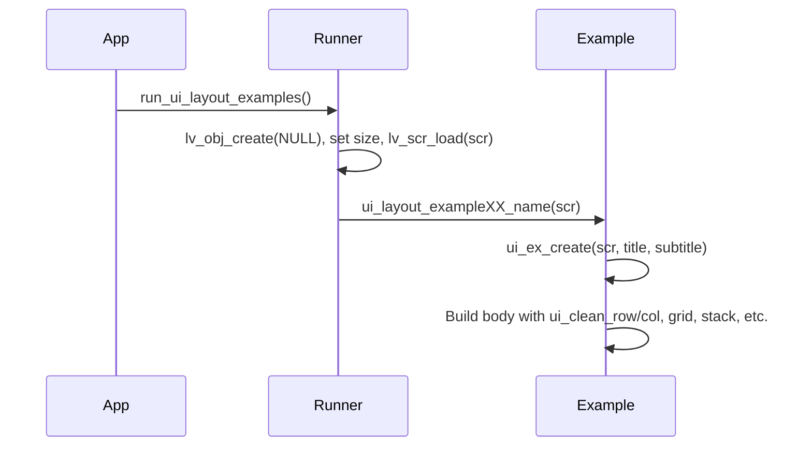
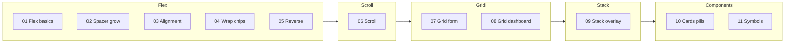

# UI Layout Examples – Tutorial

This directory contains **11 tutorial examples** that show how to build LVGL UIs using the layout helpers in `ui_layout.h` (from [lib_ui_layout](../../../lib_ui_layout)). Each example focuses on one layout concept: flex row/column, spacers, alignment, wrap, reverse, scroll, grid, stack overlay, cards/pills, and symbols. They are designed to be run one at a time from a single runner.

## Directory structure

```
src/ui/examples/
 |
 +--- ui_run_examples.c
 +--- ui_run_examples.h
 +--- ui_layout_examples.h
 +--- ui_layout_examples_common.c
 +--- ui_layout_examples_common.h
 +--- ui_layout_example01_flex_basics.c
 +--- ui_layout_example01_flex_basics.h
 +--- ui_layout_example02_spacer_grow.c
 +--- ui_layout_example02_spacer_grow.h
 +--- ui_layout_example03_alignment.c
 +--- ui_layout_example03_alignment.h
 +--- ui_layout_example04_wrap_chips.c
 +--- ui_layout_example04_wrap_chips.h
 +--- ui_layout_example05_reverse.c
 +--- ui_layout_example05_reverse.h
 +--- ui_layout_example06_scroll.c
 +--- ui_layout_example06_scroll.h
 +--- ui_layout_example07_grid_form.c
 +--- ui_layout_example07_grid_form.h
 +--- ui_layout_example08_grid_dashboard.c
 +--- ui_layout_example08_grid_dashboard.h
 +--- ui_layout_example09_stack_overlay.c
 +--- ui_layout_example09_stack_overlay.h
 +--- ui_layout_example10_cards_pills.c
 +--- ui_layout_example10_cards_pills.h
 +--- ui_layout_example11_symbols.c
 +--- ui_layout_example11_symbols.h
 +--- README.md
 +--- UI_LAYOUT_EXAMPLES.md

src/ui/core/
 |
 +--- ui_layout.h
```

The runner (`ui_run_examples.c`) includes the aggregator (`ui_layout_examples.h`) and calls one example. Each example uses the common scaffold and `ui_layout.h`. The layout implementation lives in lib_ui_layout (`ui_layout.c`).

## How to run an example

1. Open [ui_run_examples.c](ui_run_examples.c).
2. Comment out the example that is currently active and **uncomment** the one you want (e.g. `ui_layout_example07_grid_form(scr);`).
3. From your app, call `run_ui_layout_examples()` (e.g. at startup or from a menu). It creates a new screen, loads it, and runs the selected example on it.



Each example assumes it receives an empty screen (or container). The runner passes the current active screen, so only one example is shown at a time.

### Usage examples

**Example A — Choose which example runs**

In [ui_run_examples.c](ui_run_examples.c), uncomment exactly one call. The runner creates a new screen and passes it to that example:

```c
void run_ui_layout_examples(void) {
  lv_obj_t *scr = lv_obj_create(NULL);
  lv_obj_set_size(scr, ACTUAL_DISP_HOR_RES, ACTUAL_DISP_VER_RES);
  lv_scr_load(scr);

  // ui_layout_example01_flex_basics(scr);
  // ui_layout_example02_spacer_grow(scr);
  ui_layout_example07_grid_form(scr);
  // ui_layout_example11_symbols(scr);
  // ... etc.
}
```

**Example B — Call the runner from your app**

From the tabview, a menu, or main init, call the runner so the layout example fills the screen:

```c
#include "ui_run_examples.h"

void open_layout_demo_tab(void) {
  run_ui_layout_examples();
}
```

**Example C — Run one example on a specific parent**

You can call any example function with a container (e.g. tab content) instead of a full screen. Include the aggregator and pass the parent:

```c
#include "ui_layout_examples.h"

lv_obj_t *tab_content = lv_tabview_get_content(tabview, 2);
ui_layout_example01_flex_basics(tab_content);
```

**Example D — Use the scaffold and layout helpers yourself**

Minimal pattern: create the scaffold, then build the body with a row and a few buttons:

```c
#include "ui_layout_examples_common.h"
#include "ui_layout.h"

void my_custom_demo(lv_obj_t *parent) {
  ui_ex_common_t ex = ui_ex_create(parent, "My demo", "Row of buttons");
  lv_obj_t *row = ui_clean_row(ex.body, 8, 8);
  ui_width_pct(row, 100);
  ui_wrap_content(row);
  ui_ex_button(row, "One", 80, 40);
  ui_ex_button(row, "Two", 80, 40);
  ui_ex_button(row, "Three", 80, 40);
}
```

Call `my_custom_demo(scr)` or `my_custom_demo(tab_content)` from your UI code.

## Common scaffold

Every example uses the same scaffold so layout ideas are easy to compare:

| Helper | Purpose |
|--------|--------|
| `ui_ex_create(parent, title, subtitle)` | Creates root (100%×100%), header with title (and optional subtitle), and a body container. Returns `ui_ex_common_t` with `root`, `header`, `body`, `title_lbl`, `subtitle_lbl`. |
| `ui_ex_section_title(parent, text)` | Adds a section caption label inside a container. |
| `ui_ex_button(parent, text, w, h)` | Creates a simple button (centered label) with given size. |
| `ui_ex_box(parent, text, w, h)` | Creates a visible box with centered label (e.g. for flex-grow demos). |
| `ui_ex_debug_border(obj)` | Applies a thin border to visualize object bounds. |

The **body** container is where the example builds its demo (rows, columns, grids, scroll, stack, cards, etc.) using `ui_layout.h` and optional `ui_style.h` constants.

## Example catalog (all 11)

### 01 – Flex basics

- **Focus:** Row vs column, gaps, and padding.
- **What you see:** A “ROW” section with buttons A–D in a horizontal row, and a “COLUMN” section with buttons 1–4 stacked vertically. Consistent gaps and padding.
- **Key APIs:** `ui_clean_row()`, `ui_clean_col()`, `ui_width_pct()`, `ui_wrap_content()`, `ui_border()`, `ui_radius()`, `ui_ex_button()`.

### 02 – Spacer and grow

- **Focus:** Flexible spacing and expanding items (`flex_grow`).
- **What you see:** A toolbar with a spacer pushing content to the right, and a “Grow” section where the middle item expands to fill space.
- **Key APIs:** `ui_spacer()`, `ui_flex_grow()`, `ui_clean_row()`, `ui_ex_box()`.

### 03 – Alignment

- **Focus:** Main-axis and cross-axis alignment (START, CENTER, END).
- **What you see:** Several rows/columns of boxes with different alignments so you can compare placement.
- **Key APIs:** `ui_flex_align()`, `ui_flex_center()`, `ui_flex_start()`, `ui_flex_end()`, `ui_clean_row()`, `ui_clean_col()`.

### 04 – Wrap chips

- **Focus:** Automatic line wrapping (flow layout).
- **What you see:** Chips/pills with short and long labels that wrap to the next line when the container edge is reached.
- **Key APIs:** `ui_clean_row_wrap()`, `ui_make_pill()`, `ui_gap()`.

### 05 – Reverse and wrap-reverse

- **Focus:** Reversed order and reverse wrapping.
- **What you see:** “Row reverse” (e.g. D C B A), “Column reverse”, and “Wrap reverse” so items appear in reverse order or wrap from the opposite side.
- **Key APIs:** `ui_clean_row_reverse()`, `ui_clean_col_reverse()`, `ui_clean_row_wrap_reverse()`.

### 06 – Scroll containers

- **Focus:** Vertical and horizontal scrolling inside fixed areas.
- **What you see:** A vertical “feed” with many items and a horizontal “strip” of cards; both scroll within their containers.
- **Key APIs:** `ui_clean_scroll_container()`, `ui_clean_col()`, `ui_clean_row()`, `ui_height_fill()`, `ui_width_fill()`.

### 07 – Grid form

- **Focus:** Two-column form layout and column spanning.
- **What you see:** Labels on the left, “input” placeholders on the right, and a full-width “Submit” button at the bottom spanning both columns.
- **Key APIs:** `ui_grid_container()`, `ui_grid_place()`, column/row descriptors (`col_dsc`, `row_dsc`), span for the submit button.

### 08 – Grid dashboard

- **Focus:** Multi-cell grid with varying spans.
- **What you see:** A tile dashboard where some tiles span 2 columns or 2 rows, with even gaps and no overlap.
- **Key APIs:** `ui_grid_container()`, `ui_grid_place()` with different `col_span`/`row_span`, `ui_card_container()` or styled tiles.

### 09 – Stack overlay

- **Focus:** Layering content (e.g. badges, loading overlay) with a stack.
- **What you see:** A “Messages” card with a badge over one corner and a “Loading” overlay (dimmed, centered text) over a content area.
- **Key APIs:** `ui_stack_container()`, `ui_clean_stack_container()`, `ui_fill_parent()`, `ui_center_in_parent()`, `ui_bg_opa()`, `ui_opacity()`.

### 10 – Cards and pills

- **Focus:** Reusable card and pill styling.
- **What you see:** A list of cards (title + subtitle) and a row of pills in Small / Medium / Large variants with consistent radius and padding.
- **Key APIs:** `ui_card_container()`, `ui_make_pill()`, `ui_radius()`, `ui_pad_*`, `ui_style.h` constants.

### 11 – Symbols browser

- **Focus:** LVGL built-in symbols (e.g. FontAwesome) and `lv_tabview` for categories.
- **What you see:** A tabbed UI with categories (e.g. Media, Common, Hardware, Arrows); each tab has a scrollable grid of symbol cards.
- **Key APIs:** `lv_tabview`, `ui_clean_scroll_container()`, `ui_clean_row_wrap()` or grid, symbol font / `lv_label_set_text` with symbol strings.

## Example progression by topic



Recommended order for learning: **01 → 02 → 03 → 04 → 05** (flex), then **06** (scroll), **07 → 08** (grid), **09** (stack), **10 → 11** (cards/pills and symbols).

## Layout API quick reference

The examples rely on [ui_layout.h](../core/ui_layout.h) (and optionally [ui_style.h](../core/ui_style.h)). Summary:

| Category | Examples |
|----------|----------|
| **Clean flex** | `ui_clean_row`, `ui_clean_col`, `ui_clean_row_wrap`, `ui_clean_col_reverse`, etc. |
| **Spacing** | `ui_pad_all`, `ui_pad_x`, `ui_pad_y`, `ui_gap`, `ui_margin_*` |
| **Size** | `ui_width`, `ui_width_pct`, `ui_height`, `ui_height_pct`, `ui_wrap_content`, `ui_width_fill`, `ui_height_fill` |
| **Flex** | `ui_flex_flow`, `ui_flex_align`, `ui_flex_grow`, `ui_flex_center`, `ui_spacer` |
| **Grid** | `ui_grid_container`, `ui_clean_grid_container`, `ui_grid_place` |
| **Stack** | `ui_stack_container`, `ui_clean_stack_container` |
| **Scroll** | `ui_clean_scroll_container` |
| **Card / pill** | `ui_card_container`, `ui_make_pill` |
| **Visuals** | `ui_radius`, `ui_bg_color`, `ui_border`, `ui_opacity` |

Full API and semantics are in the [lib_ui_layout User Manual](../../../lib_ui_layout/USER_MANUAL.md). Detailed spec and pass criteria for each example are in [UI_LAYOUT_EXAMPLES.md](UI_LAYOUT_EXAMPLES.md).

## Reference

- [UI_LAYOUT_EXAMPLES.md](UI_LAYOUT_EXAMPLES.md) – Specification, lifecycle, spacing scale, and “correct look” for each example.
- [lib_ui_layout USER_MANUAL.md](../../../lib_ui_layout/USER_MANUAL.md) – Layout library build, integration, and API.
- [ui_layout.h](../core/ui_layout.h) – Declarations used by all examples.
