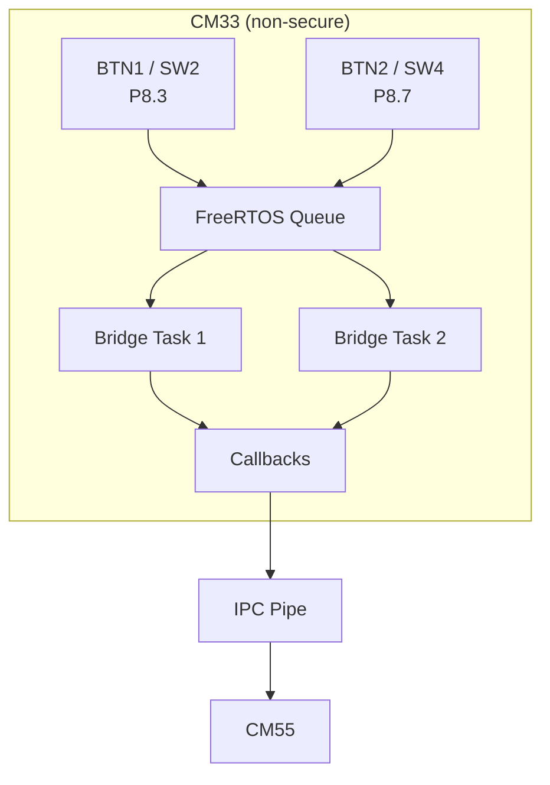
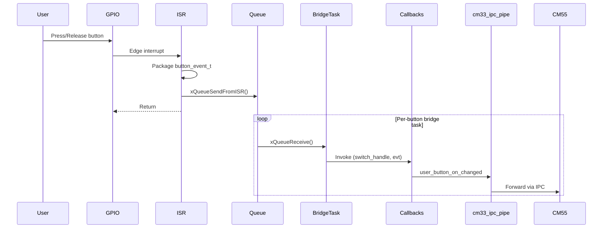
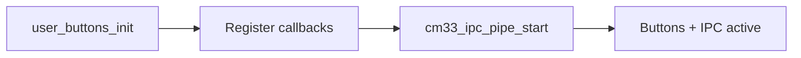

# User Buttons Module – User Manual

**Author:** Asst. Prof. Santi Nuratch, Ph.D  
**Organization:** Thailand Embedded Systems Association (TESA)

---

## 1. Overview

The user buttons module runs on the CM33 (non-secure) core and provides a thread-safe interface for physical buttons on the PSoC8 board. It captures press and release events via GPIO interrupts, defers processing through a FreeRTOS queue and bridge tasks, and delivers events via callbacks. Each callback receives the button handle (switch object) and the event so the consumer can perform desired operations. Events can be forwarded to the CM55 core via IPC (e.g. for UI or logging).

---

## 2. Features

- **Two user buttons** – BTN1 (SW2) and BTN2 (SW4) on Port 8, active-low.
- **Deferred processing** – ISR enqueues events; a per-button bridge task invokes registered callbacks to avoid race conditions with the shared IPC buffer.
- **Callback API** – Register callbacks with `user_button_on_pressed`, `user_button_on_released`, or `user_button_on_changed`. Each callback receives `(user_buttons_t switch_handle, const button_event_t *evt)` so you can use the switch object as needed.
- **Callback limit** – Up to 8 callbacks per event type (pressed, released, changed).
- **Idempotent init** – `user_buttons_init()` can be called multiple times; subsequent calls return true without re-initializing.
- **Optional low-level API** – Create, configure, start/stop, and destroy individual button handles for custom port/pin or task parameters.

---

## 3. Dependencies

- **FreeRTOS** – Queues and tasks for the bridge.
- **BSP / PDL** – GPIO (`GPIO_PRT_Type`, `cybsp`) for button pins.
- **user_buttons_types.h** – Types `button_id_t`, `button_event_id_t`, `button_state_t`, `button_event_t` (shared with CM55 for IPC).
- **ipc_communication.h** – Included by `user_buttons.h` for build; CM33 IPC pipe registers `user_button_on_changed` for both buttons to forward events to CM55.

---

## 4. Hardware Configuration

The module supports two user buttons on **Port 8**:

| Button | Board Label | Pin | Logic |
|--------|-------------|-----|--------|
| BTN1 | SW2 | P8.3 | Active LOW |
| BTN2 | SW4 | P8.7 | Active LOW |



---

## 5. Architecture

To ensure thread safety and avoid using the shared IPC buffer from an ISR, the module uses a deferred processing flow:

1. **ISR** – GPIO interrupt on both rising and falling edges (press and release).
2. **Queue** – The ISR packages the event and sends it to a FreeRTOS queue via `xQueueSendFromISR`.
3. **Bridge task** – A per-button task receives from the queue and invokes registered callbacks (pressed, released, changed) with `(switch_handle, evt)`.
4. **Callbacks** – Consumers (e.g. `cm33_ipc_pipe`) register via `user_button_on_changed` (or on_pressed/on_released) and can forward events to CM55 over IPC or perform other operations using the switch handle.



---

## 6. Integration

### 6.1 Makefile

The user buttons module lives in the **shared** tree: headers in `shared/include`, implementation in `shared/source/COMPONENT_CM33/user_buttons.c`.

**If your CM33 project already uses the shared layout** (e.g. this repo):

- **INCLUDES** – Add the shared include directory so the compiler finds `user_buttons.h` and `user_buttons_types.h`:
  ```makefile
  INCLUDES += ../shared/include
  ```
- **SOURCES** – Ensure the shared CM33 source directory is built so `user_buttons.c` is compiled:
  ```makefile
  SOURCES += $(wildcard ../shared/source/COMPONENT_CM33/*.c)
  ```
  To build only the button module (and not other shared CM33 sources), add the file explicitly:
  ```makefile
  SOURCES += ../shared/source/COMPONENT_CM33/user_buttons.c
  ```

**If you copied the module into your project** (e.g. `my_project/modules/user_buttons/`):

- Add that directory to `INCLUDES` and add the corresponding `.c` to `SOURCES`:
  ```makefile
  INCLUDES += modules/user_buttons
  SOURCES += modules/user_buttons/user_buttons.c
  ```

### 6.2 Initialization (typical in `main.c`)

1. Call `user_buttons_init()` once before any button API or `cm33_ipc_pipe_start()`.
2. Register callbacks with `user_button_on_pressed`, `user_button_on_released`, or `user_button_on_changed`. Each callback receives `(user_buttons_t switch_handle, const button_event_t *evt)`.

Example:

```c
#include "user_buttons.h"

static void on_btn_change(user_buttons_t switch_handle, const button_event_t *evt) {
  (void)switch_handle;
  const char *action = evt->is_pressed ? "PRESSED" : "RELEASED";
  printf("Button %lu %s (Count: %lu)\n", (unsigned long)evt->button_id, action,
         (unsigned long)evt->press_count);
}

void app_init(void) {
  if (!user_buttons_init()) {
    return;
  }
  user_button_on_changed(BUTTON_ID_0, on_btn_change);
  user_button_on_changed(BUTTON_ID_1, on_btn_change);
}
```

### 6.3 Init order

1. `user_buttons_init()` must be called before `cm33_ipc_pipe_start()`.
2. `cm33_ipc_pipe_start()` registers `user_button_on_changed` for BUTTON_ID_0 and BUTTON_ID_1 to forward events to CM55.



### 6.4 CM55 reception

The CM55 receives button events in its IPC callback. Example log output:

```text
cm55_ipc_callback: BTN1 PRESSED (Total Presses: 5)
cm55_ipc_callback: BTN1 RELEASED (Total Presses: 5)
```

---

## 7. API Reference

### 7.1 Lifecycle

| Function | Description |
|----------|-------------|
| `user_buttons_init()` | Creates and starts BTN1/BTN2 with board defaults. Must be called before `cm33_ipc_pipe_start()`. Idempotent. Returns true on success. |
| `user_buttons_create(button_id)` | Creates a button instance. Requires `user_buttons_init()` first. Returns handle or NULL. |
| `user_buttons_configure(handle, port, pin, stack_size, priority)` | Configures hardware and task parameters for a button. Returns true on success. |
| `user_buttons_start(handle)` | Starts monitoring the button. Returns true on success. |
| `user_buttons_stop(handle)` | Stops monitoring the button. |
| `user_buttons_destroy(handle)` | Destroys the handle and releases resources. |

### 7.2 Callbacks

| Function | Description |
|----------|-------------|
| `user_button_on_pressed(id, callback)` | Registers a callback for button press. Callback receives `(switch_handle, evt)`. Call after `user_buttons_init()`. Returns true on success. |
| `user_button_on_released(id, callback)` | Registers a callback for button release. Callback receives `(switch_handle, evt)`. Returns true on success. |
| `user_button_on_changed(id, callback)` | Registers a callback for both press and release; use `evt->is_pressed` to distinguish. Callback receives `(switch_handle, evt)`. Returns true on success. |

All callback APIs return false if not initialized, callback is NULL, or button id is invalid. Up to 8 callbacks per event type may be registered.

---

## 8. Types

Types are defined in `user_buttons_types.h` (included by `user_buttons.h`); shared with CM55 for IPC.

### 8.1 button_id_t

| Value | Name | Mapping |
|-------|------|---------|
| 0 | BUTTON_ID_0 | BTN1 (SW2) |
| 1 | BUTTON_ID_1 | BTN2 (SW4) |
| 2 | BUTTON_ID_MAX | Array size / upper bound |

### 8.2 button_event_id_t

| Value | Name |
|-------|------|
| 0 | BUTTON_EVENT_RELEASED |
| 1 | BUTTON_EVENT_PRESSED |
| 2 | BUTTON_EVENT_CHANGED |
| 3 | BUTTON_EVENT_MAX |

### 8.3 button_state_t

| Value | Name |
|-------|------|
| 0 | BUTTON_STATE_RELEASED |
| 1 | BUTTON_STATE_PRESSED |
| 2 | BUTTON_STATE_MAX |

### 8.4 button_event_t

| Field | Type | Description |
|-------|------|-------------|
| button_id | uint32_t | BUTTON_ID_0 or BUTTON_ID_1. |
| press_count | uint32_t | Total number of times this button was pressed. |
| is_pressed | bool | true = pressed, false = released. |

### 8.5 user_buttons_t

Opaque handle for a single user button instance (create/configure/start/stop/destroy API).

### 8.6 user_button_event_cb_t

Callback type; receives the button handle (switch object) and the event:

```c
typedef void (*user_button_event_cb_t)(user_buttons_t switch_handle, const button_event_t *evt);
```

---

## 9. Usage Examples

**React to press and release:**

```c
user_buttons_init();
user_button_on_changed(BUTTON_ID_0, on_btn_change);
user_button_on_changed(BUTTON_ID_1, on_btn_change);
```

**Separate press and release handlers:**

```c
user_button_on_pressed(BUTTON_ID_0, my_press_handler);
user_button_on_released(BUTTON_ID_0, my_release_handler);
```

**Low-level – custom button instance:**

```c
user_buttons_t btn = user_buttons_create(BUTTON_ID_0);
if (btn != NULL) {
  user_buttons_configure(btn, port, pin, 512, 1);
  user_buttons_start(btn);
}
```

---

## 10. Limits and Notes

- **Callback limit:** Up to 8 callbacks per event type (pressed, released, changed).
- **Thread safety:** ISR only enqueues; bridge task runs in task context and invokes callbacks there.
- **Init order:** Call `user_buttons_init()` before `cm33_ipc_pipe_start()` so the IPC pipe can register its button callbacks.
- **Event payload:** `button_event_t` is valid only for the duration of the callback; copy if needed after return.
- **No debounce:** Hardware/GPIO-level debouncing is not implemented in this module; add in application or hardware if required.
