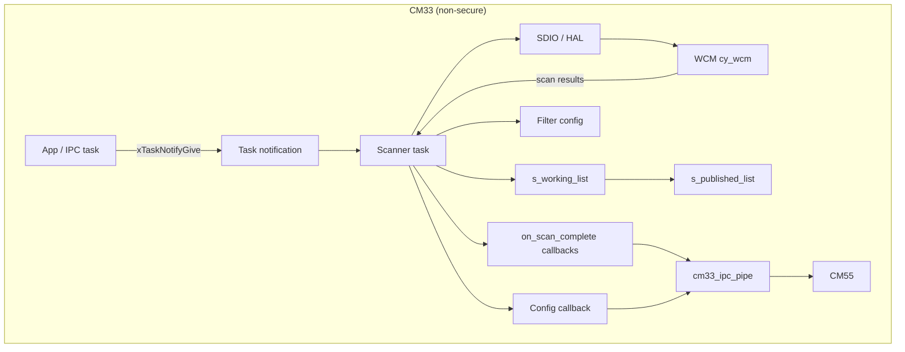
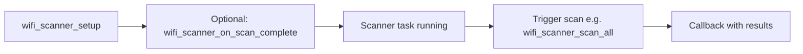
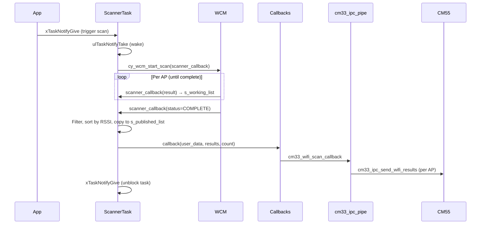

# Wi-Fi Scanner Module – User Manual

**Author:** Asst. Prof. Santi Nuratch, Ph.D  
**Organization:** Thailand Embedded Systems Association (TESA)

---

## 1. Overview

The Wi-Fi scanner module runs on the CM33 (non-secure) core and provides a task-based API to scan for nearby access points (APs), filter results by SSID, BSSID, channel, security, or RSSI, and deliver the filtered list via a callback. It uses the ModusToolbox Wi-Fi Connection Manager (WCM) and SDIO for the radio. Results can be forwarded to the CM55 core over IPC (e.g. for UI display).

---

## 2. Features

- **Single scanner task** – One FreeRTOS task performs SDIO/WCM init and runs the scan loop.
- **Filter modes** – Filter by SSID, BSSID (MAC), channel, security type, or minimum RSSI; or no filter (all APs).
- **Result limit** – Up to 20 APs per scan (configurable via `WIFI_SCANNER_RESULT_MAX` in the implementation).
- **Callback delivery** – Filtered results are passed to a configurable callback (e.g. to send over IPC to CM55).
- **Convenience APIs** – `wifi_scanner_scan_ssid()`, `wifi_scanner_scan_all()`, etc., set the filter and trigger a scan in one call.
- **Multiple scan-complete callbacks** – In addition to the single callback in `wifi_scanner_config_t`, up to 8 callbacks can be registered via `wifi_scanner_on_scan_complete()` (e.g. IPC pipe registers one to forward results to CM55).
- **Idempotent start** – `wifi_scanner_start()` can be called multiple times; the task is created only once.

---

## 3. Dependencies

- **FreeRTOS** – Task and notifications (`xTaskNotifyGive` / `ulTaskNotifyTake`).
- **ModusToolbox WCM (cy_wcm)** – Wi-Fi scan API.
- **BSP** – SDIO and GPIO for Wi-Fi (e.g. `CYBSP_WIFI_*`).
- **wifi_scanner_types.h** – Types `wifi_info_t`, `wifi_filter_mode_t`, `wifi_filter_config_t` (shared with CM55 via include path).
- **ipc_communication.h** – `IPC_CMD_WIFI_SCAN` for IPC request/response.

---

## 4. Integration

### 4.1 Makefile

The Wi-Fi scanner module lives in the **shared** tree: headers in `shared/include` (`wifi_scanner.h`, `wifi_scanner_types.h`), implementation in `shared/source/COMPONENT_CM33/wifi_scanner.c`. It also uses types from `ipc_communication.h` in `shared/include`.

**If your CM33 project already uses the shared layout** (e.g. this repo):

- **INCLUDES** – Add the shared include directory so the compiler finds `wifi_scanner.h`, `wifi_scanner_types.h`, and `ipc_communication.h`:
  ```makefile
  INCLUDES += ../shared/include
  ```
- **SOURCES** – Ensure the shared CM33 source directory is built so `wifi_scanner.c` is compiled:
  ```makefile
  SOURCES += $(wildcard ../shared/source/COMPONENT_CM33/*.c)
  ```
  To build only the Wi-Fi scanner (and not other shared CM33 sources), add the file explicitly:
  ```makefile
  SOURCES += ../shared/source/COMPONENT_CM33/wifi_scanner.c
  ```

**If you copied the module into your project** (e.g. `my_project/modules/wifi_scanner/`):

- Add that directory to `INCLUDES` and add the corresponding `.c` to `SOURCES`. Ensure `ipc_communication.h` (or equivalent shared types) is also on the include path.
  ```makefile
  INCLUDES += modules/wifi_scanner ../shared/include
  SOURCES += modules/wifi_scanner/wifi_scanner.c
  ```

**Wi-Fi / BSP:** The scanner uses ModusToolbox WCM and BSP SDIO/GPIO for Wi-Fi. Your Makefile must enable the appropriate **COMPONENTS** (e.g. `LWIP`, `FREERTOS`) and any **DEFINES** required by the BSP for Wi-Fi (e.g. `CYBSP_WIFI_CAPABLE`). Refer to your board support package and WCM documentation.

**Excluding the scanner:** If you use the wildcard `SOURCES += $(wildcard ../shared/source/COMPONENT_CM33/*.c)` but do not want the Wi-Fi scanner, either remove the wildcard and list only the `.c` files you need, or place `wifi_scanner.c` in a directory that is not compiled.



### 4.2 Initialization (typical in `main.c`)

1. Fill a `wifi_scanner_config_t` with task priority, stack size, and your callback.
2. Call `wifi_scanner_setup(&config, true)` to copy the config and start the scanner task.

Example:

```c
#include "wifi_scanner.h"
#include "cm33_ipc_pipe.h"

wifi_scanner_config_t scanner_config = {
  .task_priority   = 1,
  .task_stack_size = 1024 * 4,
  .filter_mode     = WIFI_FILTER_MODE_NONE,
  .callback        = cm33_wifi_scan_callback,
  .user_data       = NULL
};

if (!wifi_scanner_setup(&scanner_config, true)) {
  handle_error(NULL);
}
```

Init and scan trigger order:



### 4.3 Callback

The callback has the form:

```c
void my_callback(void *user_data, const wifi_info_t *results, uint32_t count);
```

- **user_data** – Value passed in `wifi_scanner_config_t.user_data`.
- **results** – Pointer to an array of `count` filtered scan results (valid only for the duration of the callback).
- **count** – Number of APs (0 to 20).

Typical use: forward `results` and `count` to another core (e.g. CM55) via IPC. The module does not store the list after the callback returns.

### 4.4 Optional: preset filter

After `wifi_scanner_setup()` you can call filter helpers (e.g. from application code) before any scan request; the last filter set is used for the next scan. The scanner does not apply a filter until a scan is triggered.

---

## 5. Architecture

The scanner runs as a single FreeRTOS task that blocks on a task notification. Triggering a scan notifies the task; the task initializes SDIO and WCM once, then runs a loop: wait for notification → run WCM scan (filtering applied when the scan completes) → invoke all registered callbacks with the filtered list → loop again.



---

## 6. API Reference

### 6.1 Lifecycle

| Function | Description |
|----------|-------------|
| `wifi_scanner_setup(config, auto_start)` | Copies config; if `auto_start` is true, creates and starts the scanner task and returns its result; otherwise returns false. |
| `wifi_scanner_start()` | Creates the scanner task if not already running. Returns true if created or already running. |
| `wifi_scanner_stop()` | Deletes the scanner task. Returns true if the task was deleted. |

### 6.2 Callbacks

| Function | Description |
|----------|-------------|
| `wifi_scanner_on_scan_complete(callback, user_data)` | Registers an additional callback for scan-complete; up to 8 callbacks. Same signature as config callback: `(user_data, results, count)`. Returns true on success. |

### 6.3 Status

| Function | Description |
|----------|-------------|
| `wifi_scanner_is_running()` | Returns true if the scanner task exists. |
| `wifi_scanner_is_scanning()` | Returns true if a scan is currently in progress. |

### 6.4 Generic scan with filter

| Function | Description |
|----------|-------------|
| `wifi_scanner_scan(filter_config)` | Triggers a scan. If `filter_config` is not NULL, the module filter is updated; otherwise the current filter is used. Returns true if the scan was triggered. |

### 6.5 Convenience scan (set filter + trigger)

| Function | Description |
|----------|-------------|
| `wifi_scanner_scan_ssid(ssid)` | Sets SSID filter and triggers a scan. Returns true if triggered. |
| `wifi_scanner_scan_bssid(bssid)` | Sets BSSID (MAC) filter and triggers a scan. Returns true if triggered. |
| `wifi_scanner_scan_security(security)` | Sets security-type filter and triggers a scan. Returns true if triggered. |
| `wifi_scanner_scan_channel(channel)` | Sets channel filter and triggers a scan. Returns true if triggered. |
| `wifi_scanner_scan_rssi(rssi)` | Sets minimum RSSI filter and triggers a scan. Returns true if triggered. |
| `wifi_scanner_scan_all()` | Clears filter and triggers a scan (all APs). Returns true if triggered. |

All scan functions return false if the scanner task is not running or a scan is already in progress.

---

## 7. Types

### 7.1 wifi_scanner_config_t

| Field | Type | Description |
|-------|------|-------------|
| task_priority | uint32_t | FreeRTOS priority for the scanner task. |
| task_stack_size | uint32_t | Stack size in words for the scanner task. |
| filter_mode | wifi_filter_mode_t | Initial filter mode (e.g. WIFI_FILTER_MODE_NONE). |
| callback | wifi_scanner_callback_t | Called when a scan completes with filtered results. |
| user_data | void * | Passed to the callback. |

### 7.2 wifi_filter_config_t

Used by `wifi_scanner_scan()` to set mode and parameters (ssid, bssid, security, channel, rssi) in one call. Defined in `wifi_scanner_types.h`; filter mode values are in `wifi_filter_mode_t` (same header).

### 7.3 wifi_info_t (in wifi_scanner_types.h)

| Field | Type | Description |
|-------|------|-------------|
| ssid | char[64] | SSID string. |
| rssi | int32_t | Signal strength (dBm). |
| channel | uint8_t | Channel number. |
| mac | uint8_t[6] | BSSID (MAC address). |
| security | char[32] | Security string (e.g. "WPA2-AES-PSK"). |

---

## 8. Filter Modes

| Mode | Meaning |
|------|--------|
| WIFI_FILTER_MODE_NONE | Keep all APs. |
| WIFI_FILTER_MODE_SSID | Keep only APs whose SSID matches. |
| WIFI_FILTER_MODE_BSSID | Keep only APs whose BSSID (MAC) matches. |
| WIFI_FILTER_MODE_SECURITY | Keep only APs with the given security type. |
| WIFI_FILTER_MODE_CHANNEL | Keep only APs on the given channel. |
| WIFI_FILTER_MODE_RSSI | Keep only APs with RSSI ≥ threshold. |

---

## 9. Usage Examples

**Scan all APs and get results in callback:**

```c
wifi_scanner_scan_all();
```

**Scan only a given SSID:**

```c
wifi_scanner_scan_ssid("MY_NETWORK");
```

**Check if a scan can be triggered:**

```c
if (wifi_scanner_is_running() && !wifi_scanner_is_scanning()) {
  wifi_scanner_scan_ssid("TERNION");
}
```

**Trigger scan with a custom filter struct:**

```c
wifi_filter_config_t filter = {0};
filter.mode = WIFI_FILTER_MODE_RSSI;
filter.rssi = -70;
wifi_scanner_scan(&filter);
```

---

## 10. Limits and Notes

- **Max results:** 20 APs per scan (see `WIFI_SCANNER_RESULT_MAX` in the .c file).
- **Scan-complete callbacks:** Up to 8 callbacks via `wifi_scanner_on_scan_complete()`, plus the single callback in `wifi_scanner_config_t`. All are invoked in scanner task context when a scan completes.
- **SSID:** Only APs with printable-ASCII SSIDs are added to the working list before filtering.
- **Thread safety:** Scan trigger APIs are intended to be called from a single context (e.g. IPC task or main loop); the callback runs in the scanner task context.
- **Blocking:** The scanner task blocks on task notifications; triggering a scan is non-blocking. The callback is invoked from the scanner task when the WCM scan completes.
- **No connect:** This module only scans; it does not connect to an AP. Use WCM connect APIs elsewhere if needed.
