# TESAIoT Audio Application (DoReMi) – Tutorial

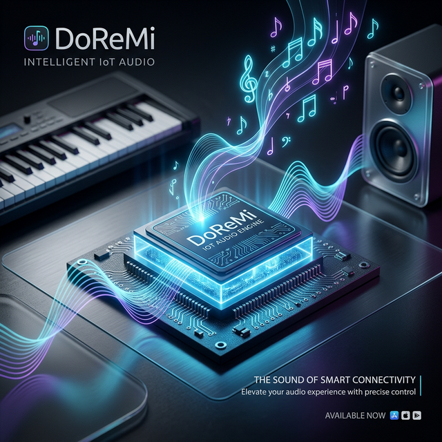

This tutorial explains how the DoReMi application works on PSoC™ Edge MCU devices. It covers software-based sound generation, the I2S audio player, piano-style note simulation, and converting WAV/audio files to C code for embedded playback.

---

## Table of Contents

1. [Overview](#1-overview)
2. [Software-Based Sound/Signal Generation](#2-software-based-soundsignal-generation)
3. [Audio/Sound Player Based on I2S](#3-audiosound-player-based-on-i2s)
4. [Piano Simulation](#4-piano-simulation)
5. [Wave/Audio File to C-Code Conversion](#5-waveaudio-file-to-c-code-conversion)
6. [Audio Codec Interface: Digital-to-Analog Conversion](#6-audio-codec-interface-digital-to-analog-conversion)

---

## 1. Overview

The DoReMi application runs on PSoC™ Edge E84 MCU and plays audio through:

- **Beep generator**: Software synthesis of sine-wave tones
- **I2S hardware**: Streaming audio to the TLV320DAC3100 codec
- **Piano-style playback**: Note sequences with frequencies and durations
- **Pre-recorded audio**: Optional WAV data stored in flash as C arrays

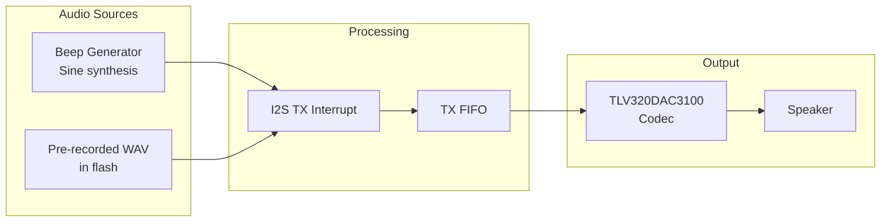

---

## 2. Software-Based Sound/Signal Generation

### 2.1 Principle

Audio is generated in software by computing samples of a sine wave:

\[
s(t) = A \cdot \sin(2\pi f t)
\]

- \(A\) = amplitude (0–32767 for 16-bit audio)
- \(f\) = frequency in Hz
- \(t\) = time in samples (discrete)

### 2.2 Implementation in `beep_generator.c`

The beep generator pre-computes one cycle of the sine wave and then loops it to save CPU.

```c
/* From beep_generator.c - Core sine wave generation */
void beep_generator_init(uint16_t frequency_hz, uint16_t amplitude,
                         uint16_t duration_ms) {
  /* Apply key transposition */
  float transposed_freq = (float)frequency_hz * key_multipliers[current_key];
  
  /* Calculate samples per cycle */
  uint32_t samples_per_cycle = BEEP_SAMPLE_RATE_HZ / (uint32_t)transposed_freq;

  /* Generate sine wave for one cycle */
  for (uint32_t i = 0; i < beep_buffer_size; i++) {
    float angle = 2.0f * 3.14159265f * i / samples_per_cycle;
    int16_t sample = (int16_t)(amplitude * sinf(angle));
    beep_buffer[i] = sample;
  }

  /* Calculate total samples to play */
  beep_duration_samples = (BEEP_SAMPLE_RATE_HZ / 1000) * duration_ms;
}
```

### 2.3 Sample Retrieval and Envelope

Samples are produced on demand in `beep_generator_get_next_sample()`:

- Circular indexing into the sine buffer
- Attack (5 ms) and release (10 ms) envelope to avoid clicks
- Duration-based stop

```c
/* Excerpt from beep_generator_get_next_sample() */
int16_t sample = beep_buffer[beep_sample_index];

/* Apply attack/release envelope */
if (beep_samples_played < attack_samples) {
  gain = (float)beep_samples_played / (float)attack_samples;
} else if (beep_samples_played + release_samples > beep_duration_samples) {
  gain = (float)remaining / (float)release_samples;  /* Fade out */
}
sample = (int16_t)((float)sample * gain);

beep_sample_index = (beep_sample_index + 1) % beep_buffer_size;
beep_samples_played++;
```

### 2.4 Main Parameters

| Parameter             | Value | Description              |
| --------------------- | ----- | ------------------------ |
| `BEEP_SAMPLE_RATE_HZ` | 16000 | Sample rate              |
| `BEEP_BUFFER_SIZE`    | 64    | Samples per cycle buffer |
| `BEEP_ATTACK_MS`      | 5     | Fade-in duration         |
| `BEEP_RELEASE_MS`     | 10    | Fade-out duration        |

### 2.5 Beep Generator State Diagram

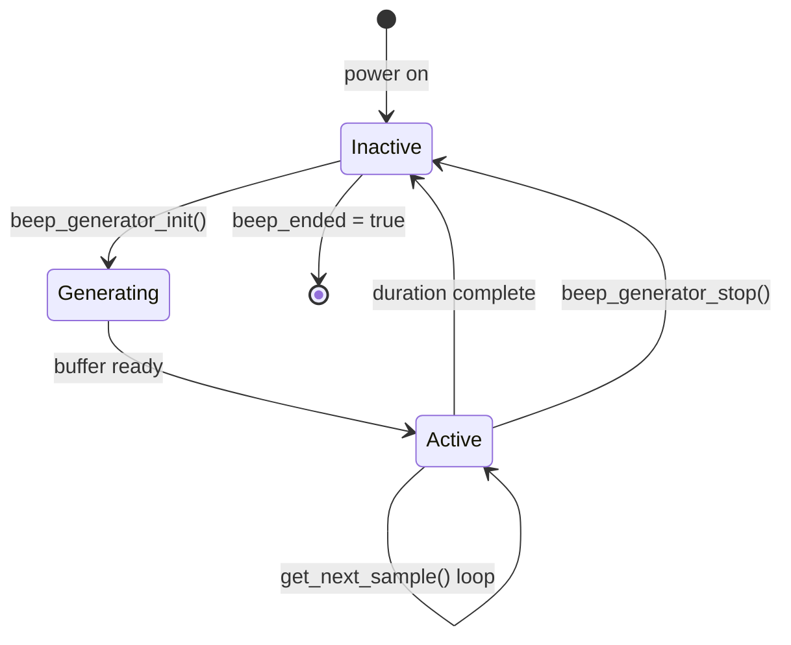

### 2.6 Example: Single Beep

```c
/* Play a 1000 Hz beep for 200 ms at 50% amplitude */
beep_generator_init(1000, 16384, 200);

while (!beep_generator_is_complete()) {
    Cy_SysLib_Delay(1);
}
```

### 2.7 Example: Custom Tone Sequence

```c
/* Play a 3-note sequence: C4, E4, G4 (major chord) */
const uint16_t chord[] = { 262, 330, 392 };
for (int i = 0; i < 3; i++) {
    beep_generator_init(chord[i], 16384, 200);
    while (!beep_generator_is_complete()) {
        Cy_SysLib_Delay(1);
    }
    Cy_SysLib_Delay(50);  /* 50 ms gap between notes */
}
```

### 2.8 Example: Adjustable Frequency Sweep

```c
/* Sweep from 200 Hz to 2000 Hz in 10 steps */
for (uint16_t freq = 200; freq <= 2000; freq += 200) {
    beep_generator_init(freq, 16384, 100);
    while (!beep_generator_is_complete()) {
        Cy_SysLib_Delay(1);
    }
    Cy_SysLib_Delay(30);
}
```

---

## 3. Audio/Sound Player Based on I2S

### 3.1 Architecture

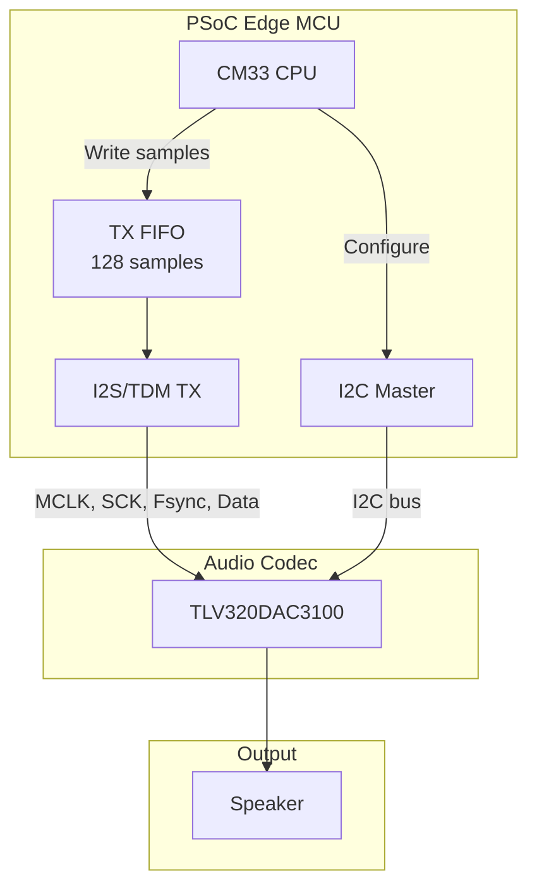

The TLV320DAC3100 codec is configured over I2C.

### 3.2 Initialization Sequence

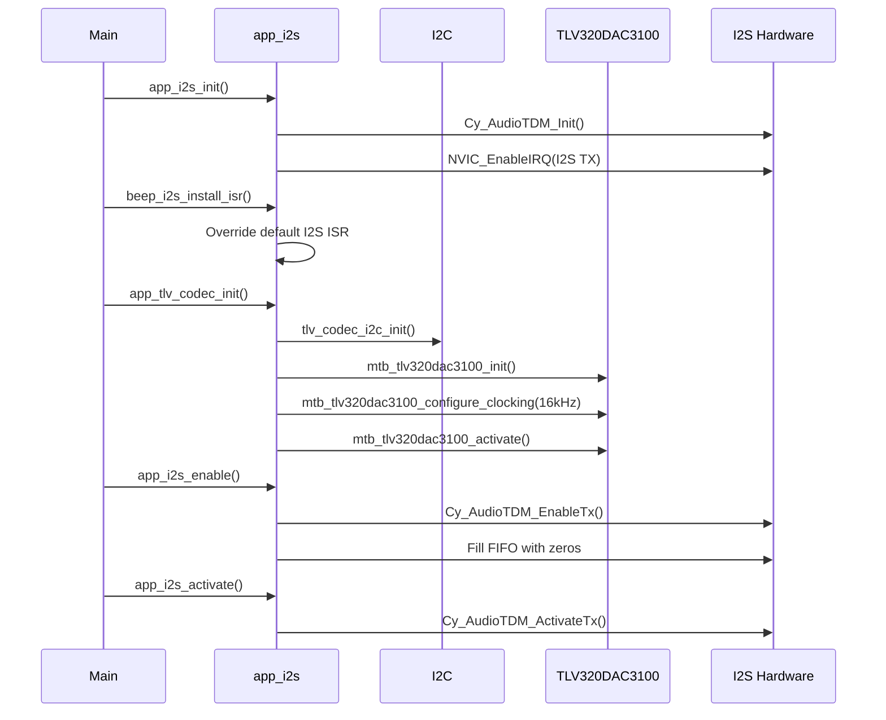

```c
/* From main.c */
app_i2s_init();           /* I2S interrupt + TDM init */
beep_i2s_install_isr();   /* Install beep ISR handler */
app_tlv_codec_init();     /* I2C + TLV codec setup */
app_i2s_enable();         /* Enable TX, fill FIFO with zeros */
app_i2s_activate();       /* Start transmission */
```

### 3.3 I2S Hardware Configuration

| Setting     | Value        | Notes                          |
| ----------- | ------------ | ------------------------------ |
| MCLK        | 2,048,000 Hz | Master clock for codec         |
| Sample rate | 16 kHz       | Matches `BEEP_SAMPLE_RATE_HZ`  |
| Word length | 16 bits      | Signed 16-bit samples          |
| FIFO size   | 128 samples  | Half-size trigger = 64 samples |

### 3.4 Interrupt-Driven Playback

The I2S TX interrupt fires when the FIFO is half empty. The handler fills it with new samples:

```c
/* From beep_i2s.c - Custom ISR feeding I2S from beep generator */
static void i2s_tx_interrupt_handler_beep(void) {
  uint32_t intr_status = Cy_AudioTDM_GetTxInterruptStatusMasked(TDM_STRUCT0_TX);

  if (intr_status & CY_TDM_INTR_TX_FIFO_TRIGGER) {
    for (int i = 0; i < HW_FIFO_HALF_SIZE / 2; i++) {
      int16_t sample = beep_generator_is_active() 
          ? beep_generator_get_next_sample() : 0;
      /* Stereo: same sample to Left and Right */
      Cy_AudioTDM_WriteTxData(TDM_STRUCT0_TX, (uint32_t)sample);
      Cy_AudioTDM_WriteTxData(TDM_STRUCT0_TX, (uint32_t)sample);
    }
  }
  Cy_AudioTDM_ClearTxInterrupt(TDM_STRUCT0_TX, CY_TDM_INTR_TX_MASK);
}
```

### 3.5 Alternate Path: Pre-recorded WAV

The original `app_i2s.c` handler can be used instead of the beep ISR to play WAV data from flash:

```c
/* From app_i2s.c - Original handler for wave.h data */
wave_data = (uint16_t *)&hex_array[0];
// ...
Cy_AudioTDM_WriteTxData(TDM_STRUCT0_TX, (uint32_t)(wave_data[i2s_txcount]));
```

Using `beep_i2s_install_isr()` replaces this with the beep generator path.

### 3.6 I2S Interrupt Flow

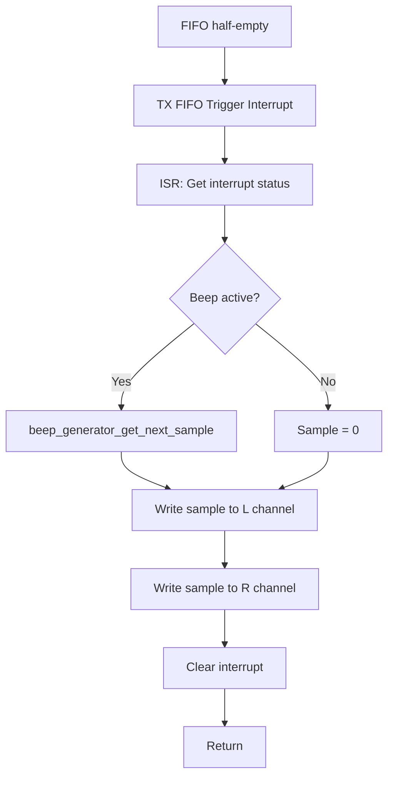

### 3.7 Example: Minimal Playback Setup

```c
/* Minimal setup to play a single beep via I2S */
void play_beep_example(void) {
    app_i2s_init();
    beep_i2s_install_isr();
    app_tlv_codec_init();
    app_i2s_enable();
    app_i2s_activate();

    beep_generator_init(440, 16384, 500);  /* A4 for 500 ms */
    while (!beep_generator_is_complete()) {
        Cy_SysLib_Delay(1);
    }
    /* I2S stays active; can play more beeps */
}
```

### 3.8 Example: Switch Between Beep and WAV Mode

```c
/* To use pre-recorded WAV: omit beep_i2s_install_isr() */
void init_for_wav_playback(void) {
    app_i2s_init();
    /* NOT: beep_i2s_install_isr();  -- use default handler */
    app_tlv_codec_init();
    app_i2s_enable();
    app_i2s_activate();
    /* Default handler reads from wave_data / hex_array */
}

/* To use beep synthesis: call beep_i2s_install_isr() */
void init_for_beep_playback(void) {
    app_i2s_init();
    beep_i2s_install_isr();  /* Override with beep handler */
    app_tlv_codec_init();
    app_i2s_enable();
    app_i2s_activate();
}
```

---

## 4. Piano Simulation

### 4.1 Concept

The “piano” is simulated by:

- Using standard musical note frequencies
- Applying key transposition (12 semitones)
- Playing note sequences with per-note durations

### 4.2 Note Frequencies (Equal Temperament)

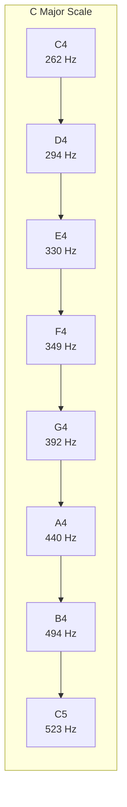

C major scale frequencies (Hz):

| Note | Frequency | Solfège |
| ---- | --------- | ------- |
| C4   | 262       | Do      |
| D4   | 294       | Re      |
| E4   | 330       | Mi      |
| F4   | 349       | Fa      |
| G4   | 392       | Sol     |
| A4   | 440       | La      |
| B4   | 494       | Ti      |
| C5   | 523       | Do      |

### 4.3 Key Transposition

Transposition is done by multiplying frequencies by semitone factors:

```c
/* From beep_generator.c */
static const float key_multipliers[] = {
    1.00000f,  /* KEY_C       - Base */
    1.05946f,  /* KEY_C_SHARP - +1 semitone */
    1.12246f,  /* KEY_D       - +2 semitones */
    // ... up to KEY_B
    1.88775f   /* KEY_B       - +11 semitones */
};
```

Example:

```c
beep_set_key(KEY_B);   /* Transpose to B major */
beep_set_key(KEY_G);   /* Transpose to G major */
```

### 4.4 Song Playback

Songs are defined as arrays of frequencies and durations:

```c
/* Jingle Bells (Song 4) - excerpt */
static const uint16_t song4_freqs[] = {
    330, 330, 330,           /* Mi Mi Mi– */
    330, 330, 330,           /* Mi Mi Mi– */
    330, 392, 262, 294, 330, /* Mi Sol Do Re Mi– */
    /* ... */
};
static const uint16_t song4_durs[] = {
    DUR_SHORT, DUR_SHORT, DUR_MID,
    /* ... */
};
```

### 4.5 Duration Definitions

```c
#define DUR_SHORT 300   /* ms */
#define DUR_MID   500
#define DUR_LONG  700
#define DUR_XLONG 1000
```

### 4.6 Song Service Loop

The main loop drives the song playback:

```c
/* From main.c */
beep_set_key(KEY_B);
beep_set_song(4);        /* Jingle Bells */
beep_scale_start();
beep_song_service_loop(); /* Runs forever */
```

In `beep_song_service_loop()`, the code:

1. Checks `beep_scale_running`
2. Selects song by `beep_current_song`
3. Calls `beep_generator_init(freq, amp, duration)` for each note
4. Waits for `beep_generator_is_complete()`
5. Inserts a short gap between notes

### 4.7 Song Playback Flow

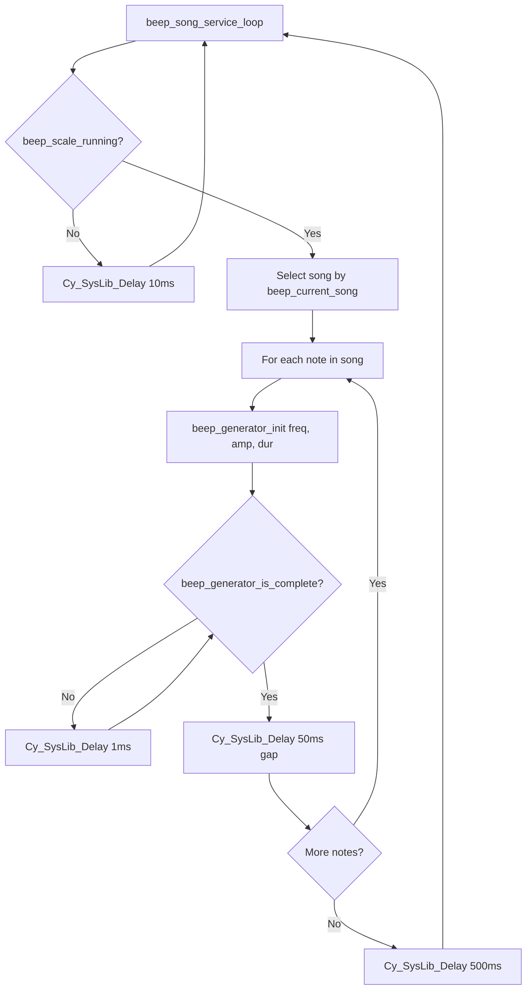

### 4.8 Available Songs

| Song | Description                         |
| ---- | ----------------------------------- |
| 0    | Extended Do-Re-Mi melody (4 verses) |
| 1    | Sol La Sol Mi…                      |
| 2    | Happy Birthday                      |
| 3    | Simple melody                       |
| 4    | Jingle Bells                        |

### 4.9 Example: Add a New Song

```c
/* Add Song 5 - Twinkle Twinkle Little Star
 * Use DUR_SHORT, DUR_MID, DUR_LONG, DUR_XLONG from beep_song_service_loop */
#define DUR_SHORT 300
#define DUR_MID   500
#define DUR_LONG  700

static const uint16_t song5_freqs[] = {
    262, 262, 392, 392, 440, 440, 392,   /* C C G G A A G */
    349, 349, 330, 330, 294, 294, 262,   /* F F E E D D C */
    392, 392, 349, 349, 330, 330, 294,   /* G G F F E E D */
    392, 392, 349, 349, 330, 330, 294,   /* G G F F E E D */
    262, 262, 392, 392, 440, 440, 392,   /* C C G G A A G */
    349, 349, 330, 330, 294, 294, 262    /* F F E E D D C */
};

static const uint16_t song5_durs[] = {
    DUR_MID, DUR_MID, DUR_MID, DUR_MID, DUR_MID, DUR_MID, DUR_MID,
    DUR_MID, DUR_MID, DUR_MID, DUR_MID, DUR_MID, DUR_MID, DUR_MID,
    /* ... repeat pattern for all notes */
};

/* Then add case in beep_song_service_loop() */
else if (beep_current_song == 5) {
    song_freqs = song5_freqs;
    song_durs = song5_durs;
    count = sizeof(song5_freqs) / sizeof(song5_freqs[0]);
}
```

### 4.10 Example: Play Scale with User Key

```c
/* Play C major scale in user-selected key */
void play_scale_in_key(beep_key_t key) {
    beep_set_key(key);
    beep_scale_start();
    beep_set_song(0);  /* Do-Re-Mi scale */
    /* In main: beep_song_service_loop() runs the scale */
}
```

### 4.11 Example: Do-Re-Mi Scale Only

```c
/* Play just the 8-note scale once */
void play_scale_once(void) {
    const uint16_t scale[] = { 262, 294, 330, 349, 392, 440, 494, 523 };
    beep_scale_start();
    app_i2s_enable();
    app_i2s_activate();

    for (int i = 0; i < 8; i++) {
        beep_generator_init(scale[i], 16384, 300);
        while (!beep_generator_is_complete()) {
            Cy_SysLib_Delay(1);
        }
        Cy_SysLib_Delay(50);
    }
}
```

---

## 5. Wave/Audio File to C-Code Conversion

This section explains how to convert a WAV file to a C array and integrate it into the PSoC DoReMi application for playback over I2S.

### 5.1 Purpose

Pre-recorded audio can be stored in flash as a C array instead of being synthesized. This is useful for:

- Short sound effects
- Spoken messages
- WAV clips

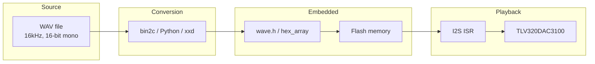

### 5.2 Step-by-Step: Convert WAV to C Array for PSoC

The following steps convert a WAV file to a C array and integrate it into the DoReMi PSoC application.

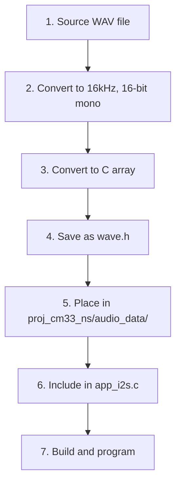

| Step  | Action                    | Details                                                                                                            |
| ----- | ------------------------- | ------------------------------------------------------------------------------------------------------------------ |
| **1** | Obtain source audio       | Any WAV, MP3, or recorded audio                                                                                    |
| **2** | Convert to correct format | 16 kHz, 16-bit signed, mono (see [5.9](#59-example-prepare-wav-with-ffmpeg))                                       |
| **3** | Convert binary to C array | Use bin2c, Python script, or xxd (see [5.4](#54-conversion-with-bin2c), [5.5](#55-alternative-conversion-methods)) |
| **4** | Save as `wave.h`          | Use `hex_array` as array name, add `hex_array_size`                                                                |
| **5** | Place in project          | `DoReMi/proj_cm33_ns/audio_data/wave.h`                                                                            |
| **6** | Include in app            | `app_i2s.c` includes `wave.h` and uses `hex_array`                                                                 |
| **7** | Build                     | Project build system compiles `audio_data/wave.h` automatically                                                    |

**WAV format requirements** (must match PSoC codec configuration):

- **Sample rate**: 16 kHz
- **Bit depth**: 16-bit signed
- **Channels**: Mono (1 channel)

**PSoC project layout**:

```
DoReMi/
└── proj_cm33_ns/
    ├── audio_data/
    │   └── wave.h          ← Place converted C array here
    └── source/
        └── app_i2s/
            └── app_i2s.c   ← #include "wave.h"
```

### 5.3 Format of `wave.h`

`wave.h` contains raw WAV data as a byte array:

```c
/* From wave.h */
const uint8_t hex_array[] = {
    0x52,0x49,0x46,0x46,  /* "RIFF" */
    0x04,0x01,0x01,0x00,  /* Chunk size */
    0x57,0x41,0x56,0x45,  /* "WAVE" */
    0x66,0x6D,0x74,0x20,  /* "fmt " */
    /* ... format chunk ... */
    0x64,0x61,0x74,0x61,  /* "data" */
    /* ... raw PCM samples ... */
};

unsigned const int hex_array_size = sizeof(hex_array);
```

The first bytes are a standard RIFF/WAVE header (format, channels, sample rate, etc.), followed by the raw PCM data.

### 5.4 Conversion with bin2c

The design documentation suggests using [bin2c](https://sourceforge.net/projects/bin2c/):

1. Prepare a WAV file:
   - 16 kHz sample rate (or match `SAMPLE_RATE_HZ` in `app_i2s.h`)
   - 16-bit signed mono
   - Short duration (flash is limited)

2. Convert to C:

   ```bash
   bin2c input.wav output.h
   ```

3. Integrate into PSoC project:
   - Rename the array to `hex_array` (bin2c often names it from the filename, e.g. `my_sound`)
   - Add `unsigned const int hex_array_size = sizeof(hex_array);`
   - Save as `proj_cm33_ns/audio_data/wave.h` (replace existing file)

### 5.5 Alternative Conversion Methods

**Example: Python script (basic)**

```python
with open("audio.wav", "rb") as f:
    data = f.read()
hex_str = ",".join(f"0x{b:02x}" for b in data)
# Emit: const uint8_t hex_array[] = { hex_str };
```

**Example: Complete Python converter with WAV validation**

```python
#!/usr/bin/env python3
"""Convert WAV file to C header for DoReMi project."""
import sys
import struct

def wav_to_c(input_path: str, output_path: str, array_name: str = "hex_array"):
    with open(input_path, "rb") as f:
        data = f.read()

    # Basic WAV header check
    if data[:4] != b'RIFF' or data[8:12] != b'WAVE':
        print("Warning: Input may not be a valid WAV file", file=sys.stderr)

    # Format: 12 bytes per line for readability
    hex_lines = []
    for i in range(0, len(data), 12):
        chunk = data[i:i+12]
        hex_str = ",".join(f"0x{b:02x}" for b in chunk)
        hex_lines.append(" " + hex_str)

    body = ",\n".join(hex_lines)
    output = f"""/* Auto-generated from {input_path} */
const uint8_t {array_name}[] = {{
{body}
}};

unsigned const int {array_name}_size = sizeof({array_name});
"""
    with open(output_path, "w") as f:
        f.write(output)
    print(f"Wrote {output_path}: {len(data)} bytes")

if __name__ == "__main__":
    if len(sys.argv) < 2:
        print("Usage: python wav2c.py input.wav [output.h]")
        sys.exit(1)
    out = sys.argv[2] if len(sys.argv) > 2 else "wave.h"
    wav_to_c(sys.argv[1], out)
```

**Example: xxd (Unix)**

```bash
xxd -i audio.wav > wave.h
```
Then adjust array name to `hex_array` and add `hex_array_size` if needed.

### 5.6 Using the Converted Data in the PSoC Application

To play pre-recorded WAV in the DoReMi PSoC application:

1. **Use WAV mode** – Do **not** call `beep_i2s_install_isr()` in `main.c`. This leaves the default `app_i2s` I2S handler active, which reads from `wave_data` / `hex_array`.

2. **Ensure `wave.h` is included** – `app_i2s.c` already includes `#include "wave.h"` and declares:
   ```c
   uint16_t *wave_data = (uint16_t *)&hex_array[0];
   ```

3. **Handle the WAV header** – A standard WAV file has a 44-byte header before the PCM data. The I2S handler treats `hex_array` as 16-bit samples, so:
   - **Full WAV (with header)**: Point `wave_data` to the raw PCM start and adjust the sample count:
     ```c
     /* In app_i2s.c - skip 44-byte WAV header */
     uint16_t *wave_data = (uint16_t *)&hex_array[44];
     /* And in ISR: use (hex_array_size - 44) / 2 for sample count */
     ```
   - **Raw PCM only** (no header): Use `&hex_array[0]` and `hex_array_size / 2` as in the current code.

4. **Sample count** – The I2S handler checks `i2s_txcount >= hex_array_size / 2`. If you skip the header, use `(hex_array_size - 44) / 2` for the sample count.

5. **Build** – The project Makefile includes `audio_data/wave.h` automatically. Replace the existing `wave.h` with your converted file and rebuild.

### 5.7 WAV Format Notes

- **Sample rate**: 16 kHz recommended (matches codec config).
- **Bit depth**: 16-bit signed.
- **Channels**: Mono preferred; stereo doubles the size.
- **Size**: Keep short to avoid flash overflow.

### 5.8 Integration Example: Modifying app_i2s.c for WAV Playback

When using a **full WAV file** (with RIFF header), skip the first 44 bytes:

```c
/* In app_i2s.c - At top, change wave_data and add sample count */

/* Skip 44-byte WAV header; remaining bytes are 16-bit PCM */
#define WAV_HEADER_SIZE 44
uint16_t *wave_data = (uint16_t *)&hex_array[WAV_HEADER_SIZE];
uint32_t wave_sample_count = (hex_array_size - WAV_HEADER_SIZE) / 2;

/* In i2s_tx_interrupt_handler(), change the end-of-playback check from:
 *   if (i2s_txcount >= hex_array_size / 2)
 * to: */
if (i2s_txcount >= wave_sample_count) {
    i2s_txcount = 0;
    audio_playback_ended = true;
}
```

When using **raw PCM** (no header, e.g. from `ffmpeg -f s16le` piped to bin2c):

```c
/* In app_i2s.c - Use entire array as samples */
uint16_t *wave_data = (uint16_t *)&hex_array[0];
/* No change needed - i2s_tx_interrupt_handler uses hex_array_size/2 */
```

### 5.9 Example: Prepare WAV with FFmpeg

```bash
# Convert any audio to 16 kHz, 16-bit mono, 3 seconds max
ffmpeg -i input.mp3 -ac 1 -ar 16000 -t 3 -acodec pcm_s16le output.wav

# Verify format
ffprobe output.wav -show_format -show_streams
```

### 5.10 Example: Full Workflow for PSoC (bin2c)

Complete workflow from source audio to playback on PSoC:

```bash
# 1. Prepare WAV (16 kHz, 16-bit, mono). Example: convert MP3.
ffmpeg -i my_sound.mp3 -ac 1 -ar 16000 -t 5 -acodec pcm_s16le my_sound.wav

# 2. Convert to C array with bin2c (download from sourceforge.net/projects/bin2c)
bin2c my_sound.wav wave.h

# 3. Edit wave.h: ensure array name is hex_array, add size:
#    const uint8_t hex_array[] = { ... };
#    unsigned const int hex_array_size = sizeof(hex_array);

# 4. Copy wave.h to PSoC project
cp wave.h /path/to/DoReMi/proj_cm33_ns/audio_data/wave.h

# 5. Modify app_i2s.c if using full WAV (header present):
#    - wave_data = (uint16_t *)&hex_array[44];
#    - In ISR: use (hex_array_size - 44) / 2 for sample count
#    (See section 5.8)

# 6. In main.c: do NOT call beep_i2s_install_isr() for WAV playback

# 7. Build and program
make build
make program
```

**Alternative: raw PCM (no header)** – avoids modifying app_i2s.c:

```bash
# Extract raw PCM and convert
ffmpeg -i my_sound.mp3 -ac 1 -ar 16000 -t 5 -f s16le -acodec pcm_s16le my_sound.raw
bin2c my_sound.raw wave.h
# Use hex_array from byte 0; no header offset needed
```

### 5.11 WAV Header Structure (Reference)

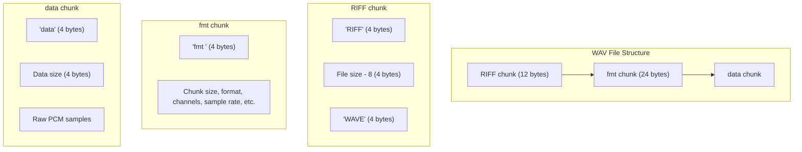

---
 
 ## 6. Audio Codec Interface: Digital-to-Analog Conversion
 
 The system utilizes the **Texas Instruments TLV320DAC3100** audio codec, controlled via I2C and fed via the I2S/TDM hardware block. This section provides a high-level overview of the integration, focusing on real-time digital synthesis and low-latency streaming.
 
 For a complete technical specification, hardware block diagrams, and detailed signal processing flow, see the standalone documentation:
 
 - **[Audio Codec Interface: Digital-to-Analog Conversion (TLV320DAC3100)](./proj_cm33_ns/source/app_i2s/Audio-Codec.md)**
 
 ---
 
 ## Summary
 
 ```mermaid
 mindmap
   root((DoReMi))
     Beep Generator
       beep_generator.c
       Sine synthesis
       Envelope
     I2S Player
       app_i2s.c
       beep_i2s.c
       TLV320DAC3100
     Piano Sim
       Note freqs
       Transposition
       Songs 0-4
     WAV Conversion
       wave.h
       bin2c / Python
       hex_array
     Audio Codec
       I2C/I2S Integration
       DSP Engine
       Data Pump ISR
 ```
 
 | Topic                     | Main components                                                             |
 | ------------------------- | --------------------------------------------------------------------------- |
 | Software sound generation | `beep_generator.c`: sine synthesis, buffer, envelope                        |
 | I2S audio player          | `app_i2s.c`, `beep_i2s.c`: TDM/I2S, FIFO, ISR, TLV320DAC3100                |
 | Piano simulation          | Note frequencies, transposition, song sequences, `beep_song_service_loop()` |
 | WAV to C conversion       | `wave.h`, bin2c or custom scripts, `hex_array`                              |
 | Audio Codec Interface     | [TLV320DAC3100 Technical Specification](./proj_cm33_ns/source/app_i2s/Audio-Codec.md) |
 
 ---
 
 ## Quick Reference Examples
 
 | Goal             | Code snippet                                                                                                                  |
 | ---------------- | ----------------------------------------------------------------------------------------------------------------------------- |
 | Single beep      | `beep_generator_init(1000, 16384, 200);`                                                                                      |
 | Set key          | `beep_set_key(KEY_G);`                                                                                                        |
 | Play song        | `beep_set_song(4); beep_scale_start(); beep_song_service_loop();`                                                             |
 | Full init        | `app_i2s_init(); beep_i2s_install_isr(); app_tlv_codec_init(); app_i2s_enable(); app_i2s_activate();`                         |
 | Wait for beep    | `while (!beep_generator_is_complete()) Cy_SysLib_Delay(1);`                                                                   |
 | Convert WAV to C | `ffmpeg -i in.wav -ac 1 -ar 16000 -acodec pcm_s16le out.wav` then `bin2c out.wav wave.h`; place in `proj_cm33_ns/audio_data/` |
 
 ---
 
 For more detail on the I2S flow:
 
 - [Design and implementation](design_and_implementation.md)
 - [Using the code example](using_the_code_example.md)
 - [Audio Codec Technical Specification](./proj_cm33_ns/source/app_i2s/Audio-Codec.md)
