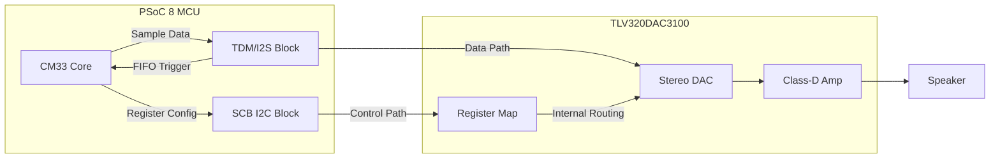
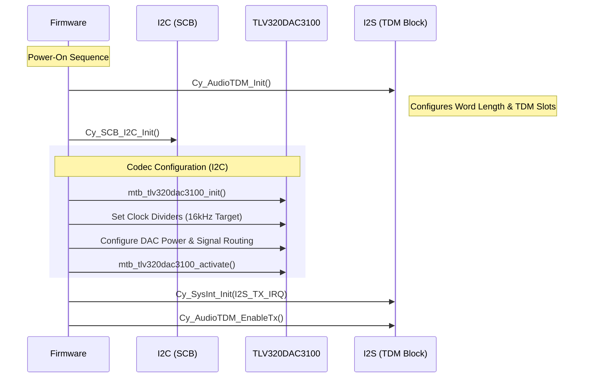
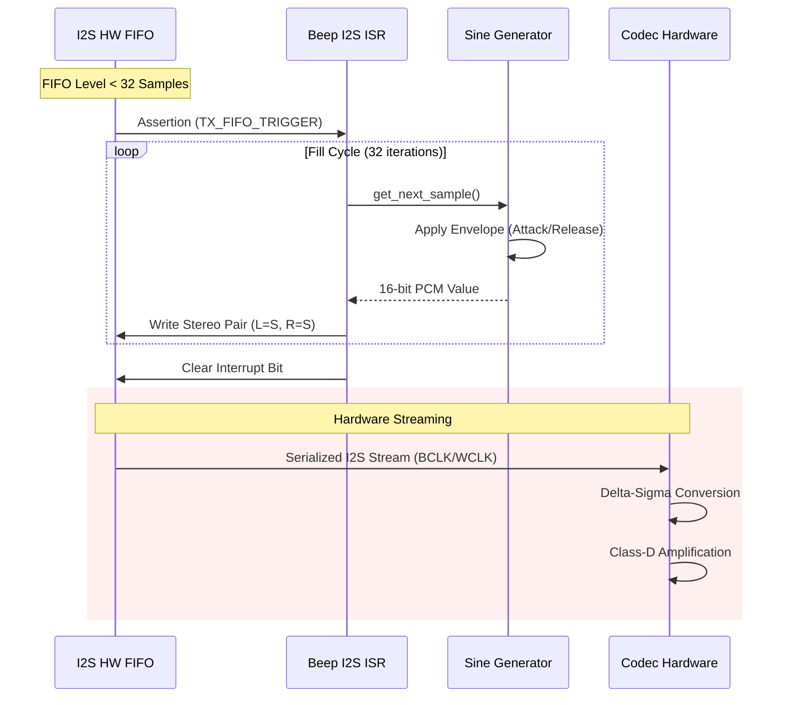

# Audio Codec Interface: Digital-to-Analog Conversion (TLV320DAC3100)

## Overview
This document provides a technical specification of the audio playback subsystem, focusing on the integration between the **PSoC™ 8 TDM/I2S Peripheral** and the **Texas Instruments TLV320DAC3100** audio codec. 

In this implementation, the system performs real-time digital synthesis (Sine Wave generation) and streams 16-bit PCM data over an Inter-IC Sound (I2S) bus. The architecture is designed for low-latency, interrupt-driven operation suitable for embedded signal processing applications.

---

## 1. System Architecture

The audio pipeline is divided into three distinct layers: the **Synthesis Layer** (Software), the **Protocol Layer** (I2S/TDM), and the **Transduction Layer** (Codec/Speaker).

| Component | Role | Responsibility |
| :--- | :--- | :--- |
| **[`app_i2s`](./app_i2s.c)** | Hardware Abstraction | Manages I2C/I2S peripheral initialization and IRQ steering. |
| **[`beep_generator`](./beep_generator.c)** | DSP Engine | Calculates sine wave values with attack/release envelopes. |
| **[`beep_i2s`](./beep_i2s.c)** | Data Pump | High-priority ISR that hydrates the I2S TX FIFO. |
| **TLV320DAC3100** | Audio Codec | 24-bit DAC with integrated Class-D speaker amplifier. |

### Hardware Block Diagram (Conceptual)

---

## 2. DSP Specifications & Timing

To ensure high-fidelity signal reproduction without aliasing or jitter, the system adheres to the following timing constraints:

### Audio Format
*   **Sample Rate ($F_s$):** 16,000 Hz
*   **Bit Depth:** 16-bit Signed PCM (2's Complement)
*   **Channels:** Stereo (Mono signal duplicated to L/R)
*   **Dynamic Range:** ~90dB (Codec capability)

### Interface Clocking
The I2S bus utilizes three primary clock signals generated by the PSoC™ MCU (Master Mode):
1.  **$M_{CLK}$ (Master Clock):** 2.048 MHz — Provides the base frequency for the Codec's internal PLL and Delta-Sigma Modulator.
2.  **$B_{CLK}$ (Bit Clock):** 512 kHz — Synchronizes individual bits (16 bits/word × 2 channels × 16 kHz).
3.  **$W_{LRCK}$ (Word Select):** 16 kHz — Demarcates the transition between Left and Right channel data.

---

## 3. Initialization Logic

The initialization sequence follows a strict order to prevent audible artifacts (pops/clicks) and ensure clock stability.

---

## 4. Real-Time Data Flow (Data Pump)

The system uses a **Hardware FIFO Trigger** mechanism to maintain continuous playback. When the I2S TX FIFO falls below 50% capacity (32 stereo samples), a high-priority interrupt is asserted.

### Interrupt-Driven Playback Sequence

### Attack/Release Envelope Logic
To eliminate the "broadband click" associated with instantaneous waveform starts/stops, the synthesis engine applies a linear ramp:
*   **Attack:** 5ms linear gain ramp from 0.0 to 1.0.
*   **Release:** 10ms linear gain ramp from 1.0 to 0.0.

---

## 5. Performance and Resource Metrics

For DSP engineers optimizing the CM33 cycles, the following metrics provide a baseline for the interrupt service routine (ISR) overhead.

| Metric | Value | Impact |
| :--- | :--- | :--- |
| **ISR Trigger Rate** | 250 Hz | Fires every 4ms. |
| **Burst Size** | 64 Words | Fills 50% of the 128-word FIFO. |
| **Processing Window** | < 1ms | Total time to synthesize 64 samples at 160MHz. |
| **Bus Load** | Insignificant | I2S at 512kHz is low-bandwidth for the AHB bus. |

> [!TIP]
> **Underrun Protection:** The `CY_TDM_INTR_TX_FIFO_UNDERFLOW` bit is monitored. If the ISR fails to hydrate the FIFO before it empties, a hardware assertion is triggered to prevent audio jitter.

---

## 6. Register Map Highlights (TLV320DAC3100)

| Register | Purpose | Configuration |
| :--- | :--- | :--- |
| **Page 0 / Reg 4** | Clock Gen | PLL Enabled, Input = $M_{CLK}$ |
| **Page 0 / Reg 27** | Interface | I2S Mode, 16-bit, Slave Mode |
| **Page 1 / Reg 35** | Routing | DAC L/R to Mono Mixer |
| **Page 1 / Reg 32** | Power | Class-D Speaker Driver Power-Up |

---

## Summary
The integration of the PSoC™ 8 TDM block with the TLV320DAC3100 provides a robust platform for real-time audio synthesis. By utilizing a deep hardware FIFO and high-priority interrupts, the CM33 core can handle other computational tasks (like UI or networking) while maintaining a glitch-free 16kHz audio stream.
